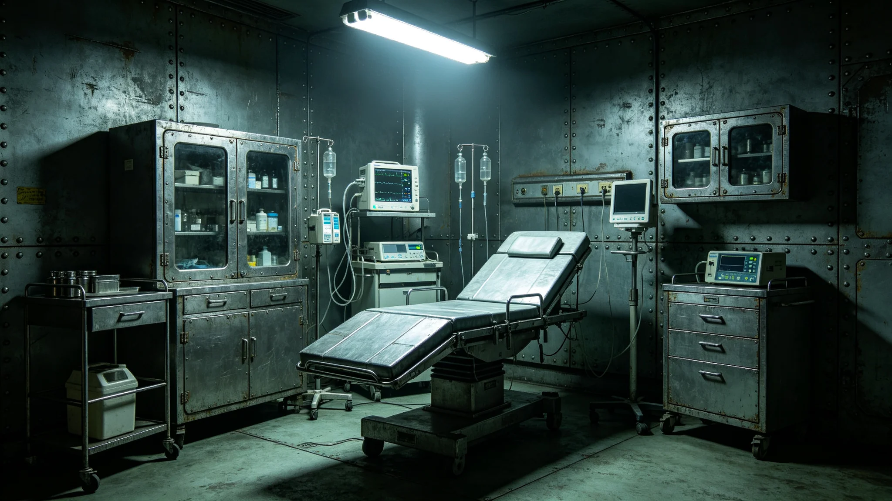

# 外交使团健康紧急事件通报

**发布单位**：联合体深空外交署与航医队　**通报编号**：DIP-MED-3752-018
**事发**：3752年6月3日　**结案**：3752年6月15日　**经办**：使馆航医值班员

## 一、值班日志与留置登记（物证）

> **航医值班日志·原行摘录**
> 　6月3日凌晨　三等秘书周某宿舍腹痛、呕吐。值班随员发现，转入使馆医疗室。
> 　初检：疑急性肠胃炎。用药。
> 　6月4日　腹痛加剧，低烧。用药二十四小时，症未缓。报大使。
> **隔离舱留置登记**：6月4日入舱，留置五日；舱外非必要接触限。
> **会诊请求存根**：6月5日经外交加密通信线路（见GS-3768-01）发跨星系港航医队，收讫回执在案。大使沈远谟（见GS-3751-01）批"启动应急医疗方案"。

## 二、处置时刻表

| 日期 | 事项 | 经手 |
|---|---|---|
| 6月3日 | 凌晨发病，转医疗室，初检用药 | 值班随员、航医值班员 |
| 6月4日 | 症加剧，入隔离舱，报大使 | 航医值班员 |
| 6月5日 | 加密线路请求远程支援，三名医生会诊 | 沈远谟 |
| 6月6日 | 航医队派医疗分队携检测设备乘班列赴"晶环"站 | 跨星系港航医队 |
| 6月8日 | 分队抵达，全面检测，当日确诊 | 医疗分队 |
| 6月9日 | 症缓解 | 航医 |
| 6月10日 | 痊愈出院，返宿舍休养 | 航医 |
| 6月15日 | 结案 | 航医撰、沈远谟签批 |

医疗分队自跨星系港出发，行程约五天，属最快响应；在"晶环"站停留三天，确认痊愈后返回，往返费用由航医队承担。周某在舱五日，症经初步用药控制，未恶化。

## 三、诊断认定（会诊与化验单）

远程会诊三名医生照录三议，不加评：

1. 异星食物不耐受——周某前日赴异星方招待宴会，或食不适宜之异星食物；
2. 异星微生物感染——周某曾在使馆周边短途散步，或接触未知微生物；
3. 普通急性肠胃炎——与异星环境无关。

> **化验单·结论行**（6月8日，全面检测）：排除异星微生物感染；确诊异星食物不耐受。前日宴会所食异星高蛋白食物，肠胃不能消化。
> 处置：停抗生素，改补电解质与休息。

## 四、责任认定

无人员过错。异星方按礼宾规范安排菜品，未故意提供不适宜食物；我方使馆人员赴宴前未充分了解菜品成分。

## 五、结案签批件与赴宴流程修订

> **结案报告**（6月15日）：航医撰，沈远谟签批"照准"，报航医队备案。结论：周某确诊异星食物不耐受，非传染病，已痊愈。
> **菜单成分预审卡**：礼宾员程礼仪（见GS-3754-01）负责，每次赴宴前向异星方确认菜单成分，标注可能不适宜之菜品，告知赴宴人员。此流程自3752年6月起执行，此后未再发生食物不耐受事件。

随访：周某痊愈后跟踪监测一个月，无后遗症。使馆通告全体人员：赴异星方宴会前应了解菜单成分。
设备：使馆医疗室原配一名航医与基本药品，可处理常见病与轻伤，重症须由跨星系班列送回跨星系港医院；事件后新增异星食物成分检测设备一台，两小时内检出常见异星食物成分，费用约五万，计入外交服务支出。
年度：航医3752年度处理外交使团健康事件三件，均异星食物不耐受类，无传染病。

> 航医注：无伤亡，无传染，使馆照常办公。沈远谟笔记一句留档——"外交不光是说话吃饭，吃错东西也能出外交事件。"档案记到此为止。
