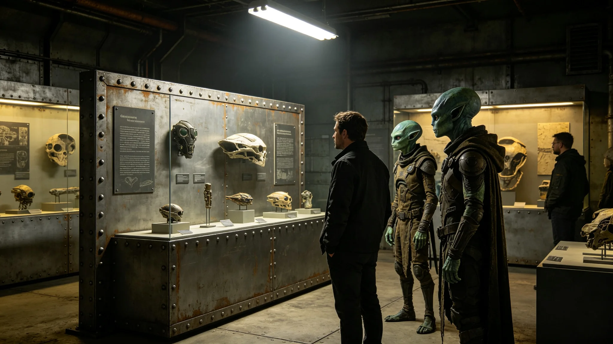

**发布单位**：联合体深空外交署与文化署
**发布日期**：3753年9月28日
**通报编号**：CUL-INC-3753-020

## 一、事件概要

3753年9月10日，我方文化代表团在访问异星方宗教场所时，一名年轻团员在场内拍照，引发对方不满。异星方向我方使馆提出正式投诉。事件以我方书面道歉与团内补课告终，未造成外交降级。

## 二、事件经过

3753年9月8日至12日，我方文化代表团五人访问异星方首都，参观文化遗址与宗教场所。代表团由文化交流特使文传声（见GS-3756-01）率领。

9月10日下午，代表团参观异星方一处主要宗教场所。参观前，文传声已向全团告知：场内禁止拍照、禁止大声交谈、禁止触摸展品。但参观过程中，代表团中一名二十三岁之年轻团员，在无人注意时用随身终端拍摄了一张场内照片。

拍照行为被异星方场所管理员当场发现。管理员上前制止，要求团员删除照片。团员删除照片后，管理员仍向场所主管报告。

9月11日，异星方通过其方使馆向我方使馆提出正式投诉，称我方代表团违反宗教场所规定，损害其方宗教情感。

## 三、处置过程

9月11日下午，沈远谟大使（见GS-3751-01）收到异星方投诉后，立即召文传声询问情况。文传声承认行前培训虽有告知，但执行不到位。

9月12日上午，文传声拜访异星方文化官员，当面说明情况并代表我方道歉。文传声表示：拍照系个别团员个人行为，非我方官方授意；我方已对该团员进行批评教育。

异星方文化官员接受道歉，表示此事以教育为主，不追究进一步责任。

## 四、团内处理

事件后，文传声在团内对全体成员进行文化禁忌补课。补课内容包括：异星方宗教场所禁忌、文化礼仪注意事项、突发情况应对流程。补课时长两小时，全体团员参加并签到。

拍照之年轻团员被处以警告处分，记入个人档案。文传声负领导责任，被扣当月绩效一成。

## 五、整改措施

事件后采取以下整改措施：

1. 行前培训增加实地模拟环节，模拟异星方宗教场所参观场景；
2. 文化代表团赴异星方宗教场所参观时，指定一名礼宾员全程跟随，及时提醒团员行为规范；
3. 所有赴异星方文化交流人员必须通过文化禁忌考核后方可出行。

## 六、事件影响

本次事件未造成外交降级。异星方对我方处置表示接受。事件后，双方文化交流活动正常进行，跨文明文化节（见GS-3781-01）按计划举办。

文传声在事后笔记中写：行前培训不能走过场，每个团员都得知道什么能看什么不能拍。

## 七、事件后行前培训修订

事件后，文传声（见GS-3756-01）修订文化代表团行前培训内容。新增实地模拟环节：模拟异星方宗教场所参观场景，团员须在模拟场景中正确行为。

培训时间从原来的一小时延长至两小时。所有赴异星方文化交流人员必须通过文化禁忌考核后方可出行。

## 八、拍照团员处理

拍照之年轻团员被处以警告处分，记入个人档案。处分决定由文传声签批，报文化署备案。

该团员在事件后书面检讨中写：知道不准拍照，但觉得拍一张没人看见。现在知道了，不是有人看见才叫错。

## 九、事件后文化交流活动调整

事件后，文传声（见GS-3756-01）在文化交流活动中增加了异星方文化禁忌讲解环节。每次文化代表团赴异星方前，须安排两小时文化禁忌讲座，由异星方文化官员远程授课。

此环节自3753年10月起执行，此后未再发生类似摩擦事件。

## 十、异星方宗教场所管理规定

异星方主要宗教场所管理规定：场内禁止拍照、禁止大声交谈、禁止触摸展品、须脱帽入场。我方代表团行前培训应逐条讲解以上规定。

## 十一、事件结案

本事件于3753年9月28日正式结案。结案报告由文传声撰写，经沈远谟签批后报文化署备案。结案报告结论：摩擦系个别团员行为不当所致，行前培训已修订，类似摩擦不会再发生。

## 十二、事件教训

本次事件教训：行前培训不能走过场。文传声在事后修订培训内容时写：每个团员都得知道什么能看什么不能拍。此教训已写入文化交流工作手册。

## 十三、事件后文化交流活动调整

事件后，文传声在文化交流活动中增加异星方文化禁忌讲解环节。每次文化代表团赴异星方前须安排两小时文化禁忌讲座。此环节自3753年10月起执行。

## 十四、事件后文化交流活动回顾

事件后，文传声回顾3753年度全部文化交流活动，确认类似文化误解仅发生这一次。其他活动均顺利进行，未再出现文化禁忌触犯事件。

## 十五、事件后文化交流活动成效

事件后，3753年11月文化交流活动未再发生文化误解。代表团反馈文化禁忌讲座内容实用、有帮助。行前培训修订有效。

## 附注

文化误解事件平息后，外交署组织编写了跨文化行为手册，分发给双方外交人员及常驻使团全体成员。手册涵盖常见礼仪差异、问候方式、赠礼禁忌、餐饮习俗等内容，共一百二十条。新入职人员须在到岗两周内完成手册学习并通过测试。
