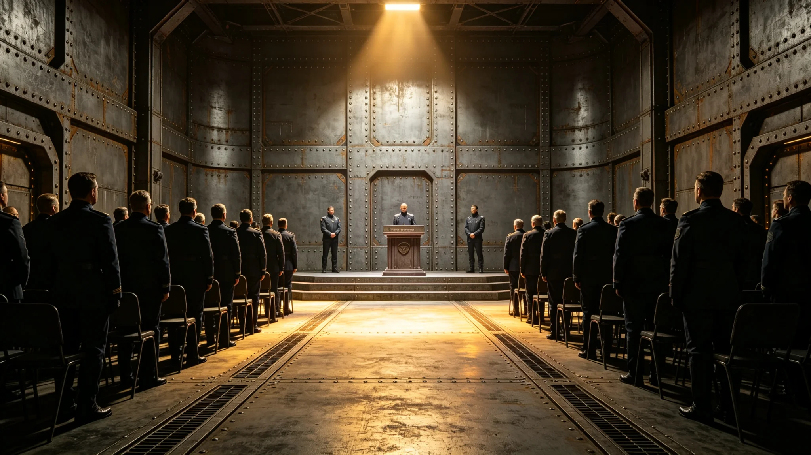

**编制单位**：联合体深空外交署礼宾司
**编制日期**：3750年1月15日
**规程编号**：PRO-CER-3750-021

## 一、仪式时间与地点

建交一周年纪念仪式定于3750年2月3日上午十时，在"晶环"站双方会晤厅举行。仪式由礼宾总长程礼仪（见GS-3754-01）主持。

## 二、参加人员

我方参加人员：大使沈远谟（见GS-3751-01）、翻译官苏译川（见GS-3752-01）、商务代表贾通商（见GS-3753-01）、文化特使文传声（见GS-3756-01）、使馆随员五人。

异星方参加人员：执政团首席代表、翻译员一人、文化官员两人、随员三人。

双方共二十一人参加。

## 三、仪式流程

| 时间 | 环节 | 负责方 |
|---|---|---|
| 10:00 | 双方代表入场 | 礼宾司 |
| 10:05 | 沈远谟大使致辞 | 我方 |
| 10:15 | 异星方首席代表致辞 | 异星方 |
| 10:25 | 双方互换纪念文本 | 双方 |
| 10:35 | 全体合影 | 礼宾司 |
| 10:45 | 仪式结束 | — |

## 四、座次安排

主席台座次安排如下：沈远谟居中，异星方首席代表居沈远谟左侧。苏译川居沈远谟右侧负责传译。贾通商、文传声分坐第二排两侧。

3751年1月建交一周年纪念宴会曾发生座次争议（见GS-3754-01），本规程座次安排已按"级别相同者按到达时间排列"规则执行。

## 五、纪念文本

纪念文本以建交公报（见GS-3759-01）为基础，追加一周年回顾内容。文本以双语缮写，双方各执一份。沈远谟与异星方首席代表在纪念文本上签字。

## 六、纪念宴会

仪式结束后举行纪念宴会。宴会菜单由礼宾处提前一周与异星方文化官员协商确认，标注可能不适宜之菜品（见GS-3777-01关联）。宴会祝酒顺序：沈远谟先祝酒，异星方首席代表后祝酒。

## 七、筹备记录

本仪式筹备自3750年1月15日开始，共筹备十九天。筹备内容包括：场地布置、座次安排、菜单确认、纪念文本缮写、双方人员通知。

程礼仪在筹备日志中写：一周年不算大庆，但也不能马虎。

## 八、筹备工作记录

本仪式筹备自3750年1月15日开始，程礼仪（见GS-3754-01）主持筹备工作。筹备内容包括：场地布置（会晤厅清洁、座椅排列、横幅悬挂）、座次安排（按级别与到达时间排列）、菜单确认（与异星方文化官员协商）、纪念文本缮写（双语）、双方人员通知。

## 九、仪式执行情况

仪式按规程执行，全程无差错。沈远谟致辞约八分钟，异星方首席代表致辞约七分钟。纪念文本交换后全体合影。宴会按座次表就座，无争议。

## 十、后续

一周年仪式成功举办后，双方约定逢五周年、十周年大庆时增加仪式规模。普通周年纪念日维持现有规模。

## 十一、纪念宴会菜单

纪念宴会菜单由程礼仪与异星方文化官员协商确认，共六道菜品。其中三道为老地球菜品，两道为异星方菜品，一道为双方合做菜。菜单中标注了可能引起食物不耐受之菜品（见GS-3777-01关联），赴宴人员自行选择是否食用。

## 十二、纪念活动媒体记录

纪念仪式由使馆随员用终端拍照记录，照片存于使馆档案室。仪式未对外公开，无媒体参与。

## 十三、仪式预算

纪念仪式预算约五万折合跨星系记账单位，包括：场地布置一万、餐饮二万、纪念文本缮写五千、摄影记录五千、其他五千。决算后报外交署审计。

## 十四、仪式后续跟进

仪式结束后，程礼仪在两天内提交活动总结，总结包括流程执行情况、有无偏差、改进建议。总结报礼宾司存档。

## 十五、仪式签到表

仪式签到表共二十一人签字，其中我方十二人、异星方九人。签到表存于使馆档案室。签到表记录了每人到场时间、离场时间。全体人员按时到场，无人迟到或早退。

## 十六、仪式反馈

仪式结束后，程礼仪向全体参与人员发放反馈表。反馈表回收十九份，约九成认为仪式流程清晰、座次安排合理、餐饮口味适宜。一份反馈认为仪式时间略长。

## 十七、仪式预算决算

纪念仪式实际支出约四万八千折合跨星系记账单位，预算约五万，节余约两千。节余部分上缴外交署。决算报告经程礼仪签批后报礼宾司审计。

## 十八、仪式后续历史

建交一周年纪念仪式成功举办后，双方约定此后每年2月3日为建交纪念日。逢五周年、十周年大庆时增加仪式规模。普通周年纪念日维持现有规模，举行简短纪念宴会。

## 十九、仪式经费来源

纪念仪式经费由外交署年度预算列支。3750年度纪念仪式经费约五万，从外交服务产业预算中调拨。经费使用经沈远谟签批，决算报审计。

## 二十、仪式参与人员签到记录摘要

参与人员签到记录摘要：我方十二人全部到场、异星方九人全部到场。签到时间集中在上午九时三十分至九时四十五分之间。无人迟到。

## 二十一、仪式后续档案

仪式档案包括：签到表、照片、预算决算报告、反馈表、活动总结。档案存于使馆档案室，保存期限为永久。

## 二十二、仪式参与人员后续评价

参与人员后续评价：约九成认为仪式有助于增进双方友谊。约一成认为仪式流程可进一步简化。程礼仪在总结中写：纪念仪式不是走过场，是两文明对建交的郑重确认。
