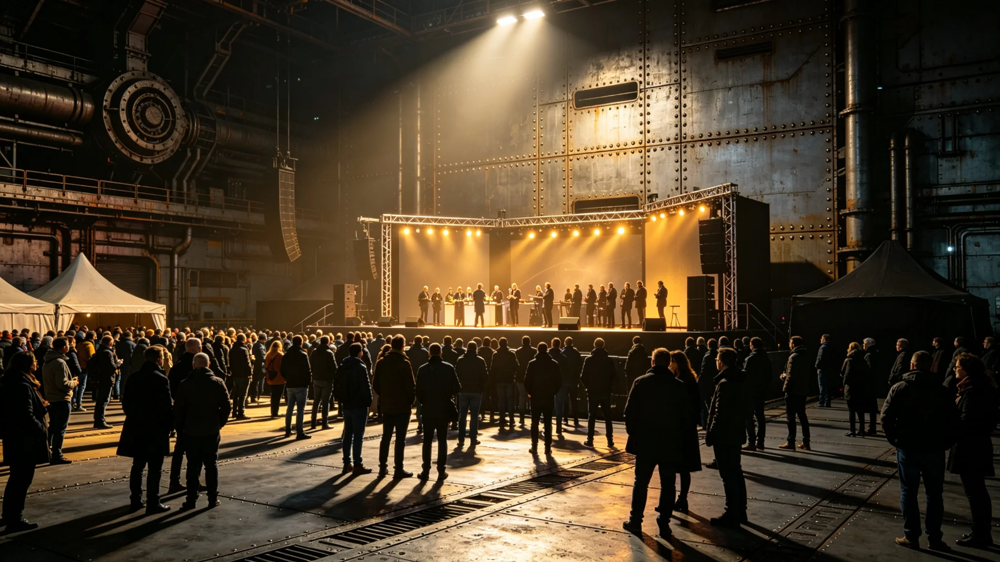

---
author_ai: Doubao
date: 3750-02-20
archive_id: GS-3781-01
coord: 文化×多星纪元×跨星系带×仪式学派×跨文明文化节
school: 仪式学派
threads: [system/cultural-festival, system/exchange]
image: world/生图集/1281.webp
title: 首届跨文明文化节规程
canon_check: 承接GS-3756文传声组织；本档为3750年2月首届跨文明文化节规程；仪式规程体；正文无纪元名。
---

**编制单位**：联合体深空文化署
**编制日期**：3750年2月20日
**规程编号**：CUL-FEST-3750-022

## 一、文化节宗旨

首届跨文明文化节旨在增进双方文明之间之文化了解，展示双方艺术、音乐、饮食、民俗等文化成果。文化节由文化交流特使文传声（见GS-3756-01）负责组织。

## 二、时间与地点

文化节定于3750年6月15日至17日，在"晶环"站文化交流中心举行。为期三天。

## 三、活动安排

| 日期 | 活动 | 内容 |
|---|---|---|
| 6月15日上午 | 开幕式 | 双方代表致辞、文艺表演 |
| 6月15日下午 | 我方文化展 | 老地球绘画、音乐、饮食 |
| 6月16日上午 | 异星文化展 | 异星绘画、音乐、饮食 |
| 6月16日下午 | 联合文艺演出 | 双方艺术家联合表演 |
| 6月17日上午 | 文化研讨会 | 双方学者讨论文化交流 |
| 6月17日下午 | 闭幕式 | 总结发言、合影 |

## 四、筹备工作

筹备工作自3749年12月开始，共筹备六个月。筹备内容包括：

1. 与异星方文化官员协商活动方案（文传声负责）；
2. 选定我方参展作品与艺术家（文化署负责）；
3. 场地布置与设备调试（礼宾处负责）；
4. 宣传通知与人员报名（文化处负责）。

3749年10月曾发生礼品文化背景调查不足事件（见GS-3756-01关联），文化节所有展品均经双方审查员联合审核后方可展出。

## 五、开幕式规程

开幕式于6月15日上午十时举行。流程如下：

1. 双方代表入场（程礼仪负责引导）；
2. 文传声致开幕词；
3. 异星方文化官员致辞；
4. 双方艺术家联合表演第一个节目；
5. 开幕式结束，观众入场参观。

## 六、参会人员

文化节预计参会人员约三百人，其中我方约一百五十人，异星方约一百五十人。参会人员包括使馆人员、文化界代表、科考队人员、异星方文化界代表。

## 七、后续

首届文化节成功举办后，双方商定每两年举办一届。第二届定于3752年6月在我方跨星系港举行。

## 八、参展作品审核

所有参展作品均经双方审查员联合审核。3751年6月艺术展期间（见GS-3784-01），我方一幅抽象画作被异星方审查员认为图案具有攻击性而撤出展览（见GS-3756-01关联）。此事件后，文化节参展作品审核流程增加一道异星方审查员确认环节。

## 九、参会人员报名

文化节参会人员需提前一周报名，由文化处登记。3750年首届文化节预计参会约三百人，实际参会约二百八十人。

## 十、文化节经费

首届文化节经费约四十万折合跨星系记账单位，由文化署财政拨款。经费主要用于场地布置、展品运输、餐饮。决算报告见GS-3791-01。

## 十一、文化节安全保障

文化节期间安全由使馆安保处负责。出入口设安检，参会人员须凭报名确认入场。文化节期间安保人员四人二十四小时值班。

## 十二、文化节后续活动

文化节闭幕后，部分优秀展品在"晶环"站文化交流中心继续展出一个月。我方展品于文化节结束后运回跨星系港，异星方展品由其方运回。

## 十三、文化节日程细节

6月15日上午开幕式后，下午我方文化展开放。我方展览内容：老地球绘画二十幅、音乐现场演奏两场、饮食体验区一个。异星方展览于次日开放。

6月16日下午联合文艺演出，我方演奏员三人与异星方演奏员三人联合演出，曲目为双方传统音乐改编。

## 十四、文化节闭幕式

6月17日下午闭幕式，文传声总结三天活动，双方代表致辞。闭幕式后合影，文化节结束。

## 十五、文化节参展作品统计

我方参展作品四十二件：绘画二十八件、摄影八件、工艺制品六件。异星方参展作品三十六件：绘画二十件、工艺制品十六件。全部作品均经双方审查员联合审核。

## 十六、文化节票务

文化节不收取门票，凭报名确认入场。报名确认由文化处提前一周发放。文化节期间实际参会约二百八十人，略少于预计三百人。

## 十七、文化节预算决算

文化节实际支出约三十八万折合跨星系记账单位，预算约四十万，节余约两万。节余部分上缴文化署。决算报告经文传声签批后报文化署审计。

## 十八、文化节历史回顾

首届文化节于3750年6月成功举办。第二届于3752年6月在我方跨星系港举办。第三届定于3754年6月在异星方首都举办。文化节每两年一届，轮流在双方举办。

## 十九、文化节经费来源

文化节经费由文化署年度预算列支。3750年度文化节经费约四十万，从文化交流产业预算中调拨。经费使用经文传声签批，决算报审计。

## 二十、文化节期间天气记录

文化节期间天气记录：6月15日晴、6月16日多云、6月17日晴。气温约十五至二十五摄氏度。天气良好，适合户外活动。

## 二十一、文化节后续档案

文化节档案包括：参展作品清单、观众签到表、照片、预算决算报告、活动总结。档案存于文化署档案室，保存期限为十年。

## 二十二、文化节参与人员后续评价

参与人员后续评价：约九成认为文化节有助于了解异星文化。约一成认为场地略小。文传声在总结中写：文化节不是展览，是两文明坐在一起过日子。
