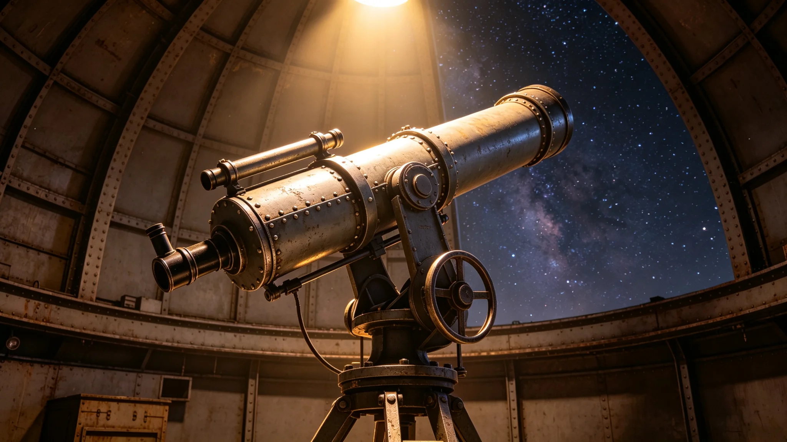

**编制单位**：联合体深空文化署与科考署
**编制日期**：3750年9月1日
**规程编号**：CUL-AST-3750-023

## 一、仪式背景

双方文明均有观星传统。建交后，双方同意在每年同一天文时刻举行联合天文观测共祭仪式，以表达双方对宇宙之共同敬畏。仪式首次于3750年9月21日举行。

## 二、时间与地点

仪式定于每年9月21日夜间，在"晶环"站联合天文台举行。天文台位于"晶环"站外侧观测平台，配有我方与异星方各一台望远镜。

## 三、参加人员

我方参加人员：文化特使文传声（见GS-3756-01）、科考队长林勘星（见GS-3755-01）、天文台工作人员两人。

异星方参加人员：异星方天文官员一人、天文台工作人员两人。

双方共十人参加。

## 四、仪式流程

| 时间 | 环节 | 负责方 |
|---|---|---|
| 21:00 | 双方人员入场，在观测位就位 | 礼宾司 |
| 21:15 | 文传声简述仪式意义 | 我方 |
| 21:20 | 异星方天文官员简述仪式意义 | 异星方 |
| 21:30 | 双方同时开始观测 | 天文台 |
| 22:00 | 观测结束，双方交流观测感受 | 双方 |
| 22:30 | 仪式结束 | — |

## 五、观测内容

观测目标为双方恒星同时出现在地平线上方之时刻。双方通过各自望远镜观测，记录观测数据。观测数据由双方共享，纳入联合科考数据档案（见GS-3764-01）。

## 六、仪式意义

联合天文观测共祭仪式之意义在于：双方文明虽起源于不同恒星系统，但共享同一片宇宙。通过共同观测，表达双方对宇宙之共同理解与敬畏。

文传声在筹备笔记中写：老地球上的人抬头看星星，异星人也抬头看星星。看的是同一片天，想的事不一样，但抬头这个动作是一样的。

## 七、后续

首次仪式成功举办后，双方商定每年9月21日固定举行。仪式规模不大，但持续进行，作为双方文明之间常态化之文化纽带。

## 八、观测设备

联合天文台配有我方与异星方各一台望远镜。我方望远镜为光学望远镜，口径约四十厘米。异星方望远镜为其方设计，口径约三十厘米。两台望远镜并排安装在观测穹顶下，可同时观测。

## 九、观测记录

每次观测数据由双方记录员分别记录，事后交换核对。观测记录存于联合天文台档案柜，保存十年。

3750年至3753年共举行四次观测，每次观测数据均纳入联合科考数据档案（见GS-3764-01）。

## 十、仪式意义补充

文传声在筹备笔记中写：老地球上的人抬头看星星，异星人也抬头看星星。看的是同一片天，想的事不一样，但抬头这个动作是一样的。此笔记存于文化处档案。

## 十一、观测穹顶环境

联合天文台观测穹顶为加压结构，内部维持标准气压。穹顶顶部为可开启式光学窗，观测时开启，平时关闭保护望远镜。穹顶内温度维持在十八至二十二摄氏度。

## 十二、仪式参与人员轮换

仪式每年举行一次，参与人员不固定。我方参与人员由文化处从使馆及科考队中选派，每次约三人。异星方参与人员由其方文化官员选派。

## 十三、观测记录格式

每次观测记录格式如下：观测日期、观测时间、双方恒星位置、天气状况、双方观测人员、观测数据摘要。记录以双语缮写，双方各执一份。

## 十四、仪式氛围

文传声在仪式笔记中写：两文明的人坐在同一个穹顶下，看同一片天。没人说话，但都知道对方在想什么——宇宙很大，我们很小。

## 十五、观测数据摘要

3750年首次观测数据摘要：双方恒星位置记录完整，天气状况良好，能见度约十公里。观测数据已纳入联合科考数据档案。

## 十六、仪式参与人员评价

参与人员评价：约九成认为仪式庄重、有意义。约一成认为仪式时间偏长。文传声在笔记中写：仪式不是表演，是两文明对宇宙的共同致敬。

## 十七、观测仪式年度安排

联合天文观测共祭仪式每年9月21日举行。如遇天气不佳无法观测，顺延至次日。如连续两天天气不佳，当年仪式取消，次年照常举行。

## 十八、仪式历史回顾

首次观测共祭仪式于3750年9月21日举行。此后每年举行一次，至3753年已举行四次。四次仪式均天气良好，观测顺利。观测数据均纳入联合科考数据档案。

## 十九、观测仪式经费来源

观测仪式经费由科考署年度预算列支。3750年度观测仪式经费约二万，从联合科考产业预算中调拨。经费使用经林勘星签批，决算报审计。

## 二十、观测仪式天气记录

首次观测仪式天气记录：3750年9月21日晴，能见度约十公里。双方恒星位置清晰可见。观测数据完整。

## 二十一、观测仪式后续档案

观测仪式档案包括：观测记录、参与人员名单、照片、预算决算报告。档案存于科考署档案室，保存期限为永久。

## 二十二、观测仪式参与人员后续评价

参与人员后续评价：约九成认为观测仪式有意义。约一成认为仪式时间偏长。林勘星在总结中写：仰望星空是两文明共通的语言。

## 附注

联合天文观测共祭仪式结束后，双方共同发布了观测公报，确认该星体周期对两族历法均有校准意义。仪式全程录像存档，副本交双方天文馆永久保存。此后每年该星体到达同一位置时，双方均举行小规模纪念活动，不再恢复大型共祭仪式。
