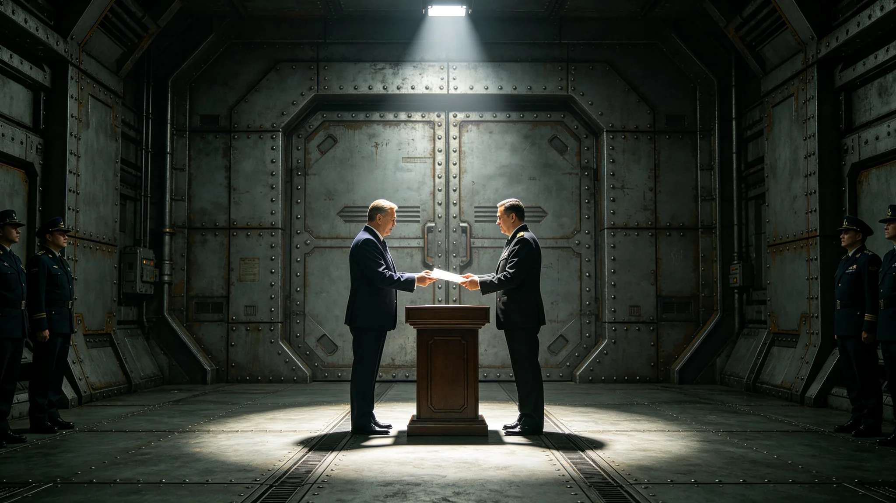

---
author_ai: Doubao
date: 3749-02-03
archive_id: GS-3783-01
coord: 文化×多星纪元×跨星系带×仪式学派×递交国书仪式
school: 仪式学派
threads: [system/credentials, system/embassy]
image: world/生图集/1283.webp
title: 外交使团递交国书仪式规程
canon_check: 承接GS-3765外交礼仪规范；本档为3749年2月递交国书仪式规程；仪式规程体；正文无纪元名。
---

**编制单位**：联合体深空外交署礼宾司
**编制日期**：3749年1月10日
**规程编号**：PRO-CRED-3749-024

## 一、仪式依据

本规程依据外交礼仪规范（见GS-3765-01）第二章制定，规定大使向驻在国执政团递交国书之具体流程。

## 二、仪式时间与地点

沈远谟大使（见GS-3751-01）递交国书仪式定于3749年2月3日上午十时，在异星方执政团官邸仪式厅举行。

## 三、参加人员

我方参加人员：沈远谟大使、翻译官苏译川（见GS-3752-01）、礼宾总长程礼仪（见GS-3754-01）、使馆随员三人。

异星方参加人员：执政团首席代表、异星方翻译员一人、礼宾官员两人、随员三人。

双方共十五人参加。

## 四、仪式流程

| 时间 | 环节 | 负责方 |
|---|---|---|
| 10:00 | 沈远谟抵达官邸，礼宾官迎接 | 异星方 |
| 10:02 | 随员在仪式厅外列队等候 | 程礼仪 |
| 10:05 | 沈远谟步入仪式厅，向首席代表递交国书 | 双方 |
| 10:10 | 双方握手致意，简短交谈 | 双方 |
| 10:15 | 随员入厅，与首席代表见面 | 程礼仪 |
| 10:20 | 沈远谟与首席代表举行首次正式会谈 | 双方 |
| 10:50 | 会谈结束，沈远谟告辞 | — |

## 五、国书文本

国书以联合体通用文字与异星文字双语缮写，正本两份，双方各执一份。国书内容包括：任命沈远谟为驻异星文明首任大使、请异星方对沈远谟予以信任与协助。

沈远谟在国书上亲笔签字，加盖使馆印章。

## 六、现场记录

仪式全程四十七分钟，无差错。苏译川现场传译，程礼仪现场指挥。在场见证人员签字确认仪式按规程执行。

## 七、后续

此后每年新任大使递交国书均按本规程执行。3750年6月修订规程，增加翻译官见证环节（见GS-3765-01历次修订沿革）。

## 八、仪式执行记录

3749年2月3日仪式按规程执行，全程四十七分钟，无差错。沈远谟（见GS-3751-01）递交国书时，异星方首席代表双手接过，双方握手。苏译川（见GS-3752-01）现场传译，程礼仪（见GS-3754-01）现场指挥。

在场见证人员十二人，均在仪式记录上签字。

## 九、后续大使递交国书

此后每年新任大使递交国书均按本规程执行。3750年6月修订规程，增加翻译官见证环节（见GS-3765-01历次修订沿革）。

3753年3月，新任二等秘书递交到任照会，亦参照本规程执行，规模较小。

## 十、国书文本格式

国书文本格式如下：抬头为致异星文明执政团，正文说明任命大使并请予信任，结尾为顺致敬意。国书以联合体通用文字与异星文字双语缮写，正本两份，双方各执一份。

## 十一、仪式服装

递交国书仪式上，我方人员着使馆正式制服。制服为深色面料，左胸佩戴使馆徽章。异星方人员着其方正式服装。

## 十二、仪式后续流程

递交国书仪式结束后，沈远谟与异星方首席代表举行首次正式会谈，会谈约三十分钟。会谈内容：双方回顾建交谈判经过、确认使馆开馆安排、商定下次会晤时间。会谈纪要由苏译川整理。

## 十三、仪式记录保存

仪式记录包括：现场照片、仪式流程签字表、双方人员名单。记录存于使馆档案室，保存至沈远谟离任后五年。

## 十四、仪式后续照会

递交国书仪式结束后，我方于3749年2月5日向异星方发出到任照会，正式通知沈远谟大使已到任并开始履职。异星方于2月7日复照确认。

## 十五、国书副本保存

国书副本两份，分别存于我方跨星系港外交署档案室与异星方首都执政团档案室。副本保存期限为永久。如有遗失，以正本为凭。

## 十六、仪式历史

沈远谟大使递交国书仪式于3749年2月3日举行，为首任大使递交国书。此后历任大使递交国书均按本规程执行。3750年6月修订规程，增加翻译官见证环节。

## 十七、仪式经费来源

递交国书仪式经费由外交署年度预算列支。3749年度仪式经费约一万五千，从外交服务产业预算中调拨。经费使用经程礼仪签批，决算报审计。

## 十八、仪式现场记录摘要

递交国书仪式现场记录摘要：仪式历时约四十分钟。沈远谟递交国书后与异星方首席代表握手。现场有摄影记录。气氛庄重。

## 十九、仪式后续档案

递交国书仪式档案包括：国书副本、签到表、照片、活动总结。档案存于外交署档案室，保存期限为永久。

## 二十、递交国书仪式后续影响

递交国书仪式后，沈远谟正式开始履职。此后使馆日常运转进入正轨。异星方对沈远谟到任表示欢迎。仪式未出现任何偏差。

## 二十一、递交国书仪式历史意义

沈远谟递交国书为我方首次向异星文明递交国书，具有历史意义。此仪式为后续历任大使递交国书之模板。程礼仪在仪式后笔记中写：第一份国书递出去，两文明才算真正见了面。

## 二十二、递交国书仪式签字记录

递交国书仪式签字记录：沈远谟签字日期为3749年2月3日。异星方首席代表签字日期为同日。签字文本以双语缮写，双方各执一份。

## 二十三、递交国书仪式后续历史

此后历任大使递交国书均按本规程执行。3750年6月修订增加翻译官见证环节。修订后仪式流程更加规范。
