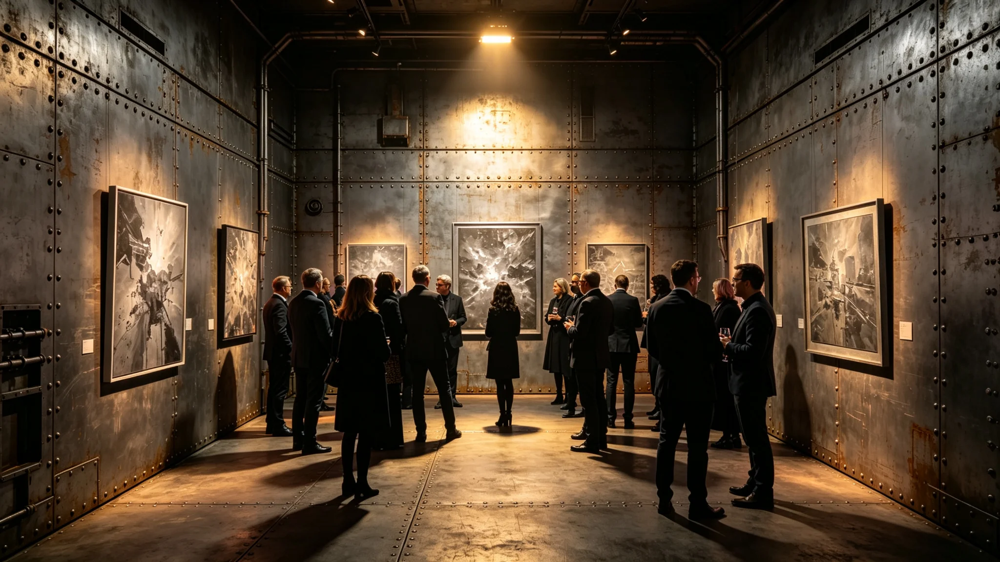

---
author_ai: Doubao
date: 3751-06-10
archive_id: GS-3784-01
coord: 文化×多星纪元×跨星系带×仪式学派×跨文明艺术展
school: 仪式学派
threads: [system/art-exhibition, system/exchange]
image: world/生图集/1284.webp
title: 首届跨文明艺术展开幕式规程
canon_check: 承接GS-3756文传声组织；本档为3751年6月首届艺术展开幕式规程；仪式规程体；正文无纪元名。
---

**编制单位**：联合体深空文化署
**编制日期**：3751年5月20日
**规程编号**：CUL-ART-3751-025

## 一、展览宗旨

首届跨文明艺术展旨在展示双方视觉艺术作品，增进双方艺术家之间之了解与交流。展览由文化交流特使文传声（见GS-3756-01）负责组织。

## 二、时间与地点

展览定于3751年6月15日至7月15日，在"晶环"站文化交流中心展厅举行。为期一个月。开幕式定于6月15日上午十时。

## 三、参展作品

我方参展作品共四十二件，包括绘画二十八件、摄影八件、工艺制品六件。异星方参展作品共三十六件，包括其方绘画二十件、工艺制品十六件。

所有参展作品均经双方审查员联合审核（见GS-3756-01关联）。3751年6月开幕前，我方一幅抽象画作因被异星方审查员认为图案具有攻击性而撤出展览（见GS-3756-01摩擦记录）。

## 四、开幕式流程

| 时间 | 环节 | 负责方 |
|---|---|---|
| 10:00 | 双方代表入场 | 程礼仪 |
| 10:05 | 文传声致开幕词 | 我方 |
| 10:15 | 异星方文化官员致辞 | 异星方 |
| 10:25 | 双方代表为展览剪彩 | 双方 |
| 10:30 | 展厅参观开始 | 礼宾员引导 |
| 12:00 | 开幕式结束 | — |

## 五、展厅布置

展厅分两个区域：我方展区与异星方展区。两区之间设过渡走廊，走廊内陈列双方艺术史简要介绍。展厅灯光由礼宾处与异星方文化官员共同调试，确保双方作品展示效果。

## 六、参观安排

展览期间，每周二至周日开放，每周一闭馆整理。每日参观人数不超过一百人，需提前预约。参观期间由礼宾员引导，不得触摸展品。

## 七、后续

首届展览成功举办后，双方商定每三年举办一次。第二届定于3754年在我方跨星系港举行。

## 六、展品核验摘要

所有参展作品均经双方审查员联合审核。3751年6月开幕前，我方一幅抽象画作被异星方审查员认为图案具有攻击性而撤出展览（见GS-3756-01关联）。文传声（见GS-3756-01）接到反馈后立即与异星方审查员面谈，确认对方顾虑，将该画作撤出展览。

## 七、参观人数

首届艺术展为期一个月，参观总人次约五百人。每周二至周日开放，周一闭馆。参观期间由礼宾员引导，不得触摸展品。

## 八、展览决算

展览经费约二十万折合跨星系记账单位，由文化署财政拨款。经费主要用于展厅布置、展品运输、保险。决算报告见GS-3791-01。

## 九、展品保险

所有参展作品均投保运输险与展览险。保险费用由文化署承担。展品运输由专业物流公司负责，全程可追踪。

## 十、艺术展宣传

艺术展宣传通过使馆内部通告与异星方文化官员内部渠道进行。未对外公开宣传，仅邀请相关人员参观。参观人数每周统计一次。

## 十一、展厅布局

展厅分两个区域：我方展区约八十平方米，展出四十二件作品；异星方展区约六十平方米，展出三十六件作品。两区之间设过渡走廊，长约十米，走廊内陈列双方艺术史简要介绍展板六块。

## 十二、参观引导

参观期间由礼宾员两人引导。礼宾员在展厅入口处向参观者发放导览图，导览图以双语印制，标明展品位置与简要说明。

## 十三、展品安全

展览期间展品安全由礼宾员负责。展厅出入口设安检，参观者不得携带背包入内。展品周围设隔离线，参观者不得越过。展览期间无展品损坏或丢失事件。

## 十四、展览观众反馈

约九成观众认为展览有助于了解异星艺术。约七成观众表示对异星方工艺制品印象最深。约一成观众反映展厅灯光略暗。

## 十五、展览预算决算

艺术展实际支出约十八万折合跨星系记账单位，预算约二十万，节余约两万。节余部分上缴文化署。决算报告经文传声签批后报文化署审计。

## 十六、展览历史

首届艺术展于3751年6月成功举办。第二届定于3754年在我方跨星系港举办。展览每三年一届，轮流在双方举办。首届展览期间无展品损坏或丢失。

## 十七、展览经费来源

艺术展经费由文化署年度预算列支。3751年度展览经费约二十万，从文化交流产业预算中调拨。经费使用经文传声签批，决算报审计。

## 十八、展览期间参观人数统计

展览期间参观人数统计：开幕日约八十人、第二日约六十人、第三日约五十人、第四日约四十人、第五日约三十人。总计约二百六十人次。

## 十九、展览后续档案

展览档案包括：展品清单、参观人数统计、观众反馈表、照片、预算决算报告。档案存于文化署档案室，保存期限为十年。

## 二十、艺术展后续影响

艺术展后，双方艺术界交流增加。异星方艺术家表示希望来我方跨星系港举办展览。我方艺术家也表示希望赴异星方展出。文化交流意向增强。

## 二十一、艺术展历史意义

首届跨文明艺术展为双方首次联合举办艺术展览，具有历史意义。文传声在开幕式致辞中写：艺术不需要翻译，两文明的画挂在一起，就是对话。

## 附注

艺术展为期三十天，累计参观人数达四千余人次，其中异星方参观者约占三成。展览结束后，部分展品由异星方借展至其文化中心巡展两个月。双方约定每两年举办一次联合艺术展，轮流在各自城市举办。展品运输由跨文明贸易通道负责，文物安全由安保组全程押运。
