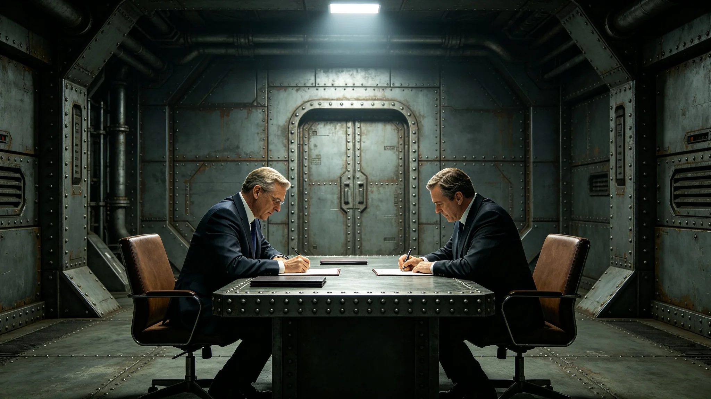

**编制单位**：联合体深空外交署礼宾司
**编制日期**：3751年11月20日
**规程编号**：PRO-PEACE-3751-026

## 一、仪式依据

本规程依据外交礼仪规范（见GS-3765-01）制定，规定跨文明贸易协定（见GS-3761-01）及相关和平条约之签署流程。

## 二、仪式时间与地点

签署仪式定于3751年12月8日上午十时，在"晶环"站双方会晤厅举行。

## 三、参加人员

我方参加人员：大使沈远谟（见GS-3751-01）、商务代表贾通商（见GS-3753-01）、翻译官苏译川（见GS-3752-01）、礼宾总长程礼仪（见GS-3754-01）、随员三人。

异星方参加人员：执政团首席代表、贸易代表一人、翻译员一人、礼宾官员两人、随员三人。

双方共二十人参加。

## 四、签署流程

| 时间 | 环节 | 负责方 |
|---|---|---|
| 10:00 | 双方代表入场 | 程礼仪 |
| 10:05 | 沈远谟简述贸易协定谈判经过 | 我方 |
| 10:15 | 异星方首席代表简述谈判经过 | 异星方 |
| 10:25 | 双方全权代表在条约文本上签字 | 双方 |
| 10:35 | 双方交换签字文本 | 双方 |
| 10:40 | 双方握手致意 | 双方 |
| 10:45 | 全体合影 | 礼宾司 |
| 11:00 | 仪式结束 | — |

## 五、签署文本

签署文本为跨文明贸易协定（见GS-3761-01），以联合体通用文字与异星文字双语缮写，正本两份。双方全权代表在两份文本上分别签字，然后交换，各执一份。

贾通商（见GS-3753-01）在签署后笔记中写：晚三个月不算晚，谈拢了比谈快了要紧。

## 六、签字台布置

签字台由程礼仪主持布置。台上铺深色台面，放置两份条约文本、双方签字笔、镇纸。签字台两侧各设一把座椅，供双方全权代表就坐签字。签字台前方设见证人席位，苏译川与异星方翻译员在场见证。

## 七、后续

签署仪式结束后，双方举行简短庆祝宴会。宴会菜单按礼宾规范提前确认。条约自签署之日起生效。

## 八、签署文本副本

签署文本正本两份，双方各执一份。副本四份，分别存于我方跨星系港外交署、异星方首都执政团、"晶环"站使馆、"晶环"站仲裁庭（见GS-3763-01）。

## 九、签署后活动

签署仪式结束后，双方举行简短庆祝宴会。宴会菜单由程礼仪（见GS-3754-01）提前一周与异星方文化官员协商确认。祝酒顺序：沈远谟先祝酒，异星方首席代表后祝酒。

## 十、签署仪式安保

签署仪式期间安保由使馆安保处负责。会晤厅出入口设安检，参会人员凭邀请进入。安保人员四人在场值班。

## 十一、签署后公告

签署仪式结束后，双方通过外交加密通信线路（见GS-3768-01）各自向本国发布公告。公告内容以双语缮写，简述签署日期与主要条款。

## 十二、签署仪式预算

签署仪式预算约三万折合跨星系记账单位，包括：场地布置五千、签署文本缮写五千、庆祝宴会一万五千、摄影记录五千。决算后报外交署审计。

## 十三、签署仪式参与人员名单

我方：沈远谟、贾通商、苏译川、程礼仪、随员三人。异星方：执政团首席代表、贸易代表一人、翻译员一人、礼宾官员两人、随员三人。共二十人。

## 十四、签署后文本分发

签署文本正本两份双方各执一份。副本四份分别存于：跨星系港外交署、异星方首都执政团、"晶环"站使馆、"晶环"站仲裁庭。副本分发于签署后一周内完成。

## 十五、签署仪式后续报道

签署仪式结束后，双方通过各自内部渠道发布简短报道。报道未对外公开，仅在双方内部传播。报道内容以双语撰写，简述签署日期与主要条款。

## 十六、签署仪式预算决算

签署仪式实际支出约二万八千折合跨星系记账单位，预算约三万，节余约两千。节余部分上缴外交署。决算报告经程礼仪签批后报礼宾司审计。

## 十七、签署仪式历史

贸易协定签署仪式于3751年12月8日举行。此后双方签署补充协定时，仪式规模相应缩小。补充协定签署不举行大型仪式，仅双方全权代表签字后交换文本。

## 十八、签署仪式经费来源

签署仪式经费由外交署年度预算列支。3751年度仪式经费约三万，从外交服务产业预算中调拨。经费使用经程礼仪签批，决算报审计。

## 十九、签署仪式现场记录摘要

签署仪式现场记录摘要：仪式历时约三十分钟。双方全权代表签字后交换文本。现场有摄影记录。气氛庄重而友好。

## 二十、签署仪式后续档案

签署仪式档案包括：签署文本副本、签到表、照片、预算决算报告。档案存于外交署档案室，保存期限为永久。

## 二十一、签署仪式后续影响

签署仪式后，贸易协定正式生效。双方开始按协定条款执行。首批贸易货物于3752年1月启运。签署仪式标志着两文明贸易关系进入新阶段。

## 二十二、签署仪式历史意义

贸易协定签署为两文明首次签署贸易协定，具有历史意义。贾通商在签署仪式后写：签下去的不只是纸，是两文明往后几十年的日子。

## 二十三、签署仪式签字记录

贸易协定签署仪式签字记录：我方全权代表贾通商签字日期为3751年12月8日。异星方全权代表签字日期为同日。
