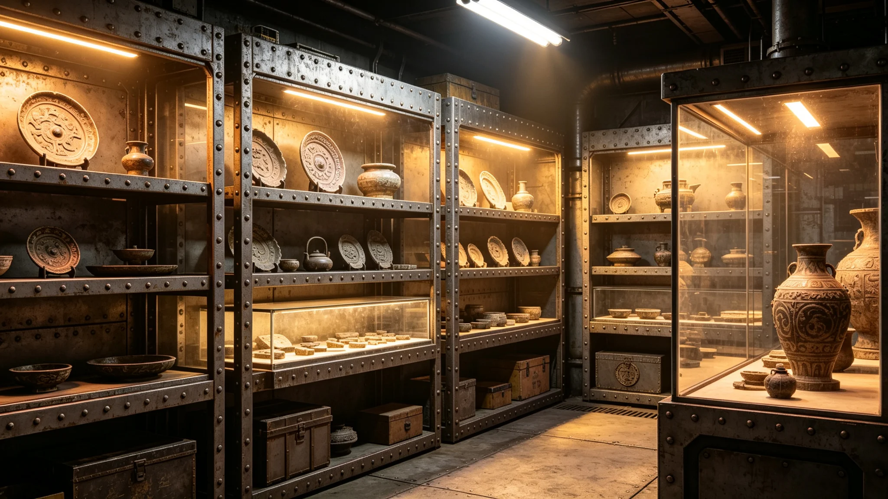

# 异星文物交易产业年度决算报告（3752 年度）

**编制单位**：联合体深空文化署
**编制日期**：3753年4月1日
**报告年度**：3752年度
**报告编号**：CUL-FIN-3753-030
**卷宗号**：文决-3752-交易　本卷附证两件

兹将异星文物交易产业3752年度决算汇列如后。范围三项：异星文物进出口审批、检疫、交易税收。退回单与复验记录附卷。

## 一、收支计数总表

| 项 | 3752年度（跨星系记账单位） |
|---|---|
| 进口交易额 | 约一百八十万 |
| 出口交易额 | 约一百四十万 |
| **交易额合计** | **约三百二十万** |
| 文物交易税收 | 约十五万（按交易额百分之五征收） |
| 检疫成本 | 约二十万 |
| 管理人员经费 | 约十五万 |
| **总支出** | **约三十五万** |
| 收入 | 约十五万 |
| 逆差 | 二十万，由联合体财政补贴 |

审批计数：进口申请四十二件，批准三十八件，退回四件｜出口申请二十六件，批准二十三件，退回三件。

审批流程：申请人提交申请→检疫部门检疫→文化署审批→海关放行，平均耗时约三十个工作日。审批不通过者书面退回。

## 二、书面退回单（存根，附一件）

> **书面退回单　卷内附证一**
> 事由：进口申请一件，审批不通过，书面退回。
> 检疫栏：已检疫，勾选一次，未见异常。
> 退回理由：手书于文化价值审查一栏，字迹两处涂改，原件附卷。
> 审批人签名略，收件人签收（略）。照准。
> 骑缝存根，逐件立单，计数见总表。

## 三、检疫争议复验记录（存根，附一件）

> **复验记录　卷内附证二**
> 事由：4月一批入境文物表面微生物超标，异星方出口商对消毒方法提出异议（见GS-3774-01）。
> 读数栏：表面微生物超标一项。复消毒后复验：合格，勾选一次。
> 处置：消毒方法复议一次，双方经办人到场，签字各一处。
> 结案：争议十五天后解决，未影响后续交易。我方签名略，异星方签认（译文附卷）。

复验记录无附页。争议既已结案，纸就到此为止。

## 四、品种与渠道（计数）

| 口径 | 分布 |
|---|---|
| 品种占比 | 异星工艺制品百分之四十、异星矿物标本百分之三十、异星植物标本百分之十五、其他百分之十五 |
| 附注口径（金额） | 异星石材文物约一百五十万、异星工艺制品约一百二十万、异星生物材料约五十万 |
| 正规渠道 | 三百余件，全部经检疫评估和文化价值审查 |

工艺制品交易额最大。

## 五、检疫成本

检疫成本约二十万：检疫设备维护约八万｜检疫人员工资约十万｜消毒材料费约二万。设备与消毒材料台账在检疫处，逐笔领用签名。

## 六、收入两口径

正表口径：收入约十五万，即文物交易税收。
附注口径：文物鉴定评估服务费为最大收入项，进出口通关代理次之。
两口径并存，本卷不合并。

税收专款专用：约十五万全部用于检疫部门设备更新与人员培训，不进入一般财政预算。

## 七、增长与展望

自3751年建交以来逐年增长：3751年度交易额约二百二十万，3752年度约三百二十万，年增长率约百分之四十五。

预计3753年度交易额约四百万、税收约二十万、支出约四十万，逆差由财政补贴。增长来源：跨文明艺术展（见GS-3784-01）带动异星工艺制品需求增加，跨文明文化交流深化。预计3754年度交易额约四百万；未来五年保持稳定增长，预计3757年度交易额约八百万。

## 八、从业人员与变动

从业人员约二十人：海关查验员约八人、检疫人员约四人、文化署审批人员约两人、其他约六人。名册在署，逐人签认。

变动：5月海关查验员一人新增、10月检疫人员一人新增。全年净增两人，年末在编约二十人。

## 九、年度事件（计数）

| 时间 | 事项 |
|---|---|
| 3月 | 检疫争议解决 |
| 6月 | 艺术展带动交易额增长 |
| 11月 | 首次异星生物材料进口 |

三项均顺利完成，事件登记簿逐笔勾选。

## 十、查处、培训与社保

非法交易查处案件共七起，涉案文物均已追缴，追缴清册在署，相关责任人按文物管制条例处罚。

培训两次：5月异星文物识别、10月检疫操作规程，由文化署与检疫处联合组织，费用约二万，考核合格率百分之百，考核卡在卷。

社会保障支出约八万：医疗保险约三万、养老保险约三万、工伤保险约二万，按联合体统一标准执行。

## 十一、审计与存档

本决算报告经文化署审计。审计结论：决算数据真实，交易额与税收记录完整，无虚报。审计报告编号WW-3753-01，附于本报告后。

本决算报告由文化署主管于3753年3月签批，存于文化署档案室，保存期限为十年；电子副本存于文化署办公终端，定期备份。

**记录人**：文化署（签名略）
**签批**：文化署主管（印）　**日期**：3753年3月

（文化署注：本卷附证两件，一件是退回去的，一件是争了十五天的。三百二十万过账，七起追缴入册。两个数都写在纸上，谁也不用替谁说好话。）
