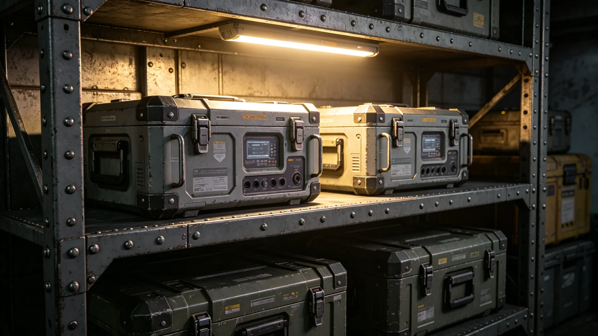

**编制单位**：联合体深空科考署
**编制日期**：3753年5月1日
**报告年度**：3752年度
**报告编号**：SCI-FIN-3753-031

## 一、决算范围

本报告为联合科考装备产业3752年度决算。范围包括：科考设备制造、维护、更新。

## 二、设备投入

3752年度联合科考队设备投入折合跨星系记账单位约一百二十万。投入设备如下：

| 设备 | 数量 | 费用 |
|---|---|---|
| 采样设备 | 一套 | 约四十万 |
| 通信设备 | 一套 | 约二十五万 |
| 异星环境适配舱 | 一个 | 约三十万 |
| 其他 | — | 约二十五万 |

## 三、设备维护费

设备维护费约三十万，包括：日常维护约十五万、故障维修约十万（见GS-3776-01关联）、备件库存约五万。

## 四、人员经费

科考队人员经费约四十万，包括：队长林勘星（见GS-3755-01）及队员工资。

## 五、总支出

3752年度科考装备产业总支出折合跨星系记账单位约一百九十万。费用分摊按联合科考资源共享协议（见GS-3764-01）执行，我方承担约六成，异星方承担约四成。

## 六、我方支出

我方实际支出约一百一十五万。其中设备投入七十万、维护十八万、人员经费二十七万。

## 七、下年度展望

预计3753年度科考装备产业总支出约二百一十万，增加部分主要为异星环境适配舱改进（见GS-3771-01后续改进计划）。

## 六、我方支出明细

我方实际支出约一百一十五万。其中设备投入七十万、维护十八万、人员经费二十七万。设备投入中，异星环境适配舱（见GS-3771-01）占三十万，为单项最大支出。

## 七、下年度设备改进

3753年度计划改进异星环境适配舱：延长续航时间、增加生物防护过滤层。改进费用预计约二十万。

## 八、设备故障率

3752年度联合科考设备故障率约百分之三。故障主要类型：传感器故障（约占四成）、接口松动（约占三成）、软件故障（约占二成）、其他（约占一成）。所有故障均现场修复或更换备件。

## 九、备件库存

"晶环"站备件库存价值约二十万。主要备件：传感器十套、接口模块五套、阀门二十个。备件每季度盘点一次，不足时从跨星系港补货。

## 十、科考队人员经费明细

科考队人员经费约四十万：队长林勘星约十万、采样技术员两人各约八万、通信技术员一人约八万、其他约六万。人员经费按联合体统一标准发放。

## 十一、科考装备产业与其他产业关系

科考装备产业与外交服务产业（见GS-3787-01）有交叉：科考队人员使用使馆通信设施。与翻译服务产业（见GS-3788-01）有交叉：科考报告翻译由翻译组承担。

## 十二、科考装备产业年度增长

3751年度科考装备费用约一百六十万，3752年度约一百九十万，年增长率约百分之十九。预计3753年度约二百一十万。增长原因为远征次数增加与设备更新。

## 十三、科考装备制造供应链

科考装备制造供应链：我方设备制造厂位于跨星系港，主要生产采样设备与通信设备。异星方设备制造厂位于其方首都附近，主要生产地表探测设备。双方设备通过跨星系班列运输。

## 十四、科考装备决算审计

本决算报告经科考署审计。审计结论：决算数据真实，设备投入与维护费记录完整，无虚报。审计报告附于本报告后。

## 十五、科考队员年度培训

3752年度科考队员培训三次：3月设备操作培训、6月互操作培训、9月安全培训。培训由科考署组织，费用约三万。培训后考核合格率百分之百。

## 十六、科考装备产业人员变动

3752年度科考队人员变动：3月采样技术员一人新增、9月通信技术员一人调离。全年净增零人，年末在编四人。人员稳定。

## 十七、科考装备产业重大事件

3752年度科考装备产业重大事件：3月设备互操作测试合格率提升至百分之九十五、7月第五次远征启动、10月设备更新完成。三项工作均按计划完成。

## 十八、科考装备产业未来规划

科考装备产业未来规划：预计3754年度科考费用约二百一十万。主要支出为设备更新与远征费用。

## 十九、科考装备产业人员社保支出明细

3752年度科考队人员社会保障支出约十二万：医疗保险约五万、养老保险约五万、工伤保险约二万。社会保障按联合体统一标准执行。

## 二十、科考装备产业总结

科考装备产业3752年度总结：装备运行良好，互操作合格率高，设备更新按计划完成。科考装备产业总体健康。

## 二十一、决算签字记录

本决算报告由林勘星于3753年3月签批。决算报告经科考署审计，审计报告编号KK-3753-01。

## 二十二、决算报告存档

本决算报告存于科考署档案室，保存期限为十年。报告电子副本存于科考队办公终端，定期备份。

## 二十三、科考装备产业附注

附注：本报告所称"科考费用"以跨星系记账单位计。3752年度费用约一百九十万，其中设备采购约八十万、设备维护约五十万、人员经费约四十万、后勤保障约二十万。

## 二十四、科考装备产业最终附注

附注：科考装备产业自3749年首次远征以来逐年发展，设备互操作合格率持续提升。产业从业人员稳定。
