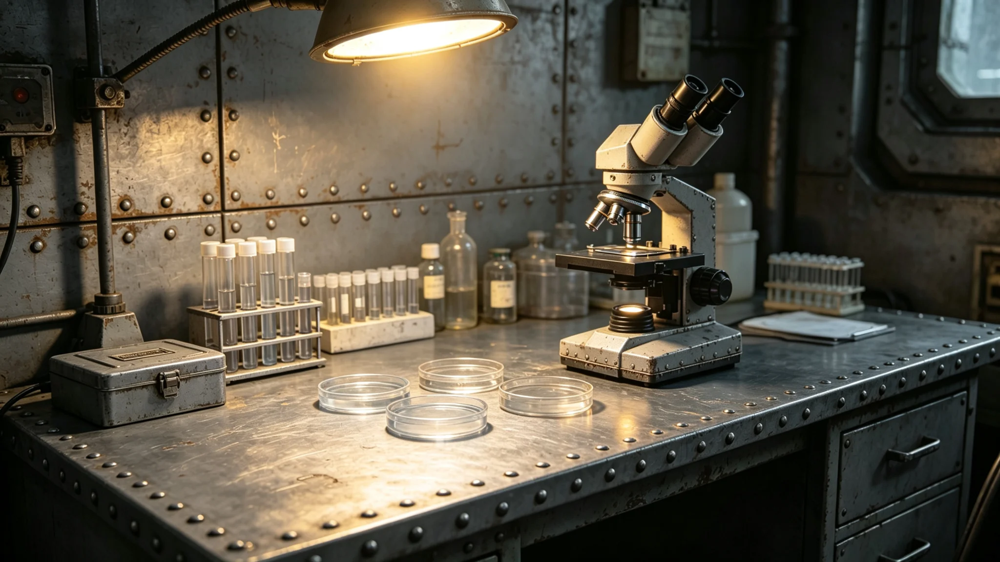

**编制单位**：联合体深空海关检疫处
**编制日期**：3753年7月10日
**报告年度**：3752年度
**报告编号**：QAR-REP-3753-033

## 一、检疫范围

本报告为3752年度异星生物样本检疫总结。范围包括：从异星方进口之生物材料样品、联合科考队（见GS-3755-01）采集带回之生物样本、文化交流活动中携带之生物材料。

## 二、检疫数量

3752年度共检疫异星生物样本约三百四十件。其中：

| 来源 | 数量 |
|---|---|
| 联合科考队带回 | 约二百件 |
| 贸易进口 | 约一百件 |
| 文化交流携带 | 约四十件 |

## 三、检疫结果

| 结果 | 数量 | 比例 |
|---|---|---|
| 合格放行 | 约三百件 | 约百分之八十八 |
| 消毒后放行 | 约二十八件 | 约百分之八 |
| 退回 | 约十二件 | 约百分之四 |

## 四、不合格样本

不合格样本主要为以下类型：

1. 表面微生物超标：约八件；
2. 内部生物危害物检出：约三件；
3. 放射性超标：约一件。

所有不合格样本均按异星文物进出口管制条例（见GS-3762-01）处理：消毒后重新检疫，连续两次不合格者退回。

## 五、检疫流程

检疫流程如下：

1. 样本到达检疫隔离舱；
2. 表面微生物检测；
3. 内部生物危害物检测；
4. 放射性检测；
5. 合格者放行，不合格者消毒处理。

## 六、检疫设备

检疫设备包括：表面微生物检测仪两台、内部生物危害物检测仪一台、放射性检测仪一台。设备均经校准，校准记录另存。

## 七、检疫人员

检疫处专职检疫人员四人，兼职两人。检疫人员均经过异星生物安全培训，持证上岗。

## 八、下年度计划

预计3753年度检疫样本约四百件，主要增长来源为联合科考队第五次远征带回样本增加。检疫处计划新增一名专职检疫人员。

## 九、检疫争议

3752年度发生检疫争议一起：4月一批入境文物表面微生物超标，异星方出口商对消毒方法提出异议（见GS-3774-01）。争议十五天后通过样品实验方式解决。

## 十、检疫人员培训

3752年度检疫人员培训两次：6月培训异星微生物识别，11月培训消毒操作规范。培训费用约五万，计入检疫成本。

## 十一、检疫设备校准

检疫设备每季度校准一次，校准由跨星系港计量部门完成。校准记录另存。3752年度校准四次，全部合格。

## 十二、检疫隔离舱

检疫隔离舱位于入境口岸，面积约二十平方米。舱内设储物柜两个、工作台一个、消毒设备一套。隔离舱使用后须消毒一次，方可接收下一批样本。

## 十三、检疫人员编制

检疫处专职检疫人员四人，兼职两人。专职人员均经过异星生物安全培训，持证上岗。兼职人员为海关查验员，在检疫高峰期协助工作。

## 十四、检疫年度趋势

3750年度检疫样本约二百件，3751年度约二百八十件，3752年度约三百四十件。逐年增长，主要原因是联合科考远征次数增加与贸易量增加。

## 十五、检疫技术改进

3752年度检疫技术改进两项：6月引入快速微生物检测法，检测时间从四十八小时缩短至十二小时；11月更新消毒设备，消毒效率提高约百分之二十。改进费用约三万，计入检疫成本。

## 十六、检疫报告审计

本报告经海关检疫处审计。审计结论：检疫数量与结果记录完整，无虚报。审计结论附于本报告后。

## 十七、检疫人员年度培训

3752年度检疫人员培训两次：6月异星微生物识别、11月消毒操作规范。培训由检疫处组织，费用约二万。培训后考核合格率百分之百。

## 十八、检疫人员变动

3752年度检疫处人员变动：5月检疫员一人新增。全年净增一人，年末在编六人。人员编制稳定。

## 十九、检疫产业重大事件

3752年度检疫重大事件：3月检疫争议解决、6月快速检测法引入、11月消毒设备更新。三项工作均按计划完成。

## 二十、检疫产业未来规划

检疫产业未来规划：预计3754年度检疫样本约四百件。主要增长原因为贸易量增加与科考远征次数增加。

## 二十一、检疫人员社保支出明细

3752年度检疫人员社会保障支出约五万：医疗保险约二万、养老保险约二万、工伤保险约一万。社会保障按联合体统一标准执行。

## 二十二、检疫产业总结

检疫产业3752年度总结：检疫数量逐年增长，检疫流程规范，无生物安全事故。检疫产业总体健康。

## 二十三、报告签字记录

本报告由检疫处主管于3753年3月签批。报告经海关检疫处审计，审计报告编号JY-3753-01。

## 二十四、报告存档

本报告存于海关检疫处档案室，保存期限为十年。报告电子副本存于检疫处办公终端，定期备份。

## 二十五、检疫报告附注

附注：本报告所称"检疫样本"以件计。3752年度共检疫样本约三百四十件，其中矿物样本约一百五十件、生物样本约一百件、工艺制品约五十件、其他约四十件。

## 二十六、检疫产业最终附注

附注：检疫产业自3749年建交以来逐年发展，检疫数量与流程规范持续提升。检疫人员持证上岗。

## 二十七、检疫产业结语

本报告为3752年度检疫工作之总结。检疫处全体人员将继续做好检疫工作，保障跨文明贸易与科考安全。
