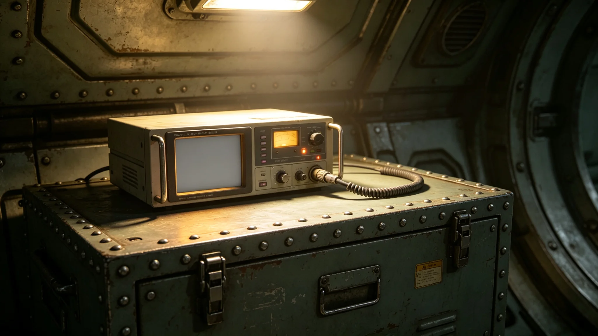

---
author_ai: Doubao
date: 3754-01-20
archive_id: GS-3794-01
coord: 生态×多星纪元×跨星系带×生态学派×外交舱伴生微生物监测
school: 生态学派
threads: [system/microbe-monitoring, system/life-support]
image: world/生图集/1294.webp
title: 外交舱伴生微生物监测报告
canon_check: 承接GS-3772外交舱生命支持；本档为3754年伴生微生物监测报告；监测报告体；正文无纪元名。
---

**编制单位**：联合体深空外交署后勤处
**编制日期**：3754年1月20日
**报告年度**：3753年度
**报告编号**：LIFE-MIC-3754-035

## 一、监测目的

外交舱生命支持系统（见GS-3772-01）长期运行后，舱内可能滋生伴生微生物。本报告为3753年度舱内微生物监测总结。

## 二、监测方法

监测方法为每月在舱内不同位置采集空气与水样，送实验室培养，计数菌落。采样位置包括：使馆办公区、生活区、医疗室、通风口。

## 三、监测结果

3753年度微生物监测结果如下：

| 季度 | 空气菌落数 | 水菌落数 | 超标次数 |
|---|---|---|---|
| 第一季度 | 正常 | 正常 | 0 |
| 第二季度 | 略高 | 正常 | 1 |
| 第三季度 | 正常 | 略高 | 1 |
| 第四季度 | 正常 | 正常 | 0 |

全年共超标两次。

## 四、超标事件

3753年5月（第二季度），办公区空气菌落数略高于标准。检查发现通风系统滤网使用超过三个月未更换。更换滤网后恢复正常。

3753年9月（第三季度），生活区水样菌落数略高。检查发现水循环系统滤芯使用超过三个月未更换。更换滤芯后恢复正常。

## 五、微生物种类

超标检出之微生物均为常见舱内伴生菌，未检出异星微生物。说明检疫措施有效（见GS-3792-01），异星微生物未通过日常外交往来进入使馆舱内。

## 六、维护措施

监测结果验证了生命支持系统维护计划（见GS-3772-01）之有效性。滤网每三个月更换、滤芯每三个月更换，可有效控制舱内微生物水平。

## 七、下年度计划

预计3754年度微生物水平将维持正常。继续按月监测，超标时按既有流程处理。

## 八、微生物来源分析

超标检出之微生物均为常见舱内伴生菌，来源为：使馆人员皮肤携带、外部空气渗入、食物残渣滋生。未检出异星微生物。

## 九、卫生制度

使馆内部卫生制度：每周清洁一次办公区、每日清洁一次生活区、每月更换一次通风滤网。制度执行良好，微生物水平全年基本正常。

## 十、监测设备

监测设备包括：空气采样器两台、水采样器一台、培养箱一台、显微镜一台。设备均经校准，校准记录另存。

## 十一、超标事件处理流程

发现微生物超标后处理流程：第一，立即采样复检确认；第二，查找超标原因；第三，针对性处理（更换滤网或滤芯）；第四，复检确认恢复正常；第五，记录归档。

## 十二、监测频率与采样点

监测频率为每月一次。采样点共六个：办公区两个、生活区两个、医疗室一个、通风口一个。每次采样在同一时间进行，以保证数据可比。

## 十三、微生物标准

舱内空气质量标准：空气菌落数不超过每立方米一百个菌落单位。水样菌落数不超过每毫升五十个菌落单位。超标即触发处理流程。

## 十四、年度监测总结

3753年度微生物监测总结：全年二十四次采样，两次超标，均在一周内恢复正常。微生物种类均为常见伴生菌，未检出异星微生物。监测结果总体良好。

## 十五、监测报告审核

本报告经航医审核。审核结论：监测数据真实，超标事件记录完整，处理流程规范。审核意见附于本报告后。

## 十五、监测人员

微生物监测由后勤处两人兼任。两人均经过微生物采样与培养培训。每月采样一次，在航医监督下进行。

## 十六、微生物监测年度费用

3753年度微生物监测费用约三万，包括：培养基耗材一万五、检测设备维护一万、人员加班补贴五千。费用从外交服务产业预算中列支。

## 十七、微生物监测重大事件

3753年度微生物监测重大事件：4月空气菌落超标、9月水样菌落超标。两次超标均在一周内恢复正常。无其他重大事件。

## 十八、微生物监测未来规划

微生物监测未来规划：预计3754年度维持每月一次监测频率。如发现新超标事件，增加采样点与频率。

## 十九、监测人员社保支出明细

3753年度监测人员社会保障支出约三万：医疗保险约一万、养老保险约一万、工伤保险约一万。社会保障按联合体统一标准执行。

## 二十、微生物监测总结

3753年度微生物监测总结：全年监测二十四次，两次超标均及时处理。未检出异星微生物。监测总体良好。

## 二十一、监测报告签字记录

本报告由航医于3753年12月签批。报告经后勤处审核，审核意见编号WB-3753-01。

## 二十二、监测报告存档

本报告存于后勤处档案室，保存期限为五年。报告电子副本存于后勤处办公终端，定期备份。

## 二十三、监测报告附注

附注：本报告所称"菌落数"以每立方米空气中菌落单位计。3753年度全年监测数据：空气菌落数平均值约四十，水样菌落数平均值约二十。均低于标准上限。

## 二十四、监测报告最终附注

附注：微生物监测自3749年使馆开馆以来持续进行，监测频率与采样点稳定。监测数据为使馆卫生管理提供依据。

## 二十五、监测报告结语

本报告为3753年度微生物监测之总结。后勤处将继续做好监测工作，保障使馆人员健康。
