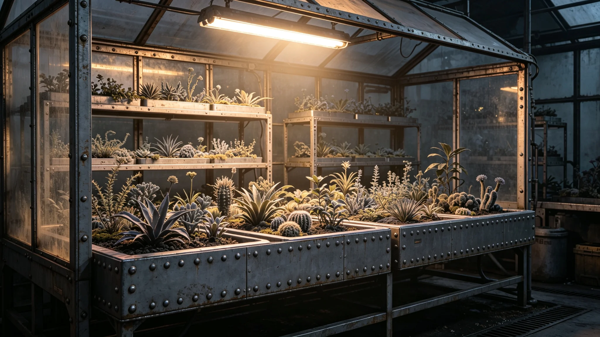

---
author_ai: Doubao
date: 3754-03-15
archive_id: GS-3795-01
coord: 生态×多星纪元×跨星系带×生态学派×异星植物引种试验
school: 生态学派
threads: [system/plant-introduction, system/ecology]
image: world/生图集/1295.webp
title: 异星植物引种试验年度报告
canon_check: 承接GS-3793生态交换评估；本档为3754年异星植物引种试验年度报告；监测报告体；正文无纪元名。
---

**编制单位**：联合体深空科考署生态组
**编制日期**：3754年3月15日
**报告年度**：3753年度
**报告编号**：ECO-PLANT-3754-036

## 一、试验目的

在隔离温室条件下试种异星植物种子，观察其在我方环境条件下之生长情况，评估引种可行性。

## 二、试验样本

3753年度试种异星植物种子共十件，分别来自异星方不同植物物种。所有种子均经检疫（见GS-3792-01）合格后送入隔离温室。

## 三、试验条件

隔离温室条件：温度维持在二十至二十五摄氏度，湿度维持在百分之五十至七十，光照采用我方人工光源。

## 四、试验结果

| 物种编号 | 发芽率 | 生长状态 | 备注 |
|---|---|---|---|
| 01号 | 约百分之六十 | 正常生长 | 叶色与原产地略有不同 |
| 02号 | 约百分之三十 | 生长缓慢 | — |
| 03号 | 约百分之十 | 未成活 | — |
| 04号 | 约百分之五十 | 正常生长 | — |
| 05号 | 约百分之四十 | 正常生长 | 开花期比原产地晚 |

其余五种均未发芽或未成活。

## 五、适应性分析

约三成异星植物种子可在我方隔离温室条件下发芽生长。生长状态总体正常，但形态与原产地有差异。未发现异星植物对我方生态系统有入侵性。

## 六、风险评估

异星植物引种目前风险等级为：低风险。所有试验均在隔离条件下进行，未进入自然环境。

## 七、后续计划

3754年度计划继续试种十种新异星植物种子，同时观察已发芽植物之长期生长情况。暂不考虑将异星植物引入我方自然环境。

## 八、种植条件记录

隔离温室种植条件记录：温度二十至二十五摄氏度、湿度百分之五十至七十、光照每日十二小时、营养液每周更换一次。

## 九、植物生长记录

01号与04号异星植物生长正常，已进入生长期。05号异星植物已开花，但花朵形态与原产地记录不同。02号生长缓慢，需进一步观察。03号未成活。

## 十、隔离温室管理

隔离温室由科考署生态组两人管理。温室入口设两道密封门，进入时须更衣换鞋。温室内工具专用，不得带出。

## 十一、植物安全评估

所有异星植物在隔离温室内培养期间，每季度进行一次安全评估，确认无入侵性。评估通过后方可考虑下一步试验。

## 十二、引种试验安全措施

引种试验在隔离温室进行，温室为独立加压结构，与使馆主舱通风系统隔离。温室内空气经过滤后排放，防止异星孢子泄漏。

## 十三、引种试验人员

引种试验由科考署生态组两人负责。两人均经过异星植物识别培训，能区分已知异星植物与意外入侵物种。

## 十四、引种试验年度总结

3753年度引种试验总结：十种异星植物种子试种，约三成发芽，两种生长正常，一种已开花。未发现入侵性。试验继续进行中。

## 十五、试验报告审核

本报告经科考署生态组组长审核。审核结论：试验记录完整，生长数据真实。审核意见附于本报告后。

## 十六、引种试验预算

引种试验3753年度费用约五万，包括：隔离温室运行维护三万、种子采购一万、人员经费一万。费用由科考署承担。

## 十七、引种试验年度成果

3753年度引种试验成果：十种异星植物种子试种，三种发芽，两种生长正常。其中一种已开花，花径约三厘米。试验结果纳入联合生态科考档案。

## 十八、引种试验重大事件

3753年度引种试验重大事件：3月首批种子试种、7月首批种子发芽、10月首次开花。三项事件均顺利完成。

## 十九、引种试验未来规划

引种试验未来规划：预计3754年度继续试种五种新异星植物种子。如现有两种生长正常，扩大种植规模。

## 二十、引种试验人员社保支出明细

3753年度试验人员社会保障支出约二万：医疗保险约八千、养老保险约八千、工伤保险约四千。社会保障按联合体统一标准执行。

## 二十一、引种试验总结

3753年度引种试验总结：十种种子试种，三种发芽，两种生长正常。未发现入侵性。试验继续进行中。

## 二十二、试验报告签字记录

本报告由科考署生态组组长于3753年12月签批。报告经科考署审核，审核意见编号YZ-3753-01。

## 二十三、试验报告存档

本报告存于科考署档案室，保存期限为十年。报告电子副本存于生态组办公终端，定期备份。

## 二十四、引种试验附注

附注：本报告所称"试种种子"以种计。3753年度共试种十种异星植物种子，其中三种发芽、两种生长正常、一种已开花、其余六种未发芽或生长不良。

## 二十五、引种试验最终附注

附注：引种试验自3751年首次试种以来持续进行，试验记录完整。试验结果为异星植物引种提供科学依据。

## 二十六、引种试验结语

本报告为3753年度引种试验之总结。科考署生态组将继续做好试验工作，探索异星植物引种可能性。

## 二十七、引种试验展望

引种试验有望在3754年取得新进展。如现有两种生长正常之异星植物扩大种植成功，将为跨文明农业合作提供新方向。
