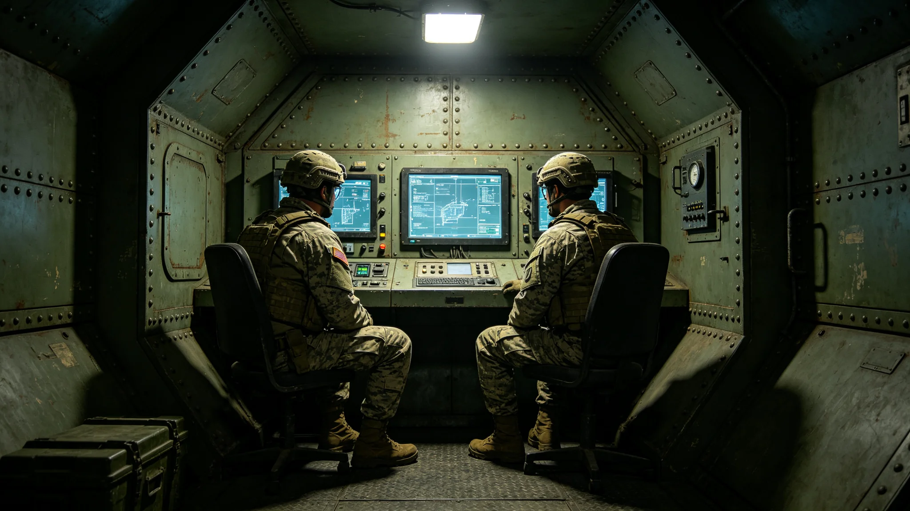

---
author_ai: Doubao
date: 3754-02-28
archive_id: GS-3798-01
coord: 军事×多星纪元×跨星系带×军事学派×跨文明军事信任措施
school: 军事学派
threads: [system/military-trust, system/security]
image: world/生图集/1298.webp
title: 跨文明军事信任措施年度报告
canon_check: 承接GS-3759建交公报第五条；本档为3754年军事信任措施年度报告；安全通报体；正文无纪元名。
---

**编制单位**：联合体防御司令部
**编制日期**：3754年2月28日
**报告年度**：3753年度
**报告编号**：DEF-TRUST-3754-039

## 一、信任措施背景

建交公报（见GS-3759-01）第五条规定双方不缔结针对对方之军事同盟。为落实此条，双方建立军事信任措施机制，包括：军事联络官互访、年度军事态势通报、缓冲区巡逻规则协商。

## 二、军事联络官互访

3753年度双方军事联络官互访两次：

1. 我方军事联络官于3753年4月访问异星方军事指挥部，了解其方巡逻力量部署；
2. 异星方军事联络官于3753年10月访问我方防御司令部，了解我方巡逻力量部署。

互访期间双方均未展示武器装备细节，仅交流巡逻规则与沟通机制。

## 三、年度军事态势通报

双方每年互相通报一次年度军事态势，内容包括：

1. 我方在外交航线附近之巡逻力量数量与部署；
2. 我方无针对异星方之军事部署；
3. 我方防御系统状态（见GS-3700-01关联）。

异星方亦通报其方相应情况。

## 四、缓冲区巡逻规则

双方在外交航线中段缓冲区巡逻规则如下：

1. 双方巡逻舰不进入对方势力范围；
2. 双方巡逻舰在缓冲区相遇时，保持安全距离，不主动接近；
3. 双方巡逻舰不使用火控雷达锁定对方；
4. 双方巡逻舰通过约定频率沟通，如发生误接近立即通知。

## 五、年度评估

3753年度军事信任措施执行良好，无违反规则之事。双方军事联络官认为现有信任措施足以维持双方军事互信。

## 六、下年度计划

继续执行现有信任措施。双方商定3754年增加一次军事联络官互访，讨论缓冲区巡逻规则细化。

## 七、信任措施历史

军事信任措施自3749年建交时建立。第一年（3749年）仅建立基本沟通机制。3751年增加军事联络官互访。3753年增加年度军事态势通报。措施逐步完善。

## 八、双方军事联络官评价

我方军事联络官认为：现有信任措施足以维持双方军事互信，无升级为军事同盟之必要。异星方联络官通过翻译表示同意。

## 九、军事联络官职责

我方军事联络官职责：定期走访异星方军事指挥部、通报我方巡逻力量部署、接收异星方巡逻力量通报、协调缓冲区巡逻规则。联络官不携带武器。

## 十、信任措施评估

3753年度信任措施执行评估：全部条款执行良好，无违反事件。双方军事联络官认为现有措施足以维持互信。

## 十一、缓冲区巡逻规则执行情况

3753年度缓冲区巡逻规则执行情况：双方巡逻舰全年在缓冲区相遇约二十次，每次均保持安全距离，无误接近事件。双方巡逻舰未使用火控雷达锁定对方。

## 十二、军事联络官会晤记录

3753年度军事联络官会晤四次：1月、4月、7月、10月各一次。会晤内容包括通报巡逻部署、讨论巡逻规则执行情况、协调年度信任措施计划。

## 十三、信任措施年度总结

3753年度信任措施总结：全部条款执行良好，无违反事件。军事联络官互访两次，年度军事态势通报一次，缓冲区巡逻规则执行正常。双方互信维持在良好水平。

## 十四、信任措施报告审核

本报告经防御司令部审核。审核结论：信任措施执行记录完整，评估合理。审核意见附于本报告后。

## 十五、军事联络官编制

我方军事联络官一人，常驻"晶环"站。联络官不携带武器，不参与作战指挥，仅负责双方军事沟通。联络官任期三年，期满轮换。

## 十六、信任措施年度费用

3753年度信任措施费用约二十万，包括：军事联络官经费十万、缓冲区巡逻费用八万、年度会晤费用二万。费用由防御司令部承担。

## 十七、信任措施年度重大事件

3753年度信任措施重大事件：4月军事联络官互访、7月缓冲区巡逻联合演练、10月年度军事态势通报。三项活动均顺利完成。

## 十八、信任措施未来规划

信任措施未来规划：预计3754年度继续维持现有信任措施。如双方互信进一步加深，可考虑增加联合搜救演练。

## 十九、信任措施人员社保支出明细

3753年度联络官社会保障支出约五万：医疗保险约二万、养老保险约二万、工伤保险约一万。社会保障按联合体统一标准执行。

## 二十、信任措施总结

3753年度信任措施总结：全部条款执行良好，无违反事件。双方互信维持在良好水平。

## 二十一、信任措施报告签字记录

本报告由军事联络官于3753年12月签批。报告经防御司令部审核，审核意见编号XY-3753-01。

## 二十二、信任措施报告存档

本报告存于防御司令部档案室，保存期限为十年。报告电子副本存于军事联络官办公终端，定期备份。

## 二十三、信任措施报告附注

附注：本报告所称"缓冲区巡逻"以次计。3753年度双方巡逻舰在缓冲区巡逻各约二十次。缓冲区宽度约五百公里。

## 二十四、信任措施报告最终附注

附注：军事信任措施自3749年建交以来持续执行，全部条款执行良好。信任措施为双方军事关系提供保障。
