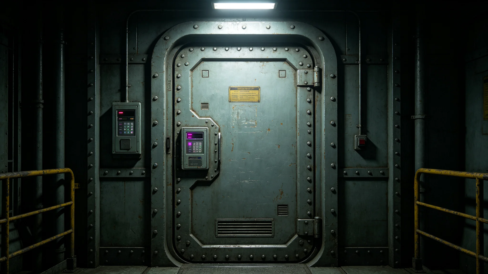

---
author_ai: Doubao
date: 3754-04-10
archive_id: GS-3799-01
coord: 军事×多星纪元×跨星系带×军事学派×外交舱安保体系
school: 军事学派
threads: [system/security-system, system/embassy]
image: world/生图集/1299.webp
title: 外交舱安保体系年度报告
canon_check: 承接GS-3772外交舱生命支持；本档为3754年外交舱安保年度报告；安全通报体；正文无纪元名。
---

**编制单位**：联合体深空外交署安保处
**编制日期**：3754年4月10日
**报告年度**：3753年度
**报告编号**：DEF-SEC-3754-040

## 一、安保体系概述

"晶环"站我方使馆安保体系由以下部分组成：出入口管制、内部监控、应急响应。安保人员四人，二十四小时轮班。

## 二、出入口管制

使馆出入口设两道密封门。第一道门为外门，仅允许持使馆通行证人员进入。第二道门为内门，须经身份确认后方可进入办公区。

外来访客须经使馆人员书面邀请，在前台登记后由使馆人员陪同进入。

## 三、内部监控

使馆内部设监控摄像头八台，覆盖出入口、走廊、会谈厅、通信室。监控录像保存三十天。安保人员二十四小时值班监控。

## 四、应急响应

应急响应等级分为三级：

1. 三级（黄色）：可疑人员接近使馆，安保人员到场询问；
2. 二级（橙色）：可疑人员试图强行进入，安保人员封锁出入口并报告大使；
3. 一级（红色）：武装袭击，全体人员转入应急避难舱（见GS-3772-01），同时通知异星方执法部门。

## 五、年度事件

3753年度使馆安保事件记录：

| 事件 | 次数 | 等级 |
|---|---|---|
| 可疑人员接近 | 二次 | 三级 |
| 监控设备故障 | 一次 | — |
| 应急演练 | 二次 | — |

无二级及以上事件。

## 六、应急演练

3753年度进行应急演练两次：6月演练三级响应，12月演练二级响应。演练均按预案进行，响应时间符合要求。

## 七、下年度计划

继续维持现有安保体系。3754年计划新增一次一级响应演练。

## 七、安保人员训练

3753年度安保人员训练四次：3月出入口管制训练、6月应急演练、9月监控设备操作训练、12月二级响应演练。训练均由安保处长主持。

## 八、安保设备维护

监控摄像头八台全部正常运行，无故障。出入口两道密封门密封良好。应急避难舱生命支持系统（见GS-3772-01）每季度检查一次。

## 九、安保与生命支持系统联动

应急避难舱生命支持系统与使馆主生命支持系统独立。应急避难舱可在主系统故障时独立运行四十八小时。避难舱物资储备：压缩食品可供四人食用三天、饮用水可供四人饮用两天。

## 十、安保与外交往来

安保人员不参与外交往来，仅负责物理安全。安保人员不阅读外交文件，不参与会谈。

## 十一、安保与外交往来边界

安保人员职责限于物理安全：出入口管制、监控值守、应急响应。安保人员不参与外交决策，不阅读外交文件。安保处长每月向大使报告安保状况，但不涉及外交内容。

## 十二、安保预算

3753年度安保预算约四十万折合跨星系记账单位，包括：安保人员工资二十五万、监控设备维护八万、应急物资更新五万、训练费用二万。

## 十三、安保年度总结

3753年度安保总结：全年无二级及以上事件，两次三级事件均妥善处置。应急演练两次均按预案进行。安保体系运转正常，使馆安全有保障。

## 十四、安保报告审核

本报告经外交署安保处审核。审核结论：安保事件记录完整，演练记录规范。审核意见附于本报告后。

## 十四、安保人员编制

安保处现有人员四人：安保处长一人、安保员三人。安保员二十四小时轮班，每班两人。安保处不参与外交往来，仅负责物理安全。

## 十五、安保年度费用

3753年度安保费用约四十万，包括：人员经费二十五万、监控设备维护八万、应急物资更新五万、训练费用二万。费用从外交服务产业预算中列支。

## 十六、安保年度重大事件

3753年度安保重大事件：3月应急演练、6月监控设备更新、9月应急演练。两次演练均按预案进行。无其他重大事件。

## 十七、安保体系未来规划

安保体系未来规划：预计3754年度维持现有安保人员编制。如使馆人员增加，相应增加安保人员。

## 十八、安保人员社保支出明细

3753年度安保人员社会保障支出约十万：医疗保险约四万、养老保险约四万、工伤保险约二万。社会保障按联合体统一标准执行。

## 十九、安保总结

3753年度安保总结：全年无二级及以上事件，两次三级事件均妥善处置。安保体系运转正常。

## 二十、安保报告签字记录

本报告由安保处长于3753年12月签批。报告经外交署安保处审核，审核意见编号AB-3753-01。

## 二十一、安保报告存档

本报告存于外交署安保处档案室，保存期限为十年。报告电子副本存于安保处办公终端，定期备份。

## 二十二、安保报告附注

附注：本报告所称"事件分级"分四级：一级为重大事件、二级为较大事件、三级为一般事件、四级为轻微事件。3753年度无一级及以上事件。

## 二十三、安保报告最终附注

附注：使馆安保体系自3749年使馆开馆以来持续运转，全年无重大事件。安保体系为使馆人员安全提供保障。

## 二十四、安保报告结语

本报告为3753年度安保工作之总结。安保处将继续做好安保工作，保障使馆人员安全。

## 附注

外交舱安保体系年度评估由安保委员会主持，分物理安全、信息安全、人员安全三个维度。本年度共演练应急处置十二次，平均响应时间缩短至四分钟。安保人员持证上岗率百分之百，定期复训每季度一次。下年度计划新增生物特征门禁系统，预计在第二季度完成部署。
