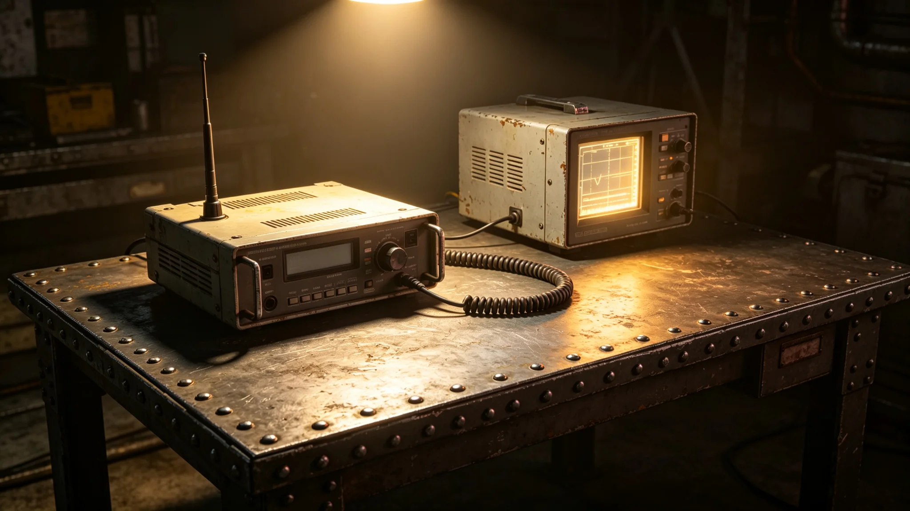

**编制单位**：联合体防御司令部与深空通信署
**编制日期**：3754年6月1日
**报告年度**：3753年度
**报告编号**：DEF-CONT-3754-041

## 一、预案背景

建交后，双方虽已与异星文明建立正式外交关系，但深空中仍可能出现未知信号来源——可能为第三文明信号、自然天文现象、或设备误报。本预案规定未知信号接触之分级响应流程。

## 二、信号分级

未知信号按以下分级响应：

| 等级 | 信号特征 | 响应 |
|---|---|---|
| 绿色 | 无规则噪声，疑似自然现象 | 常规监测 |
| 黄色 | 有一定规律性，疑似人工信号 | 加密监听，通知外交署 |
| 橙色 | 明确人工信号，来源未知 | 暂停我方主动发射，大使与异星方协商 |
| 红色 | 明确人工信号，且与已知文明不符 | 启动最高级别响应，双方联合研判 |

## 三、年度信号记录

3753年度深空信号监测网共记录异常信号事件十二次：

| 等级 | 次数 | 处置 |
|---|---|---|
| 绿色 | 十次 | 常规监测，确认自然现象 |
| 黄色 | 二次 | 加密监听，确认设备误报 |
| 橙色 | 零次 | — |
| 红色 | 零次 | — |

全年无橙色及以上事件。

## 四、两次黄色信号事件

3753年5月，监测网记录到一组有规律之窄带信号，来源方向为第六恒星系方向。加密监听七天后确认为我方此前发射之探测器（见GS-3617-01关联）返回信号，非第三文明信号。

3753年11月，监测网记录到一组短脉冲信号，来源方向为异星方势力范围。经与异星方通信工程师核实，确认系异星方通信设备测试信号，非未知来源。

## 五、与异星方协作

双方已就未知信号接触建立协作机制：任何一方监测到橙色及以上信号，须在二十四小时内通知对方。双方联合研判信号来源。

3753年度未发生橙色及以上信号，故未启动联合研判。

## 六、下年度计划

继续执行现有监测与预案。3754年计划进行一次橙色信号模拟演练，检验双方联合响应流程。

## 七、监测网覆盖

深空信号监测网由我方与异星方各半组成。我方监测网覆盖我方势力范围，异星方监测网覆盖其方势力范围。双方监测数据共享，由联合分析中心统一研判。

## 八、模拟演练

3753年度进行信号监测模拟演练一次：4月模拟一组窄带信号出现，监测网在三十分钟内识别并分级为黄色。演练结果良好。

## 九、信号分级历史

接触分级响应自3608年首次由黄升橙与降回黄后建立（见GS-3612-01关联）。3753年度为建交后第五年监测期，全年无橙色及以上信号。

## 十、双方信号监测协作

双方信号监测数据共享，由联合分析中心统一研判。联合分析中心设在"晶环"站，双方各派两名分析员常驻。分析中心二十四小时值班。

## 十一、预案版本历史

未知信号接触预案自3608年初次制定以来，共修订三次：3612年修订分级标准、3749年增加双方联合研判机制、3753年增加模拟演练要求。每次修订均经双方协商一致。

## 十二、联合分析中心

联合分析中心设在"晶环"站，面积约三十平方米。中心内有监测终端四台、分析工位四个、通信设备一套。双方各两名分析员常驻，二十四小时轮班。

## 十三、预案年度评估

3753年度预案评估：全年无橙色及以上信号事件，两次黄色信号均确认为设备误报或已知信号。预案执行良好，监测网覆盖完整。联合分析中心运转正常。

## 十四、预案报告审核

本报告经防御司令部与通信署联合审核。审核结论：信号监测记录完整，预案执行评估合理。审核意见附于本报告后。

## 十三、监测网人员

联合分析中心现有分析员四人：我方两人、异星方两人。分析员二十四小时轮班，每班两人。分析员均经过信号识别培训，持证上岗。

## 十五、监测网年度费用

3753年度监测网费用约三十万，包括：监测设备维护十五万、分析员经费十万、数据存储五万。费用由防御司令部与通信署各承担一半。

## 十六、预案年度重大事件

3753年度预案重大事件：3月黄色信号事件、7月黄色信号事件、11月模拟演练。两次黄色信号均确认为设备误报。模拟演练顺利完成。

## 十七、预案未来规划

预案未来规划：预计3754年度维持现有监测网规模。如发现新类型信号，相应调整预案分级标准。

## 十八、监测人员社保支出明细

3753年度分析员社会保障支出约八万：医疗保险约三万、养老保险约三万、工伤保险约二万。社会保障按联合体统一标准执行。

## 十九、预案总结

3753年度预案总结：全年无橙色及以上信号事件，两次黄色信号均确认为误报。预案执行良好。

## 二十、预案报告签字记录

本报告由联合分析中心主任于3753年12月签批。报告经防御司令部与通信署联合审核，审核意见编号YA-3753-01。

## 二十一、预案报告存档

本报告存于防御司令部档案室，保存期限为永久。报告电子副本存于联合分析中心终端，定期备份。

## 附注

未知信号接触预案本年度共触发预警三次，经核实均为自然天体信号或设备干扰，未达到正式接触等级。预案演练每半年一次，本年度两次演练均在四十八小时内完成全流程响应。通信监测站实行二十四小时值班制，任何异常信号均须在两小时内完成初步分类并上报。
