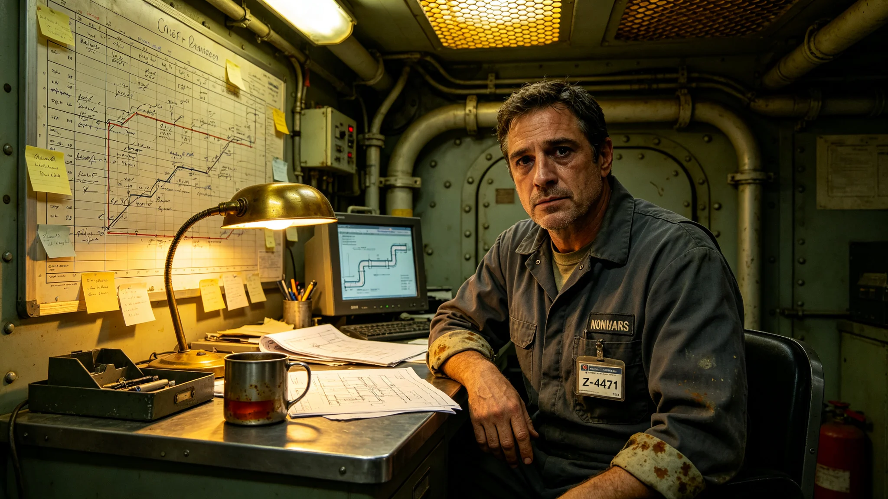

# 世代飞船中期改造总工程师沈既明人事档案摘录

## 一、档案袋封口

本档案袋由世代飞船改造工程署人事科于3801年1月12日封缄，内含考勤卡、体检通知单、签认原件复印件、处分登记单四类物证，共十九件。封条上经办人事员两处签名均有涂改痕迹，一处把"沈"字重描，一处把"即"字描成"既"，涂改处盖有更正章。人事科在封口注记中说明：沈既明本人申请在封袋前不得开封查阅，故本摘录由封袋后依程序抽编，未让本人逐件核对。以下摘录按物证原序排列，不作人物评语，不补传主履历。

## 二、考勤摘录

沈既明，工号Z-4471，原推进工程署结构科副主任工艺师，3796年4月调任中期改造总工程师。其考勤卡自调任之日起抄录如下：3796年四月至十二月，全勤，无补休记录，签到时间集中在早班第一刻；3797年三月十二日，缺勤半日，事由栏填"腰椎复查"，附船医所开复诊单，复诊单上医生注明"与长期穿作业服坐姿有关"；3798年全年，夜班签到二百一十七次，其中十一月、十二月连续两月夜班超过二十六次，超出本署《工时上限规程》第十五条，考勤科已在卡边批注"已超额，待核"；3799年五月三日至五月九日，连续七日签到时间早于舱门开启规定时刻一个时辰，被门禁系统记为"未授权进入"，后由改造署出具《提前入场作业说明》撤销，说明中列举其提前入场原因均为现场预制段夜间巡查。

## 三、体检通知单

船医署3799年第四季度体检通知单留档一页。沈既明四十二岁，身高一米七四，体重较调任时下降四公斤，骨密度读数较同舱段同龄工艺师均值低百分之八，视疲劳指数连续三季度偏高，腰椎复查结论为轻度椎间盘退变。通知单建议项为"减少夜班、增加旋转环康复区使用频次每周两次、连续带班不超过十日"。该建议项下方有其本人签字，旁附一行手书："改造总进度表已排满，康复区排期待三季度后。"该手书未在档案袋其他地方得到回应，船医署次年又发一张同款建议单，其仍签字，仍无手注。

## 四、签认原件复印件

中期改造总进度总表共十一版，沈既明签认九版。其中第七版签认日期为3798年八月十六日，签字后第三日即被其本人申请作废，作废理由抄录为："主推进换装与居住舱扩容两道工序在第五舱段时间线重叠，原表未留缓冲，现退回重排。"作废件与重排后的第八版同袋留存。第八版把两道工序拉开三十日缓冲，重排工时较第七版多占四十二日。第九版至第十一版均一次签认通过，未再作废。签认墨水颜色记录：前六版为蓝黑，第七版作废件为蓝黑划线，第八版起改用黑色。

## 五、处分登记单

3799年十月二十一日，改造工程署质量监督处出具处分登记单一张，编号QC-3799-1021。事由：第三舱段预装段一次试压未达额定值，总工程师未在试压记录上即时签注"暂缓"，致后续两天工序已按原计划推进。处分内容为"书面检查一次，扣减当月绩效工时八小时"。沈既明在处分单回执栏签字，未申请复核。书面检查原件三页附后，内容照录大意："流程上本人确有未即时签注之责，然试压记录与工序调度之间确有两小时空窗，建议在空窗期内由系统自动锁定后续工序，不必事后追责个人。"同袋另附质量监督处次年一月补充说明一纸，载明该处复查后认为"暂缓签注流程本身存在冗余，已提请修订为系统自动锁定"，未改动本次处分结论。

## 六、调任前后对照

调任前在推进工程署，沈既明历年考评为"称职"两次、"良好"一次，无处分记录，无夜班超额；调任中期改造总工程师后，首两年内即出现考勤超额、体检报警、处分各一。人事科在档案袋末页附工作交接清单一份，列其移交原科室工作共计十七项，其中三项标注"未及移交，由副手续办"，三项均与主桁架接口校核有关。交接清单上原科室主任签"已收"，未附评价。

## 七、与原科室交接遗留

工作交接清单上三项"由副手续办"的主桁架接口校核，三年间仅完成两项，第三项在3800年被发现接口公差超出换装允许值，反推为调任时未及校核所致。改造署在档案袋中夹入一张便笺，注明该公差已在吊装方案修订中一并处理，未归咎于沈既明个人。

## 八、封缄备注

封缄时档案袋重量零点二公斤，附照片一张，为其在总进度表前的登记照，面色疲惫，眼下有深色阴影，工作服袖口有未洗净的油污，胸牌工号Z-4471清晰。照片背面无题词。人事科注记最后一行："本袋此后如再入物证，另立续袋，不再启此袋。"封袋当日改造署已按规程通知本人，沈既明未到现场，仅由副手代领回执。本摘录到此为止。
