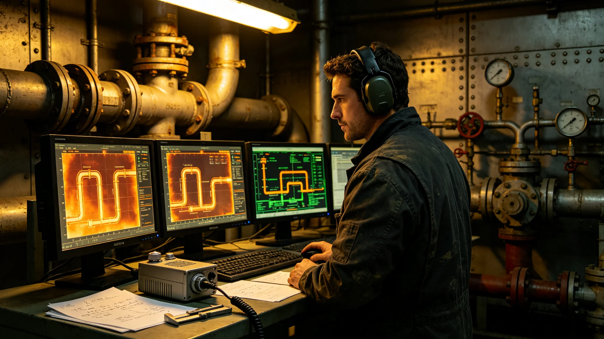

# 第十一代聚变推进系统总设计师陆衡考勤与签认档案

## 一、来源说明

本件由推进工程署设计科整理，为第十一代聚变推进系统总设计师陆衡的在职物证选录，非传记。材料取自其个人工时册、三次试车签认单副本、一份调岗征询回执及一页噪声暴露记录。设计科注明：陆衡本人未审阅本摘录，亦未被征询，选录原则为"只入物证，不入评语"。

## 二、工时册摘录

陆衡，工号T-1190，推进署反应堆室出身。其工时册自3797年立项起逐日登记。3797年全年，其在模拟器上的累计工时为一千一百二十小时，超出同室工艺师年均值一倍有余；册页边注有其本人一行小字："第十代换装时液滴辐射器余温过高，本次须先在模拟器跑满三代工况再上实物。"3798年第二季度，工时册首次出现连续十一日空白，事由为"陪同结构组评审主桁架接口"，未计入反应堆室工时，事后由总师室补记跨室工时三十六小时。3799年试车前夜，工时册显示其连续十四日每日在模拟器与试车台之间往返，单日最高登记工时十六小时，考勤科在页边批注"已达上限，请次日补休"，次日其工时仍登记十四小时。

## 三、试车签认单副本

第十一代推进系统三次点火试车的签认单副本同存。第一次试车（3799年六月）签认单上，陆衡在"是否同意进入下一工况"一栏画圈，又在圈外补写"建议延长低功率段观测两小时"，该补写经试车指挥同意执行，事后证明低功率段确实暴露一处冷却管微漏；第二次试车（3800年正月）其未到场，签认由其副手代签，回执注明"本人在第三舱段会诊，授权代签"，代签件上有副手与试车指挥双签；第三次试车（3800年十月）签认单一次通过，无补写，无附加条件。三次签认单的墨水颜色不一，第一次为蓝黑，第二次为红（代签专用），第三次为黑。

## 四、调岗征询回执

3801年腊月，推进署人事室向陆衡发出调岗征询，拟调其往燃料供应署任副总工艺师，待遇提升一档，理由为"其反应堆经验在燃料侧更缺人"。陆衡回执照抄如下："现职第十一代推进定型未结，液滴辐射器长期工况数据未满二十个月，此际调离，于系统不负责任。请暂缓征询，待定型验收后再议。"回执下方无第二人签名，仅有收发室收文章。该调岗征询此后未再发出。人事室在征询档案末页注记一行："征询件按程序归档，未计入拒绝调岗记录。"

## 五、与前后代设计师的工时对照

档案末页附设计科整理的对照表一张：第八代聚变推进总设计师在任期间年均模拟器工时六百八十小时，任期六年；第十代总设计师年均九百一十小时，任期八年；陆衡任期内前四年年均一千零四十小时。对照栏未作评价，仅列数字与任期长度。对照表下方另有一行小字："第十一代立项书要求长期工况数据周期较长，故工时偏高。"

## 六、噪声暴露与体检

陆衡三十九岁，3801年船医署体检记录一项：听力在高频段下降，左耳较右耳明显，建议远离试车台噪声区并改戴定制护耳。设计科在旁注明：陆衡仍坚持每次试车到场，未调至远程观摩席，仅按医生要求更换了加厚护耳。噪声监测卡显示其3801年累计暴露于试车台噪声环境约一百二十小时。

## 七、设计风格注记

设计科编录人附观察一条：陆衡在图纸上的批注从不写"按惯例"三字，凡引用前代设计必注年代与舱段编号；凡新改一处，必附一行"此改动若失效的回退步骤"。本档收录其图纸批注复印件五页，每页末尾均有回退步骤。编录日，第十一代推进系统定型验收报告已进入会签，陆衡在末页签字。

## 八、液滴辐射器长期数据摘要

本档另附一页陆衡要求留存的液滴辐射器长期工况数据摘要，自3800年十月第三次试车起连续记录，至整理日已满十六个月。摘要列每月余温读数、辐射效率、微滴分布均匀性三项。3801年第七个月曾出现一次效率下滑，陆衡在对应月份批注"冷却水杂质偏高，已下令过滤芯提前更换"，更换后次月读数恢复。摘要页末其注："满二十个月方可定型，现仍差四个月。"

## 九、设计科编录人附注

编录人另附三行观察：其一，陆衡的图纸批注从不引用未经实测的预估数；其二，其三次试车签认中，第一次的延长建议直接改写了后续两次试车流程；其三，其个人工时册与模拟器日志可逐日对上，无虚记。编录人注明此三行仅为编录过程记录，不构成评价。

## 十一、与第十代设计的对照注记

本档末附一页陆衡亲笔的对照注记，比较第十代与第十一代推进系统在四个关键参数上的取舍：比冲、工质消耗、辐射器余温、可维护窗口。注记写明第十一代比冲提高约一成，工质消耗下降约一成五，代价是辐射器结构更复杂、维护窗口更窄。他在末行写："不是十一代比十代先进，是它适合这艘船再飞两百年。下一代会不会反过来向十代学，留给后任。"注记未交任何会议，仅存于本档。

## 十二、结案

本摘录止于3802年三月八日整理日。陆衡在职，未到任满，定型验收未毕，后续物证另册续存。
