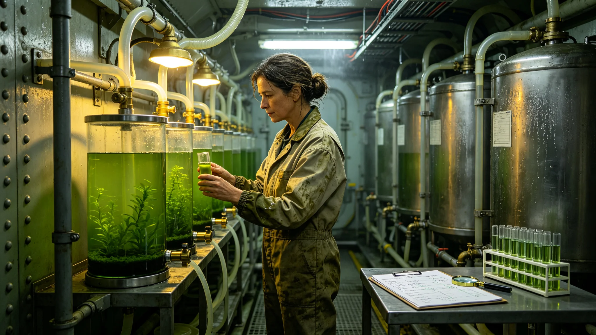

# 第三代闭环生命支持系统首席工程师温蘅医疗与菌群交接档案

## 一、袋内物证清单

环控署人事股3803年5月21日整理，袋内八件：温蘅体检单三页、菌群交接记录两页、值班排班表一页、同事证言一纸、处分查询回执一纸。首席工程师一职由其自3795年起担任，至今九年。袋外标签注明"此人不宜长期调离一线，调岗前须附船医意见"，该标签为人事股所贴，非本人所写。

## 二、体检单摘录

温蘅，女，工号L-0733，原水培藻舱值班工艺师出身。三页体检单跨3799、3800、3801三年。3799年项：呼吸道常年低浓度致敏原暴露，鼻黏膜充血，晨起干咳；3800年项：同款致敏原浓度较上年下降，但皮肤菌群检测出现一株耐受菌定植，医生建议换岗远离高湿舱；3801年项：致敏原浓度反弹，皮肤耐受菌未消退，肺功能小气道指标轻度下降，医生第二次建议"考虑调离闭环一线，改任培训或文档"。温蘅在第二次建议单上未签字，单页空白，仅在旁注日期。

## 三、菌群交接记录

第三代闭环改造要求重建舱内菌群。交接记录两页载明：3800年秋，温蘅主持把旧环控系统中的四株驯化菌分批转入新系统，每批间隔十四日，记录温度、湿度、进出水浊度、溶氧四项。每批转入后第七日测一次菌量，第三批转入后菌量一度下降两成，她在记录上手注"降速，再延一周观察"。第二页附其手注一行："旧菌用了六十年，不能一刀切换全新，否则前三个月会断氧。"记录上有她与副手两人签名，无涂改。交接记录后附一张菌种暂存槽清单，共九槽，每槽标注保存温区与下次复检日期。

## 四、值班排班表

3801年冬季排班表一页，温蘅排夜班十一次，其中五次落在菌群切换关键节点。排班表备注栏有值班长一行字："她本人要求关键夜班不换人，副手仅备班。"同页另有一处涂改：原排一名新工艺师值切换第四夜，被划掉，改回她本人，划改处值班长盖章确认。

## 五、同事证言

一纸证言由同舱值班工艺师联名，内容照录大意：温蘅在闭环切换故障当夜（见另册子事件档）连续值守三十一小时，未离岗，交班时把四株菌的存活数据手写在交班板上，字迹由深到浅，最后几行已几乎不可辨；次日她在交班椅上睡着，被扶至休息舱，醒来后第一件事是问菌量。证言末尾有三人按手印，未注明日期，按手印的油迹与交班板字迹墨色相近。

## 六、处分查询回执

人事股另附一纸：3802年有人匿名向质量监督处举报温蘅"私自保留旧菌、拖延新菌全面替换，恐致新系统性能打折"。监督处查询后回执：经核，保留旧菌为第三代改造规程第十四条明文允许的过渡措施，过渡期满后旧菌将逐步退出，举报所指"拖延"与规程不符，不成立。回执盖监督处章，未退回举报人，亦未注明举报来源。

## 七、与旧系统退出计划

交接记录后附一页《旧菌逐步退出计划》，由温蘅手拟，把四株旧菌按"先退新菌已稳定株、后退关键过渡株"的顺序排期，共分八步，每步间隔三个月。计划上她批注："退出不等于杀灭，先在备用槽保种，万一新菌失稳可回种。"环控署在计划旁签注"同意备用槽保种，保种费用列改造预算"。该计划与匿名举报所指"拖延"实为同一文件，举报未读到计划末页即上报。

## 八、菌群监测周报摘抄

交接记录后另附十周监测周报摘抄，每周记溶氧、浊度、四株菌相对比例四项。第二周第三批菌比例一度降至设计下限，温蘅在周报边栏画圈，批示"降光降肥，稳一周再升"，第五周比例回升。周报末其总批一行："闭环不是调出来的，是等出来的，急不得。"十周周报无一周被抽掉，均按周留存。

## 十、闭环切换故障当夜的处置时间线

同事证言之外，本档另附一页当夜处置时间线，为事后由值班记录复原：第一小时发现溶氧波动，第二小时隔离波动段，第三小时切换备用藻池，第六小时第三批菌量见底，第九小时降光降肥，第二十一小时菌量回升，第三十一小时交班。时间线上每一小时有一名值班员签字。温蘅的签字出现在第二、第六、第九、第三十一小时。时间线旁注："若当晚换任何一名不熟悉旧菌的值班员，备用藻池位置都会找不到。"该时间线后被收入新值班员培训教材。

## 十一、整理备注

整理日，温蘅仍在闭环一线，未换岗。三页体检单与两页交接记录之间，夹一张便签，上书"第六个月再测一次菌，重点看第三批"，无落款，笔迹与交接记录一致。人事股在便签旁注："其本人健康与系统运行绑定，调岗一事悬而未决。"另注：第三代闭环切换至今已满两年，四株旧菌已按退出计划退出两株，余两株在备用槽保种。本摘录到此为止。
