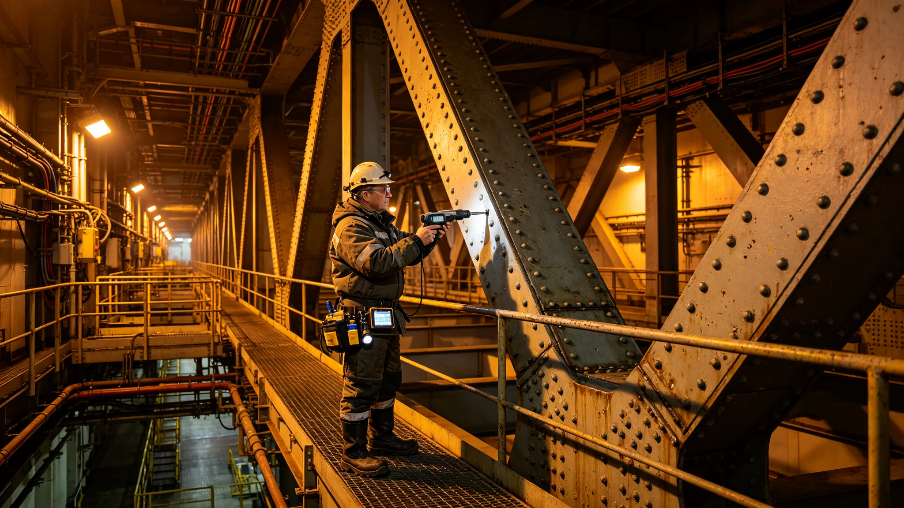

# 飞船主桁架结构延寿首席专家钟离硕检测记录与签认档案

## 一、材料来源

结构延寿工程署3805年2月28日编录。钟离硕，工号S-0092，原为无损探伤班班长，3796年受聘为主桁架结构延寿首席专家。本档以检测报告签认件、检测工时记录、一次预算争议批注、体外作业排班为主。

## 二、检测工时记录

主桁架全长分段编号共一千二百段，钟离硕任期内要求把原定每十年一轮的超声检测加密为每六年一轮。工时记录显示：3797年至3802年，其带队完成加密检测两轮，累计在桁架外通道行走检测路线折合单程两千四百次，相当于沿桁架全长往返十二轮。记录旁注："他要求每段由两名探伤员独立出数据，自己复听一遍，两人数据偏差超阈值即重测。"两轮加密检测共重测段数一百三十七段，占总段一成一。

## 三、签认件与裂纹事件

3801年结构检测发现裂纹事件（见另册），即发生在其加密检测的第三百零七段。该段检测报告上，钟离硕在"是否评定为可继续服役"一栏勾"否"，并附一页手写说明，列裂纹走向、宽度读数、扩展速率估算、建议更换窗口。此签认直接导致该段被列入更换清单。结构署在旁注："若仍按十年一轮，该裂纹将在三轮后才被发现，届时扩展速率或已超出可更换范围。"更换工程开工前，其又要求对相邻三百零五、三百零六、三百零八三段加做磁粉复检，三段均未发现裂纹。

## 四、争议批注

3800年，工程预算处曾提出把第三轮加密检测推迟两年以节约工时，理由为"前两轮未发现致命缺陷，加密收益下降"。钟离硕在预算评审纪要空白处批注一行："主桁架延寿不是节流项目，省下的工时将来要用解体的代价付。"该批注被收入会议纪要附件，预算处最终未通过推迟动议，仅同意把第三轮检测顺序与大修工期合并以省往返。纪要上双方均有签字，无争吵记录。

## 五、个人情况与排班

钟离硕五十一岁，长期在桁架外通道作业，3802年体检显示膝关节与腰椎关节退行性改变，船医建议"减少体外通道长时连续作业，单次外检不超过两时辰"。其当年仍要求外检轮班，排班表显示其体外作业时长占比由七成降至三成，改为室内复听数据为主，外检仅到关键段。船医在排班表旁签注"已采纳建议"。

## 六、签认风格

编录人附观察一条：钟离硕的签认从不写"同意"二字，只在结论栏勾选项，说明一律另起一页手写，字迹小而密，从不出现主观形容词。本档收录其手写说明共七页，每页均含数据读数与结论，无一页写"大概""可能"。其签名在每份报告末尾位置固定，距页边距一致。

## 七、复检相邻段与更换窗口

第三百零七段列入更换后，钟离硕主持对全桁架按裂纹可能传播路径作一次筛检，共抽段一百零四段，仅在第四百二十一段发现一条极短表面微裂纹，经磁粉复检判定不扩展，列入下一轮观察。筛检报告上其批注："裂纹不是孤例就是系统病，必须筛一轮才敢说只此一处。"筛检工时由其本人从私人额度中匀出，未另列预算。更换窗口排在大修间隙，不另停航。

## 八、与设计部门的接口会签

裂纹事件后，设计部门曾提出修改主桁架设计图以反映新的疲劳模型。钟离硕在会签件上批注："图上改一改容易，已在飞的桁架改不了，图纸更新应作为下一艘船的依据，不应掩盖本船已检出的裂纹。"会签结果为：本船按实测更换，下一艘船按新疲劳模型设计。两案分开，互不混同。会签件附其手写一页，列已在飞船段数与新建船段数。

## 十、检测仪器校准记录

本档另附一页仪器校准记录：钟离硕要求其带队所用超声探伤仪每轮检测前自校一次，每台仪器附校准单。两轮加密检测共用仪器六台，校准单十二张，无一缺失。校准记录旁注："他不相信不校准的仪器，也不相信只测一遍的数据。"若仪器校准偏差超限，该轮数据全部作废重测，两年内共作废一轮中的八段数据。

## 十一、截止

编录日，第三百零七段更换工程已开工，钟离硕在更换段复检记录上再次签字，结论为"合格，转入下一周期六年检测"。相邻三段及第四百二十一段复检报告与其签认同袋。另注：钟离硕手写说明七页，本档全部留存，未删改一字；其签名位置与页边距历年一致，编录人未发现一次潦草签名。另注：加密检测两轮共重测一百三十七段，相邻三段磁粉复检与第四百二十一段表面微裂纹观察件，均与其签认一一对应，无遗漏。编录人另注：两轮加密检测为其在任内主动加密，非上级交办，工时由其从个人额度匀出部分。
