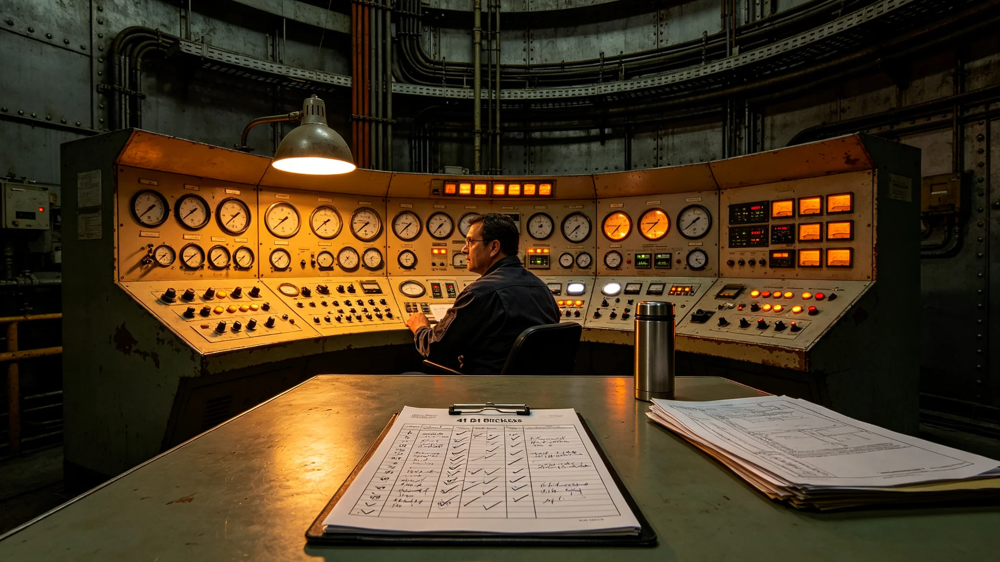

# 聚变堆芯升级总工艺师霍衡之值班与停电责任追溯档案

## 一、编录说明

能源署运行科3806年4月19日整理。霍衡之，工号E-3301，原堆芯运行值长出身，3799年起任聚变堆芯升级总工艺师。本档收录其值班记录、一次过载停电事件的责任追溯单、能源配额会议签认件、装料首日排班。

## 二、值班记录

霍衡之任职四年，其值班表显示其主动承担堆芯升级期间全部高风险窗口的本班值守，共值高风险夜班八十七次，占全部高风险窗口的六成。运行科备注："其余值长轮值时，他在旁室备班，未进现场，仅在电话线上，备班记录与当班记录同册。"3801年堆芯首次升功率试验夜，其连续值守二十六小时，次日交班前由副值长接替，自己在备班室睡四小时后又回到调度台。

## 三、过载停电事件追溯

3802年能源系统过载停电事件（见另册）发生在霍衡之当班之夜。停电主因为扩容工程临时负荷未计入堆芯调度曲线，堆芯保护跳闸，全船三级回路停电十一分钟，生命支持回路靠备用电池维持未断。责任追溯单认定：霍衡之作为当班总工艺师，在负荷申报单上签了字，未在签字前核对临时负荷与堆芯余量的对应表，属"流程内疏忽"。处分："书面检查，扣绩效工时十二小时，通报全能源署。"霍衡之签字接受，未申诉。追溯单末页附其事后提交的《临时负荷申报对照表修订案》，要求此后任何临时用电必须双人核对签字、堆芯余量低于阈值时系统自动拒批。修订案当年即被能源署采纳，3803年起执行，此后同类申报无一次单人签字。

## 四、能源配额会议签认件

3804年能源配额管理办法修订会议上，霍衡之代表运行方发言，记录照录大意："改造期能源不是越省越好，闭环系统和居住舱绿化不能断氧断光，配额要先保生命支持，再保工程进度，工程进度再挤生活用电。"会议签认件上，其在"生命支持优先级最高"一条旁单独画了重线，在"工程进度次之"一条画了中线。表决结果为按其发言顺序排序，与会各方均签字。

## 五、个人健康

霍衡之四十二岁，3803年体检有一项长期夜班引发的睡眠周期紊乱，伴轻度心律不齐，船医建议"调整为白班为主，高风险夜班每周不超过一次"。其调整后，仍保留每周一次高风险夜班在岗，运行科认为其身体"已处于可承受边缘，建议下次体检后再议"。

## 六、与前任对照

运行科附对照：上一任堆芯总工艺师任期内无责任事故，运行平稳；霍衡之任期内发生一起停电事件，并随之推动申报对照表修订，同类流程冗余被消除。对照栏无评价。表下另有一行小字："其书面检查原件留存，未公开。"

## 七、备用电池十一分钟记录

停电事件后，运行科附一页备用电池放电记录：生命支持回路靠电池维持十一分钟，电池容量剩三成二，未触底。霍衡之在记录旁注："若停电再延九分钟，备用电池即触发降级，闭环氧循环会掉一档。"该注记成为后来《停电分级预案》中"生命支持电池保底容量"条款的来源。预案规定此后任何施工临时负荷必须先过电池余量测算。

## 九、装料前的最后一页检查单

装料前，霍衡之把堆芯所有阀门、仪表、保护定值列成一页检查单，逐项亲自复点，共四十一项。复点中发现一项保护定值被上次试验改动后未复原，当场改回。检查单末其注："装料后再发现定值错，代价不是扣工时能算的。"该检查单经副值长复签，与本档同存。

## 十一、能源配额逐年对照表

本档附一页3800至3804年能源配额逐年对照表，列生命支持、工程施工、生活用电三项占比。霍衡之主持的配额排序在表上体现：生命支持占比始终稳在四成以上，工程施工随工期起伏，生活用电占比由两成五压至两成。表旁他注："改造期生活用电让渡给工程，但生命支持一寸不让。"五年间无一年生命支持占比跌破四成。

## 十二、编录截止

编录日，堆芯升级进入装料阶段，霍衡之在装料首日值班表上排第一班，排班表旁注"装料窗口不可换人"。其书面检查原件仍存于运行科抽屉，未随本档移交。另注：五年配额对照表上生命支持占比从未跌破四成，此为其任内唯一未让过的红线。另注：临时负荷双人签字制度自3803年执行至本档整理日，未再发生单人签字申报；装料前四十一项检查单复点出的一项定值错误，已当场改回并留痕。另注：备用电池十一分钟放电记录成为后来停电分级预案中生命支持保底容量条款的来源，该条款自3803年起执行。另注：其在能源配额会议上坚持的排序——生命支持、工程进度、生活用电——五年未变，会议记录与签认件均在卷。
