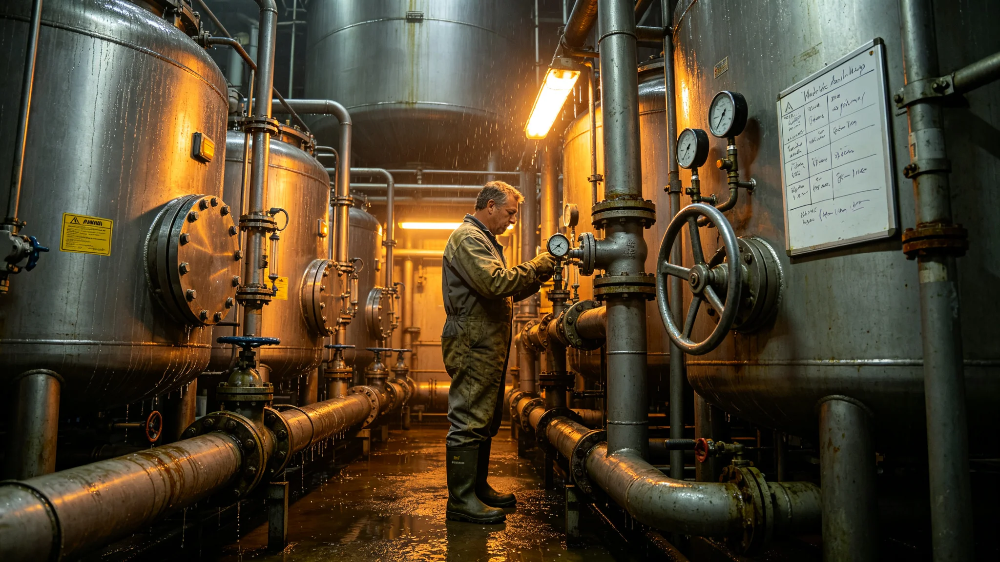

# 废物全循环系统负责人桑维堵塞处置与菌群保障档案

## 一、来源

环能署物料循环科3807年6月30日整理。桑维，工号W-0455，原为污水处理班班长，3797年起任废物全循环系统改造负责人。本档收录其堵塞事件处置记录、菌群保障交接、跨科协调备忘、系统可用率统计。

## 二、堵塞处置记录

3803年废物循环系统堵塞事件（见另册）中，主堵塞段位于第三级生化反应槽进料管。处置记录载：桑维当夜到场，先关进料阀保下游闭环，再分段反冲，全程九小时，未停机导致全船污水外溢，未影响生命支持回路。处置记录上其签字注明"先保闭环，再通主路；下游闭环不停，上游可慢"。事件后其提交《堵塞应急预案》，把单段处置扩展为全系统分段隔离，预案规定每级反应槽可独立关阀、独立反冲，不必停全系统，预案纳入规程。执行后同类堵塞处置时间由九小时降至三小时。

## 三、菌群保障交接

废物循环依赖降解菌群。3800年系统改造换槽期间，桑维主持把降解菌分槽暂存，共转移六槽，每槽保留接种源，记录转移前后菌量、活性、温度。交接记录载："换槽不停菌，宁可换得慢，不可菌种断；任一槽菌量下降即暂停该槽换装。"与生命支持侧的菌群重建（见另册）由其与温蘅联合签字确认接口，两侧菌种清单互抄一份。六槽暂存菌在换装完成后全部回种，无一槽报废。

## 四、跨科协调备忘

3801年，扩容工程施工产生大量建筑垃圾，其中含少量不宜入降解系统的惰性填料。桑维向居住工程署发备忘一纸，要求"施工废料与生活废物分道，不得混入降解系统，否则菌群中毒全槽报废，恢复需三个月"。备忘发出后，居住署回复并附《废料分类清运单》样式，规定惰性填料走另一条回收通道。两份文件同袋留存，备忘与回复均有双方负责人签字。

## 五、个人情况

桑维四十八岁，长期在高湿高味舱段作业，3802年体检嗅觉敏感度下降，对氨类气味辨识力低于同舱均值，船医建议"调离一线反应槽区，改任调度与培训"。其接受调离至调度室，仍每日到槽区巡查一次，巡查时由一名嗅觉正常的副手同行。排班表显示其一线作业时长占比由八成降至两成。

## 六、考评与可用率

物料循环科附：桑维任内系统可用率从改造前的百分之九十一提升至改造后的百分之九十七，堵塞次数三年累计下降四成，降解残渣含水率下降两成。数字照列，未作评语。表下一行小字："可用率提升主因分段隔离与菌群暂存两项措施。"

## 七、残渣回用与产品方向

全循环改造后，降解残渣经二次处理成为居住舱绿化的基质原料。物料循环科附一页回用台账：3805年全年回用残渣折成绿化基质约供两段新舱段绿化使用，无需另采外购。桑维在台账旁注："循环不是只排干净，是把排出去的再种回来。"台账与绿化系统升级（见另册）接口由其签字。

## 九、培训与交接

桑维调离一线前，把七年处置堵塞、换槽保种的经验整理成一册操作要点，共三十二条，交两名副手。要点第一条即"先保下游闭环"，最后一条为"任一槽菌量异常，先停本槽，别停全系统"。培训记录显示其用六周带教，考核两人均合格。操作要点末页他注："系统比人长寿，人得把它交给能接的人。"

## 十一、与环保监测的数据互抄

全循环系统出水与居住舱绿化用水、闭环进水之间，桑维要求每日互抄一次水质数据，附三个月互抄记录摘抄。记录显示有一周出水浊度偏高，桑维当日即与环控署对表，发现是上游扩容施工冲洗水误接入，整改后次日恢复。互抄记录旁他注："我这一级的指标单看合格，不等于别人那一级能用。"互抄机制此后制度化。

## 十二、截止

编录日，全循环系统进入连续运行考核期，桑维在首月运行日报上签"正常"，日报附菌量曲线一张，曲线平稳。其调离一线后，一线处置由两名副手按其应急预案轮值。另注：三十二条操作要点已印成手册，发至全循环系统全部值班岗，每人一册，回收旧版时逐人登记。另注：六年间系统可用率由九成一升至九成七，堵塞次数下降四成，残渣回用已供两段新舱段绿化基质，数据均来自物料循环科台账，编录人未加改易。另注：六槽暂存菌换装后全部回种无报废，与环控署温蘅两侧菌种清单互抄一份，接口会签至今有效。另注：其调离一线后仍每日到槽区巡查一次，与嗅觉正常副手同行；排班表显示一线作业占比已降至两成，体检建议被执行。连续运行考核期首月运行日报菌量曲线平稳，日报由两名副手轮值签，桑维仅在末页复核。其本人未签运行日报。
