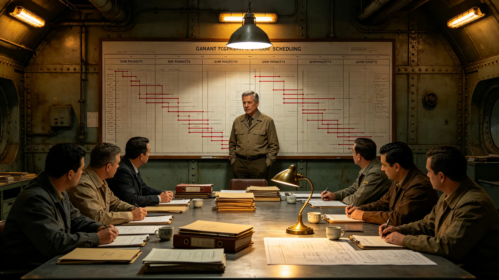

# 飞船中期大修工程总监窦展工期与临时安置协调档案

## 一、编录

大修工程署3808年8月22日整理。窦展，工号O-6620，原为舱段开腹工程队长，3796年起任中期大修工程总监，统辖八大改造子项的总工期协调。本档收录其工期调度记录、临时安置协调件、一次燃料供应延期回函、总验收清单。

## 二、工期调度记录

大修总工期原定二十年。窦展的调度记录显示：3798年居住舱扩容坍塌险情后，总工期表被其本人往后顺延十四个月；3801年主桁架裂纹发现后，再次顺延八个月。两次顺延均由其在总表上用红笔改线，并附《工期顺延说明》，说明中写明"宁可顺延，不带病完工；顺延期间已开腹舱段须维持临时防护"。最终工期较原计划延长二十三个月。顺延说明共两份，每份末尾有改造署、安全处、预算处三方会签。

## 三、临时安置协调件

大修期间大量居民需临时迁置。窦展与居住署、生态署三方协调件同存：3800年第三舱段开腹前，一千二百户居民临时迁往备用居住环；3802年第五舱段开腹前，九百户迁置；协调件载迁置批次、批次间隔、每户携带物品限额、回迁条件。末页附居民代表签字一行："迁置可以，要求回迁日期写进调度表，不得口头承诺。"窦展当日即在调度表上补写回迁排期，两批迁置均按排期回迁，无逾期。

## 四、燃料供应延期回函

3804年，燃料供应署因氚供应紧张要求大修暂停六个月。窦展回函照录大意："停工会让已开腹舱段长期暴露，密封与保温层失修风险大于等待供应，建议改为分段减速而非全停；关键段（推进、闭环、桁架）不停，非关键段减速。"该建议被采纳，最终改为关键段不停、非关键段减速三个月，总工期仅多延一月。燃料供应署回函致谢并附分段供应计划。

## 五、个人情况

窦展五十二岁，3803年体检心脏指标偏高，伴轻度早搏，船医建议"减少连续高强度调度会，会议不超过两时辰，会间休息"。其把每周七次调度会减为五次，余两次改为书面会签，调度会旁由副总监记录。船医在体检单签注"已调整，继续观察"。

## 六、与历次大修总监对照

大修署附对照：上一次中期大修总监任期内无延期记录，工期按原表完成，未发生坍塌与裂纹；本次窦展两次主动延期、一次建议不全停、一次主动修订吊装方案。对照栏仅列事实。表下一行小字："上次大修时无加密结构检测，本次裂纹为首次在主桁架检出。"

## 七、迁置居民回迁后回访

两批迁置居民回迁后，窦展要求各署联合作一次回访，附回访记录一页：一千二百户中，回迁后一周内报修共四十一项，主要为新风与给排水小故障，三日内全部修复；九百户批次报修二十三项，两日内修复。回访记录上居民代表批注"回迁比预想的快，没在备用环拖"。窦展在记录旁注："迁置可以临时，回迁不能临时。"

## 九、总验收前的一次复核

收尾验收前一月，窦展要求把八张子项验收表全部重对一遍工期与预算，附复核记录一页：发现居住舱子项决算与总表差两日，系回迁延后两日记法不一致，已统一。复核中无实质性漏项。他在记录旁注："总验收不是签个字，是把二十年的账对平。"复核记录经预算处会签。

## 十一、八子项进度对照与他签认顺序

本档附一页八子项进度对照表：推进、闭环、居住、结构、能源、废物、大修、舱段重构，各子项开工与收尾日期分列。窦展签认总验收时按子项逐项核，而非整体一次签。表旁他注："八个子项不是一条绳，一个拖了别把另一个也拖住。"对照表显示舱段重构子项因等待结构延寿结论而最晚开工，未拖累其他子项收尾。

## 十二、编录截止与总验收

编录日，大修进入收尾验收，窦展在总验收清单上逐项签字，共四十四项，末项旁注"验收合格后封存总表，本表不复用"。清单上有改造署、安全处、质量监督处三方会签栏，均已签满。总工期最终二十三年，较原定延二十三个月，未再追加。另注：两批迁置居民均按排期回迁，无一户滞留备用环；回访报修均在三日内修复。另注：八子项进度对照表显示舱段重构子项最晚开工，等待结构延寿结论；其余七子项按序收尾，无一项因等待而停工。总验收四十四项签认一次性通过，无补签。另注：两次工期顺延与一次不全停建议均由其主动提出，非事故被迫；顺延说明与回函原件均附本档，三方会签齐备。另注：其调度会由每周七次减为五次、余两次改书面会签，此为船医建议后的执行结果，体检单签注在卷。总验收四十四项清单封存后，本表不复用；八子项进度对照表与回访记录同档留存。
