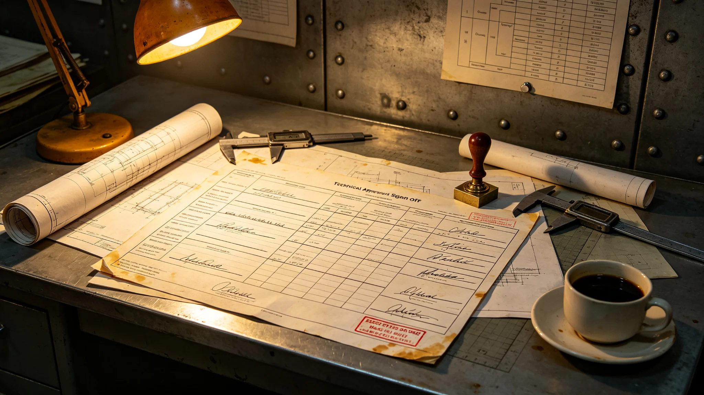

# 主推进系统升级审批制度（3810年颁行）

## 第一章 适用范围与立法缘由

本制度规范第十一代聚变推进系统换装的立项、试车、定型三级审批，自3810年四月颁行，取代第十代换装时沿用的口头试车规程。第十代换装时曾因低功率段未充分观测，暴露冷却管微漏险些带入高功率段，故本次改以书面分级审批。凡涉及主推进功率、工质、辐射器、点火试车的变更，均须按本制度逐级报批，口头同意一律无效。

## 第二章 立项审批

立项须提交设计书，列比冲、工质消耗、辐射器余温、可维护窗口四参数，并附模拟器三代工况数据。模拟器数据未满三代工况者，不予立项审批，因第十代教训即来自模拟器未跑满。立项由推进署设计科初审，总工程师复审，改造署核准。核准件须注明四参数取舍理由。

## 第三章 试车分级

试车分低功率、中功率、高功率三级。低功率段须先满两小时观测方可进中功率，此条来自第一次试车延长观测两小时暴露微漏的经验；中功率段暴露的微漏等问题未排除前不得进高功率。每级试车签认单须由试车指挥与总设计师双签，代签须书面授权并双签留痕。

## 第四章 长期工况数据要求

定型前须积累连续不少于二十个月的长期工况数据，列余温、效率、液滴分布三项。数据未满二十个月者，即使试车全部通过，亦不予定型。此条为硬性门槛，不因工期压力放宽，理由是第十一代辐射器结构更复杂、维护窗口更窄，短试车不足以暴露长期问题。

## 第五章 工质安全审批

氚等工质的装卸须单独报批，列装卸窗口、防护、泄漏应急。工质微量逸出事件后，装卸窗口由单次改为分段，每段装卸前核对泄漏应急就绪。工质运输与储存另列规程，本制度仅管审批节点。

## 第六章 与结构接口审批

推进换装与主桁架接口的公差须经结构延寿工程署会签。公差超出换装允许值者，不得进入吊装。接口校核未完成的段，列入未移交项跟踪，不得口头带过。会签件附公差读数。

## 第七章 试车噪声与人员防护

试车台噪声环境下人员须佩戴加厚护耳，高频听力下降者改远程观摩，不强制到场。试车班次排定须留足恢复时间，连续试车不超过规定班次。噪声监测卡记录累计暴露时长，超阈值即轮换。

## 第八章 试车记录与定型

每级试车记录、签认单、批注全部留档，代签件与原签件同存。定型验收报告会签后，试车阶段资料封存，不复用。试车中任一补写建议被采纳者，在记录中注明后果。

## 第九章 废止与生效

本制度自3810年四月颁行日生效，原口头试车规程同时废止。解释权归推进署，与改造法抵触者以改造法为准。过渡期内已立项未试车者按本制度补报试车分级。
## 第十章 执行问答（节选）

问：试车低功率段为何必须满两小时？答：第一次试车正是延长观测两小时才暴露冷却管微漏，短段试车会把隐患带入高功率。问：长期工况数据未满二十个月可否先定型后补？答：不可，此为硬门槛，工期压力不放宽，因辐射器长期余温只能靠时间暴露。问：代签试车单是否允许？答：允许但须书面授权并双签留痕，口头授权无效。问：与主桁架接口公差超谁负责？答：由结构延寿工程署会签，超公差即不得吊装，不因推进进度让路。
## 第十一章 三级试车签认分工

低功率试车由试车指挥与当班值长双签，总设计师远程观摩；中功率试车须总设计师到场，与试车指挥、当班值长三方签认；高功率试车在长期数据满二十个月后方可安排，由总设计师、试车指挥、改造署代表三方签认。每次试车后七日内向监督处报备记录。代签仅限中功率以下，高功率一律本人到场。试车中补写建议一旦被采纳，须在记录中注明后果与执行日期。
## 第十二章 过渡期安排与解释

本制度颁行时，第十一代推进已完成前两次试车，第三次未进行。过渡期内：已完成的前两次试车按原规程认可，但须补做长期工况数据台账；未进行的第三次试车按本制度高功率程序办理，总设计师须到场。工质装卸窗口自颁行日起即改分段，不再沿用单次。与结构接口公差会签缺签段不得吊装。解释中如遇试车分级与工期冲突，以试车分级为准，工期让步于试车安全。本制度不涉及比冲等技术参数本身，参数另见设计书。

本制度由推进署解释，与改造法冲突者以改造法为准。颁行之日，原口头试车规程同时作废，试车班、值长、设计科均按本制度重新领受一次。历次试车记录与签认单装订成册，存于推进署档案柜，编号按试车顺序排。本制度有效期至第十一代推进定型验收后止，定型后视情再议第十二代是否沿用。
