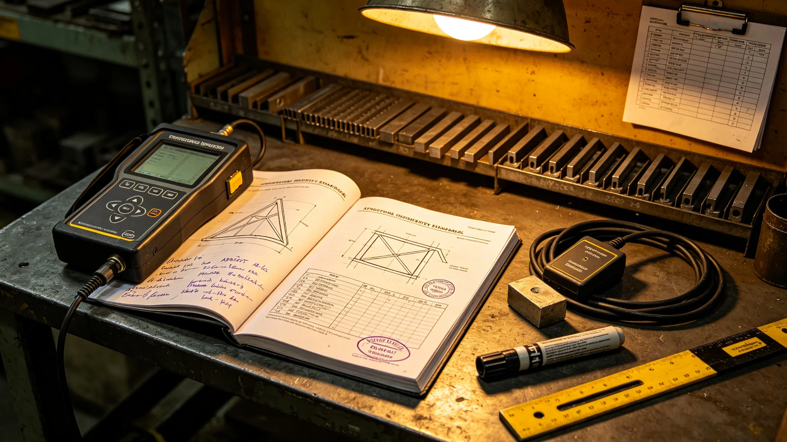

# 飞船结构延寿标准（3812年颁行）

## 第一章 标准目的与由来

本标准规定主桁架等关键结构的检测周期、判废阈值与更换窗口，自3812年三月颁行。此前主桁架检测原定每十年一轮，裂纹事件后改为加密六年一轮，本标准把加密周期正式定型。标准制定基于检测发现第三百零七段裂纹的教训，若仍按十年一轮，该裂纹将在三轮后才被发现，届时或已超出可更换范围。

## 第二章 分段编号

主桁架全长分段编号共一千二百段，每段建档，记录历次检测数据。分段编号一经定下不再变更，更换段沿用原编号，仅在档案中标注更换年份。每段档案含位置、材料、历次读数、签认人四项。

## 第三章 检测周期与双数据

关键段检测周期定为六年一轮，非关键段可八年一轮。每段由两名探伤员独立出数据，偏差超阈值即重测。所用超声探伤仪每轮检测前自校一次，校准偏差超限则该轮数据作废重测。两年内曾作废一轮中八段数据，均因仪器校准偏差。

## 第四章 裂纹判废阈值

检出裂纹者，按宽度读数与扩展速率估算判定：宽度超过阈值或扩展速率超过可更换范围者，列入更换清单，评定为不可继续服役；极短表面微裂纹、判定不扩展者，列入下一轮观察。判定须附手写说明，列裂纹走向、读数、估算，不写"大概""可能"。

## 第五章 相邻段复检

关键段检出裂纹列入更换后，须对相邻段及可能传播路径抽段磁粉复检。筛检发现新裂纹者，按第四章判定。筛检工时单列，不从常规轮次中扣减。首次筛检一百零四段，仅发现一条不扩展微裂纹。

## 第六章 更换窗口与复检

更换排在大修间隙，不另停航。更换后须复检合格，转入下一周期六年检测。更换记录与相邻段复检报告同档留存。更换段沿用原编号，标注更换年份。

## 第七章 设计更新与本船分离

检测得出的新疲劳模型用于下一艘船的设计，不得用于掩盖本船已检出的裂纹。本船按实测更换，下一艘按新模型设计，两案分开，互不混同。设计图更新不等同于本船免于更换。

## 第八章 与预算的关系

预算处无权以节流为由推迟结构性检测，结构检测工时单列。曾有推迟第三轮检测两年的动议被否，理由为延寿项目不得用节流转嫁解体代价。检测工时自个人额度匀出部分亦登记。

## 第九章 生效

本标准自3812年三月颁行，解释权归结构延寿工程署。过渡期内已到期未检段按新标准优先补检，补检结果入档。
## 第十章 执行问答（节选）

问：检测周期为何改六年？答：第三百零七段裂纹若按十年一轮将迟三轮才发现，六年一轮可在可更换窗口内检出。问：裂纹判废凭什么？答：凭宽度读数与扩展速率估算，附手写说明，不写主观判断。问：相邻段为何要复检？答：裂纹不是孤例就是系统病，必须筛一轮才敢说只此一处。问：新疲劳模型能否免本船更换？答：不能，本船按实测更换，新模型只用于下一艘船设计。
## 第十一章 检测数据双轨记录

每段检测数据由两名探伤员独立出具，两轨数据偏差超阈值即重测。超声探伤仪每轮检测前自校，校准偏差超限则该轮全部作废。作废记录入档，不隐瞒。裂纹判废说明须含走向、宽度、扩展速率三项读数，缺一项即退回补写。相邻段磁粉复检记录与原段签认同档。已在飞段更换沿用原编号，仅标更换年份，不另编号。
## 第十二章 过渡期安排与解释

本标准颁行时，第三百零七段已列入更换，相邻三段及第四百二十一段复检已毕。过渡期内：已到期未检关键段按六年一轮优先补检，补检结果入档；已检出裂纹段按本标准更换窗口排入大修间隙。非关键段八年一轮维持。解释中如遇检测周期与预算节流冲突，以检测周期为准，预算让步。本标准不涉及材料配方，材料另见设计规范。双轨数据与仪器自校自颁行日起执行，此前单轨检测段列入下一轮补测。

本标准由结构延寿工程署解释。每段档案保存至该段更换后另立新档，旧档留存不毁。检测双轨数据与仪器自校记录随段档走。本标准有效期内如检出新裂纹类型，先按本标准判定，再视情出补充标准。预算处节流动议须先过结构署会签。

本标准所定六年周期自颁行年算起，非从上次检测日算起，以统一起算便于排程。已在飞段与新更换段同表管理。检测中如遇仪器故障，当日记录顺延，不另约远期。

判废读数临界段须由两名探伤员复测加一名结构署专家复听，三方一致方定更换。观察段下次检测优先排。

观察段下次检测结果另报。本标准不溯及既往。