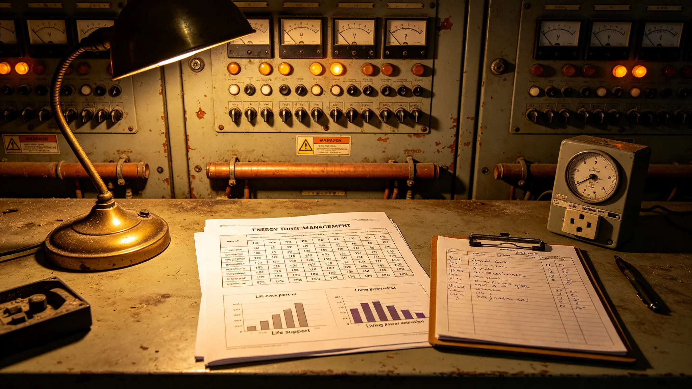

# 能源配额管理制度（3813年修订）

## 第一章 修订缘由

改造期能源需求激增，扩容工程临时负荷与既有生命支持、生活用电争夺配额。3802年过载停电事件中，扩容临时负荷未计入堆芯调度曲线，致堆芯保护跳闸、全船三级回路停电十一分钟，生命支持回路靠备用电池维持未断。事故后能源署于3813年修订本制度，确立配额排序与临时负荷双人核对制。

## 第二章 配额排序

配额排序三级：第一级生命支持，不得让渡；第二级工程进度，改造期优先于生活；第三级生活用电，可在改造期内适度让渡。生命支持占比任何时期不得低于四成，五年对照无一突破此线。排序经各方会签，不得单方调整。

## 第三章 临时负荷申报

任何施工临时用电须先过堆芯余量测算，双人核对签字，堆芯余量低于阈值时系统自动拒批。单人签字申报一律退回。此条自3803年起执行，本次修订正式入制度。临时负荷申报对照表修订案即事故后所立，执行后无一次单人签字。

## 第四章 备用电池保底

停电分级预案规定生命支持回路备用电池保底容量。任何施工不得把备用电池容量挤至保底线以下。停电十一分钟即电池容量剩三成二、再延九分钟即触发降级，此为保底容量设定依据。保底容量条款自3803年起执行。

## 第五章 配额年度对照

每年编列能源配额对照表，列生命支持、工程、生活三项占比，公示。生命支持占比跌破四成须说明原因并恢复。对照表示生命支持占比始终稳在四成以上，工程随工期起伏，生活用电由两成五压至两成。

## 第六章 能源节约

生活用电可让渡部分，通过分时计价引导，不强制限电。工程用电厉行节约，但不得挤占生命支持与结构检测。改造期节能以工程侧为主，不以居民节电补工程浪费。

## 第七章 堆芯升级与配额

聚变堆芯升级期间，配额随装料与升功率调整。装料窗口不可换人，高风险夜班每周不超过一次。堆芯升功率前须复点保护定值，一次复点曾改回一项被试验改动后未复原的定值。

## 第八章 生效

本修订自3813年五月颁行，原临时负荷口头申报制废止。解释权归能源署。过渡期内已申报未用临时负荷按本制度补双人核对。
## 第九章 执行问答（节选）

问：配额排序为何生命支持最高？答：改造期可让工程与生活，不可断氧断光，五年对照从未让生命支持跌破四成。问：临时用电为何要双人签字？答：单人签字曾致过载停电，双人核对加系统拒批，执行后无一次单人申报。问：备用电池保底为何设此容量？答：停电十一分钟即触底，再延九分钟即触发降级，保底容量据此定。问：生活用电能否强制限电？答：不强制，以分时计价引导，节能主要压工程侧。
## 第十章 三年配额占比对照

| 年度 | 生命支持 | 工程施工 | 生活用电 |
|---|---|---|---|
| 3801 | 四成三 | 三成一 | 两成六 |
| 3802 | 四成一 | 三成六 | 两成三 |
| 3803 | 四成二 | 三成五 | 两成三 |

三年间生命支持从未跌破四成，工程随工期起伏，生活用电由两成六压至两成三。配额年度对照公示，跌破四成须说明并恢复。临时负荷双人签字自3803年执行，未再发生单人申报。
## 第十一章 过渡期安排与解释

本修订颁行时，双人签字制已实际执行十年，备用电池保底条款已执行十年。过渡期内：把行之有效的临时措施正式入制度，无需重新宣贯；已申报未用临时负荷按本制度补双人核对。堆芯升级装料期间配额随升功率调整，但生命支持占比不跌破四成。解释中如遇工程进度与生命支持配额冲突，以生命支持为先。本制度不涉及堆芯技术参数，参数另见运行规程。年度对照自颁行年起编列。

本制度由能源署解释。年度配额对照表自颁行年起每年一编，报改造署并摘要公示。临时负荷申报单双人签字件与系统拒批记录按月装订。本制度有效期内如新增大功率工程，须先过配额测算再立项。生活用电分时计价细则另见供电站通告。

堆芯装料与升功率各阶段的配额预估值提前一个月报改造署，便于工程侧调整临时负荷。备用电池每季放电试一次，试结果入档，试放电期间生命支持不降级。

配额让渡生活用电部分经居民代表会议认可，不单方压减。工程侧节能先查浪费再谈让渡。堆芯升级期间每日报一次配额余裕。

堆芯升级全周期配额预估值与实际值年终对照，偏差入档。本制度不溯及既往。

分时计价细则随供电站月度通告调整，居民可在终端查当日电价。工程侧临时负荷余裕日报每日早七时更新。

日报余裕若低于预警线，工程侧临时负荷自动延后。