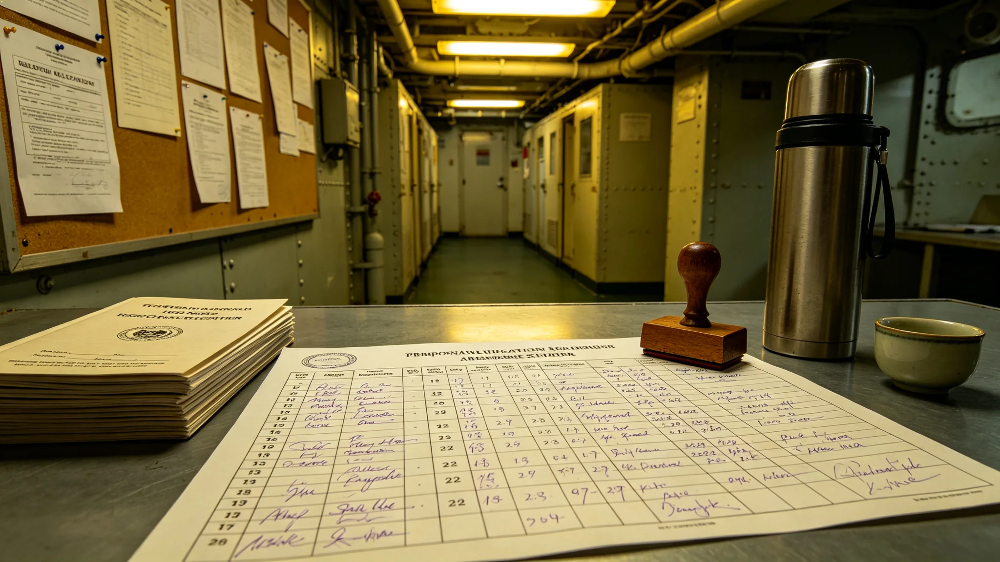

# 大修期间临时安置制度（3814年颁行）

## 第一章 适用范围与由来

本制度规范中期大修开腹舱段期间居民的迁置、临时居住、回迁与回访，自3814年七月颁行。此前两批迁置（第三舱段一千二百户、第五舱段九百户）依协调件办理，本制度将其定型为常轨，使迁置回迁不再逐案协商。

## 第二章 迁置批次

开腹前居民分批迁往备用居住环，批次间隔不少于十五日，便于备用环逐步接纳，避免备用环瞬时过载。每批迁置登记到户，列携带物品限额。迁置批次写入调度表，与开腹排期同表管理。

## 第三章 回迁排期

回迁排期与开腹排期同时写入调度表，不得只排迁置不排回迁。回迁以开腹舱段验收合格为前提。居民代表要求回迁日期书面化，本制度照准，两批迁置均按排期回迁，无逾期、无滞留。

## 第四章 临时居住权益

迁置期间居民原居住权益保留，临时居住环提供同等基本生活条件。迁置费用列入大修预算，不向居民摊派。学龄儿童就读位置变更由学校出具通知。迁置不是放逐，临时环条件不得低于原舱段基本水平。

## 第五章 回迁验收与回访

回迁后一周内由各署联合回访，记录报修事项，三日内修复。回访向住户确认，记录存档。两批回迁报修分别为四十一项与二十三项，均按期修复。回迁不得临时应付，验收与回访缺一不可。

## 第六章 不得滞留

迁置居民须按排期回迁，不得滞留备用环占用容量。确需延后者，向居住署申请，列原因与延后期限。滞留者不享受优先轮候新舱段。

## 第七章 迁置与施工协调

迁置与开腹施工之间须留防护期，已开腹舱段在迁置完成、临时防护就绪后方可开工。迁置未完成不得开腹，防止居民与施工混线。迁置批次与施工批次在总表上互为前提。

## 第八章 生效

本制度自3814年七月颁行，解释权归大修工程署与居住工程署联席。过渡期内已迁置未回迁户按本制度补办回迁排期书面通知。
## 第九章 执行问答（节选）

问：迁置批次为何隔十五日？答：让备用环逐步接纳，避免瞬时过载，也给居民整理时间。问：回迁日期能否口头承诺？答：不能，必须写入调度表书面通知，两批均按排期回迁无滞留。问：临时环条件能否降格？答：不能，须维持同等基本生活条件，迁置不是放逐。问：回迁报修多久修？答：一周内联合回访，三日内修复，记录存档。
## 第十章 两批迁置实绩

| 批次 | 舱段 | 户数 | 迁置间隔 | 回访报修 | 修复时限 |
|---|---|---|---|---|---|
| 第一批 | 第三舱段 | 一千二百户 | 十五日 | 四十一项 | 三日内 |
| 第二批 | 第五舱段 | 九百户 | 十五日 | 二十三项 | 三日内 |

两批均按排期回迁，无逾期、无滞留。迁置费用列入大修预算，未向居民摊派。学龄儿童就读变更由学校出通知。本制度颁行后第三批迁置将按本常轨办理。
## 第十一章 过渡期安排与解释

本制度颁行时，两批迁置已按协调件完成回迁。过渡期内：已完成两批留档，第三批起按本常轨办理；已迁置未回迁户按回迁排期书面通知。迁置批次间隔自颁行日起固定十五日。解释中如遇迁置与开腹工期冲突，迁置未完成不得开腹，工期让步。本制度不涉及备用环建设标准，标准另见居住规程。回访报修自颁行日起三日内修复，记录存档。

本制度由大修工程署与居住工程署联席解释。迁置批次登记到户，回迁排期书面通知，回访报修记录逐年装订。本制度有效期内如开腹舱段数增加，按十五日间隔类推，不得压缩。确需延后回迁者向居住署申请。第三批迁置实绩将回填入本制度附表。

迁置居民携带物品限额单列清单，贵重物品由本人保管，公共物品由居住署登记。临时环内不另立学校，学龄儿童沿原校远程就读。迁置批次通知提前十五日到户。

临时环基本生活条件列对照单，含供水供电供餐与洗浴，不低于原舱段。迁置批次通知含集合时间、交通、登记点。回迁后原舱段物品由居住署协助运回。

迁置登记到户编号，与回迁排期一一对应，不留无编号户。临时环条件对照单随迁置通知发到户。本制度颁行前两批迁置留档，不补办。

回迁后原舱段由居住署先验后还，住户当日可入住。迁置期间家庭联系按原通讯线不断。第三批迁置实绩将回填本制度附表，与前两批并列。

临时环内公共食堂供应标准与原舱段一致，不单设特殊供应。迁置家庭如遇病老孕幼特殊情况，向居住署申请优先批次。

优先批次名单公开，不另设内部照顾。

优先批次名单由居住署与监督处共核，季度公示。

本制度自颁行日起执行，既往迁置不溯及。

既往迁置不补办手续。