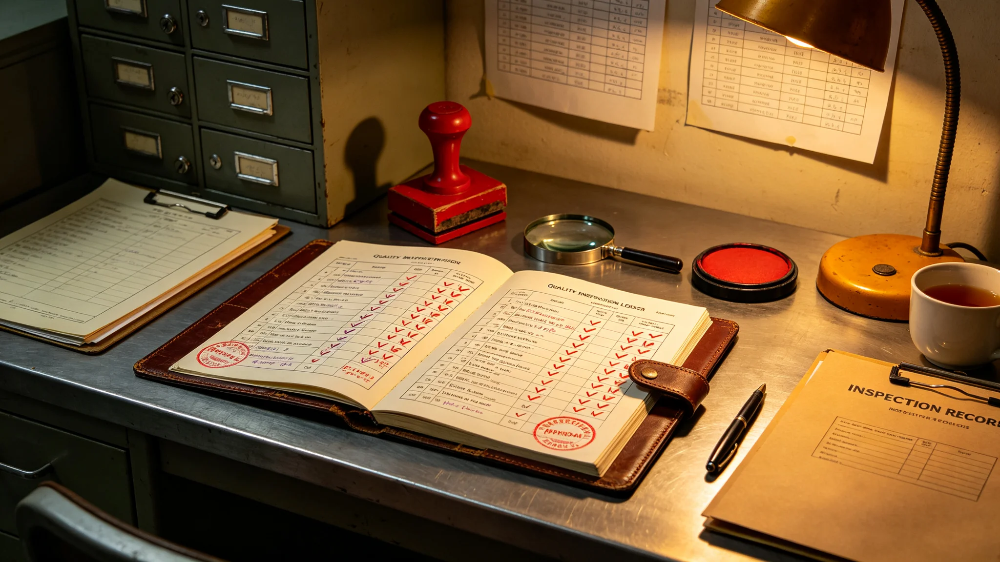

# 改造工程质量监督制度（3815年颁行）

## 第一章 独立地位

改造工程质量监督处独立于改造八署，直接对船务署负责。监督处有权查阅任一子项记录，八署不得拒绝。监督处分立设处，不受总工程师指挥，以保证对总工程师本身亦可监督。此条来自试压签注空窗事件后，监督处需独立于改造署。

## 第二章 监督范围

监督覆盖八子项全部关键工序：试压、吊装、检测、试车、迁置、回迁、验收。关键工序记录须留痕，监督处抽查。非关键工序由各署自检，监督处抽检。关键与非关键工序清单由监督处与各署共定，年度更新。

## 第三章 红线停工

下列情形监督处应下令停工：生命支持回路中断超十一分钟未恢复备用；防护等级临时降级超期；结构关键段检测不合格仍继续工序。红线停工认定为规程生效，责任人不受处分，以鼓励停工上报。红线停工记录入年度报告，不点名个人。

## 第四章 处分与申诉

责任事故由监督处出具处分单，当事人可申请复核。处分记录入人事档案。匿名举报经核不实者留卷，不退回举报人，不附举报来源。处分以流程责任为主，不以个人苛责，推动流程整改而非事后追人。

## 第五章 自动锁定建议

试压记录与工序调度间存在空窗期者，监督处应推动把人工签注改为系统自动锁定，减少事后追责个人。修订建议由监督处提请改造署。试压未达额定值即自动锁定后续工序，不必等人工签注。

## 第六章 居民申诉

居民对迁置、噪声、施工时段、新舱段质量有异议，可向监督处申诉，三十日内答复。申诉处理记录公开。申诉受理不以改造署意见为前置，监督处直接受理。

## 第七章 年度报告

监督处每年编改造质量年度报告，列关键工序抽查合格率、红线停工次数、申诉答复情况，报船务署。报告不点名个人，只列系统问题。年度报告向居民摘要公示。

## 第八章 与各子项规程关系

监督处依本制度独立行事，各子项规程中与监督制度抵触者无效。监督处对八子项一视同仁，不因子项重要性差别放松抽查。解释权归船务署。

## 第九章 生效

本制度自3815年九月颁行。颁行前已发生的处分与举报留卷，不因本制度重新认定。过渡期内监督处按本制度补立独立台账。
## 第十章 执行问答（节选）

问：监督处为何独立？答：需对总工程师本身亦可监督，试压签注空窗事件后更须独立于改造署。问：红线停工是否算事故？答：不算，认定为规程生效，责任人不受处分，以鼓励上报。问：匿名举报不实怎么处理？答：留卷，不退回举报人，不附来源。问：年度报告为何不点名个人？答：只列系统问题，推动流程整改，不以追人为目的。
## 第十章 红线停工判定流程

监督处接报或自查发现疑似红线情形，先现场核实记录，再下令停工，停工令直送总工程师与改造署。停工后七日内出处置意见，列是否恢复、整改要求、责任划分。红线停工不处分个人，转入流程整改。停工记录入年度报告，只列工序不点名。监督处对八子项一视同仁，不因子项重要性差别放松。
## 第十一章 过渡期安排与解释

本制度颁行时，监督处已依临时章程独立办事多年。过渡期内：把独立地位、红线停工、年度报告三项正式入制度，已发生的处分与举报留卷不重新认定。解释中如遇监督处抽查与各署自检冲突，监督处抽查为准。红线停工不处分个人自颁行日起执行。本制度不涉及具体技术质量标准，标准另见各子项规程。年度报告自颁行年起编列，向居民摘要公示。

本制度由船务署解释。监督处独立台账自颁行日起建立，八子项关键工序抽查记录按季归档。年度报告报船务署并向居民摘要公示。本制度有效期内如新增子项，先列入关键与非关键清单再纳入监督。匿名举报留卷不退回，处分不点名个人。

监督处抽查发现问题分三等：提示、限期整改、红线停工。提示留档，限期整改须回复，红线停工直送总工程师。三等判定标准每年复看一次。年度报告含三等待办数量。

监督处与各署信息互通，关键工序记录同步可查。年度报告附抽查合格率走势。申诉答复留双方记录。

监督处独立台账与各署自检台账分存，年度合并报告。本制度颁行前已发生事项留卷，不重新认定。

提示类问题由各署自查回复，监督处抽验。限期整改逾期未复者升级为停工。

抽验结果随季度报告。监督处不介入技术方案本身，只查流程是否到位。

技术方案争议由各署技术会裁，监督处不越权。

技术会裁结论抄送监督处备案。

本制度自颁行日起执行。