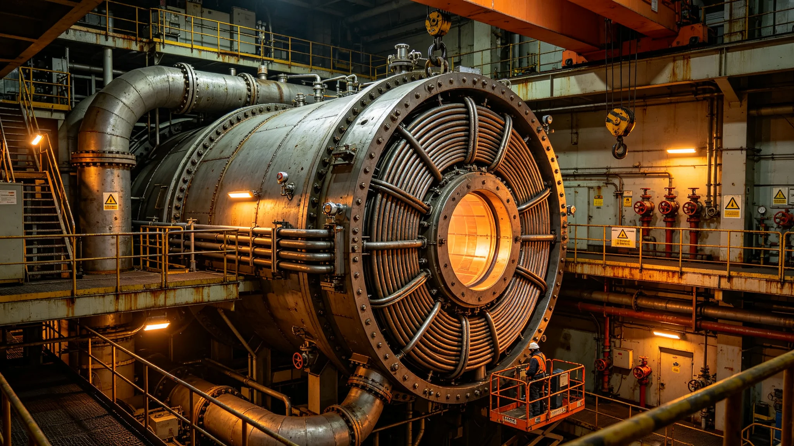

# 第十一代聚变推进系统换装技术报告

## 一、换装背景与历程

飞船连续航行约四百年，第十代聚变推进系统已运行逾一百六十年，工质消耗逐年升高，液滴辐射器余温偏高，比冲维持在基准线。继续以第十代延寿，工质补给与辐射器散热将在一个大修周期内成为瓶颈。第十一代换装自3797年立项，经模拟器三代工况、三次实车试车，至3816年进入定型验收。本报告汇总换装技术要点、试车数据取舍与遗留问题，供验收会签。

## 二、四项关键参数取舍

第十一代与第十代相比，比冲提高约一成，工质消耗下降约一成五，辐射器余温控制在阈值内，代价是可维护窗口较窄。比冲与工质收益来自燃烧室磁约束改进与工质回收闭环；维护窗口变窄是因辐射器结构更复杂、部件更紧凑。四项取舍不是简单的技术进步，而是为"再飞两百年"所作的定向选择，下一代是否反向借鉴第十代的宽窗口，留待后任。

## 三、液滴辐射器重设

第十代换装时液滴辐射器余温过高，长期未根治。第十一代重设辐射器，把微滴分布均匀性列为长期观测项。3801年第七个月效率一度下滑，经查为冷却水杂质偏高，滤芯提前更换后次月读数恢复。辐射器余温每月记录，须连续二十个月方达定型门槛，试车全过亦不得提前。

## 四、三次试车记录

第一次试车延长低功率段两小时，由此暴露冷却管一处微漏；第二次试车总设计师在外舱会诊，由副手书面授权代签；第三次试车一次通过无补写。三次试车签认单颜色依次为蓝黑、红、黑，代签件与原签件同存。低功率段必须满两小时的制度，即由第一次试车延长观测的经验固化而来。

## 五、工质闭环与装卸

第十一代配套工质回收闭环，氚等工质装卸由单次改分段。每段装卸前核对泄漏应急就绪，装卸窗口单独报批。此项来自工质微量逸出事件教训，防止单次集中装卸的逸出风险。

## 六、与主桁架接口

换装与主桁架接口公差经结构延寿工程署会签。第三项接口公差曾因总工程师调任未及校核，3800年发现超差，反推为调任遗留三项之一，已在吊装方案修订中一并处理。超差不吊装，不因推进进度让路。

## 七、遗留问题与验收

定型前仍差四个月长期工况数据。维护窗口窄问题拟靠操作手册与培训弥补，不改硬件。比冲一成五与工质一成五的收益在二十年尺度方显。本报告经总设计师、试车指挥、改造署代表三方签认，长期数据满二十个月后另出定型报告。
## 八、长期工况月度数据摘录

| 月份 | 余温读数 | 辐射效率 | 液滴均匀性 | 备注 |
|---|---|---|---|---|
| 首月 | 偏高 | 达标 | 良好 | 试车刚结束 |
| 第三月 | 回落 | 达标 | 良好 | 稳定 |
| 第七月 | 偏高 | 下滑 | 波动 | 滤芯提前更换 |
| 第九月 | 恢复 | 达标 | 良好 | 换芯后 |
| 第十六月 | 达标 | 达标 | 良好 | 持续 |

第七个月效率下滑经查明为冷却水杂质，非辐射器本体缺陷，故不列入遗留硬件问题。满二十个月后数据仍稳定，方提交定型。比冲与工质收益在二十年尺度显现，短期延寿为主。
## 九、试车期故障记录

试车期共记录三次异常：第一次低功率段冷却管微漏，延长观测后排除；第二次低功率段一处温度传感器读数漂移，换传感器后复试车；第三次试车无异常。三次异常均未进入高功率段。记录注明所有异常均在低功率段暴露，未带入定型后运行。

## 十、运行交接与培训

定型后操作手册重编，把低功率段满两小时、长期数据二十个月、工质分段装卸三项固化为规程。值班员培训六周，考核合格上岗。手册与三次试车记录同存，作为第十二代设计的参考。
## 十一、与第十代系统逐项对照

| 项目 | 第十代运行实绩 | 第十一代预期 | 依据 |
|---|---|---|---|
| 比冲 | 基准 | 提一成 | 磁约束改进 |
| 工质消耗 | 基准 | 降一成五 | 回收闭环 |
| 余温控制 | 长期偏高 | 阈值内 | 液滴重设 |
| 维护窗口 | 较宽 | 较窄 | 结构紧凑 |
| 试车流程 | 口头 | 分级书面 | 制度改革 |

对照表说明第十一代不是全面超越，而是定向取舍。维护窗口窄靠培训与手册弥补，不改硬件。本报告所附三次试车记录与长期月度数据，构成定型依据。验收通过后，本套参数将作为后续运行基线。
## 十二、结语

第十一代换装是为飞船再飞两百年作的定向取舍，不是全面超越。比冲与工质收益在长期显现，维护窗口窄靠培训补。本报告所附试车记录、月度数据、故障记录、对照表四项，构成定型验收的完整依据。验收会签后，本套参数转为运行基线，后续运行偏差另册。第十一代能否反哺第十二代，待长期数据满周期后另议。

本报告编制日3816年3月，附试车记录、月度数据、故障记录、对照表、结语五项，缺一不验收。