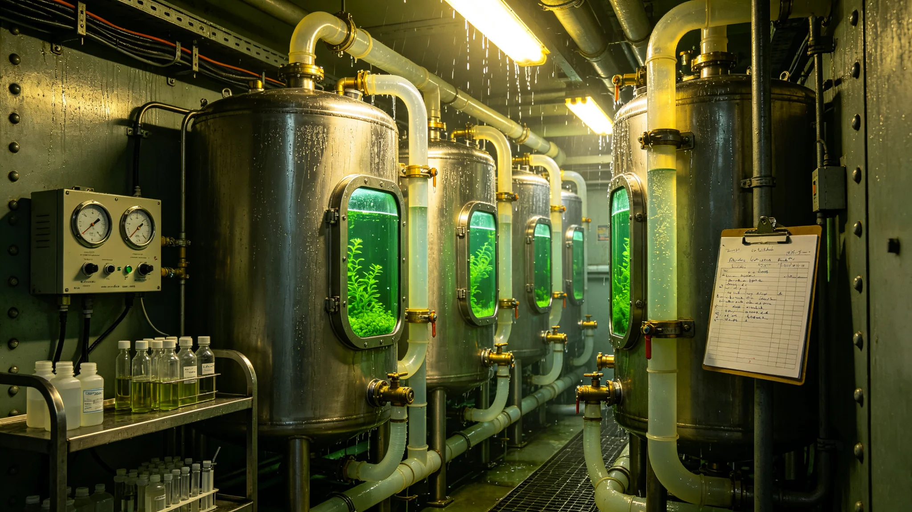

# 第三代闭环生命支持系统改造技术报告

## 一、改造背景

原闭环生命支持已运行百年，藻池老化，降解菌群退化，氧循环与水循环效率逐年下降，尘肺致敏暴露在一线工艺师身上累积。第三代改造重建舱内菌群，配套新藻池与水回路，自3800年起分批切换，不追求一步到位。

## 二、四株驯化菌过渡

旧环控四株驯化菌用了六十年，不能一刀切换全新，否则前三个月断氧。改造把四株菌分批转入新系统，每批间隔十四日，记录温度、湿度、进出水浊度、溶氧四项。第三批转入后菌量一度降两成，降光降肥稳一周后回升。过渡期满旧菌逐步退出，备用槽保种，万一新菌失稳可回种。

## 三、切换故障当夜时间线

切换故障当夜溶氧波动。处置时间线逐小时复原：第一小时发现波动，第二小时隔离波动段，第六小时第三批菌量见底，第九小时降光降肥，第二十一小时菌量回升，第三十一小时交班。全程三十一小时未离人，备用藻池位置为关键，换不熟悉旧菌的值班员找不到。该时间线后入新值班员培训教材。

## 四、溶氧与水循环

第三代新藻池溶氧波动控制在设计范围内，水循环浊度达标。水质与废物循环侧每日互抄一次，一周浊度偏高查明为上游扩容施工冲洗水误接入，整改后次日恢复。互抄机制此后制度化，单看本侧合格不等于别侧能用。

## 五、菌群监测

每七周测菌量一次，十周监测周报留存。闭环不是调出来是等出来，急不得。旧菌退出计划八步排期，每步间隔三月，先退新菌已稳定株，后退关键过渡株。

## 六、人员健康

首席工程师常年暴露致敏原，鼻黏膜充血，皮肤耐受菌定植，小气道指标下降，医生两次建议调离一线，本人未签字。新系统切换后密闭暴露浓度下降，但菌群重建期仍需人盯。

## 七、验收运行

切换满两年，氧循环与水循环连续达标，旧菌已退出两株，余两株备用槽保种。本报告经环控署与环能署会签，附十周监测周报与当夜处置时间线。
## 八、菌群十周监测曲线摘抄

| 周次 | 溶氧 | 浊度 | 第三批菌比例 | 处置 |
|---|---|---|---|---|
| 第一周 | 正常 | 正常 | 正常 | 观测 |
| 第三周 | 偏低 | 略升 | 降两成 | 降光降肥 |
| 第五周 | 回升 | 正常 | 回升 | 稳一周 |
| 第八周 | 正常 | 正常 | 稳定 | 维持 |

第三批菌比例第三周触底，降光降肥第五周回升，未触及备用槽回种线。旧菌退出八步排期每步三月，先退新菌已稳定株。闭环切换满两年，氧循环水循环连续达标。
## 九、切换期故障记录

切换期共记录两处异常：切换故障当夜溶氧波动，处置三十一小时稳定；一周后浊度偏高，查明为施工冲洗水误接入，整改恢复。两处异常均未断氧，备用藻池未启用。

## 十、运行交接与培训

新值班员培训教材收入当夜处置时间线，强调熟悉旧菌位置。四株旧菌退出按八步排期，备用槽保种。监测周报留存，每七周测菌量。本系统与废物循环侧每日互抄水质。
## 十一、与旧闭环逐项对照

| 项目 | 旧闭环 | 第三代 | 依据 |
|---|---|---|---|
| 藻池 | 老化 | 新藻池 | 重建 |
| 菌群 | 退化 | 四株过渡 | 分批切换 |
| 溶氧波动 | 较大 | 设计范围 | 新回路 |
| 暴露浓度 | 偏高 | 下降 | 新系统 |
| 旧菌处置 | 一刀切换 | 分步退出 | 保种回种 |

对照表说明第三代不是推倒重来，而是渐进替换。旧菌用六十年，不能骤换。切换满两年，氧循环水循环连续达标，备用槽保种保留。本报告附监测周报与当夜时间线。
## 十二、结语

第三代闭环是渐进替换而非推倒重来，旧菌六十年积累不能骤弃。切换故障当夜的三十一小时处置与备用藻池位置，是新值班员必须熟悉的命门。本报告附监测周报、当夜时间线、对照表三项。切换满两年连续达标，旧菌分步退出，备用槽保种保留。后续运行偏差另册。

## 附录：关键节点日期

| 节点 | 年份 | 事项 |
|---|---|---|
| 改造启动 | 3800 | 分批切换开始 |
| 切换故障夜 | 3800 | 三十一小时处置 |
| 旧菌退出 | 分步 | 八步排期每步三月 |
| 满两年 | 3802 | 连续达标 |
| 本报告 | 3817 | 汇总 |

本系统与废物循环侧水质每日互抄，与生命支持备用槽保种联动。后续监测周报另册留存，不随本报告归档。

监测周报十周留存，每七周测菌量。新值班员培训教材收入当夜时间线。本系统与生命支持、废物循环两侧接口均已会签。

本报告编制日3817年5月，所附材料包括改造背景、菌群过渡、当夜时间线、溶氧水循环、监测、人员健康、验收运行、十周曲线对照表、故障记录、交接培训、前后对照、结语、关键节点。材料齐全，可供验收。

材料齐全，可供验收。本报告不涉技术参数本身，参数另见设计书。

本报告经环控署与环能署会签，签字日期3817年5月。

本报告归档于环控署，编号按改造年度排。

归档编号已编定。