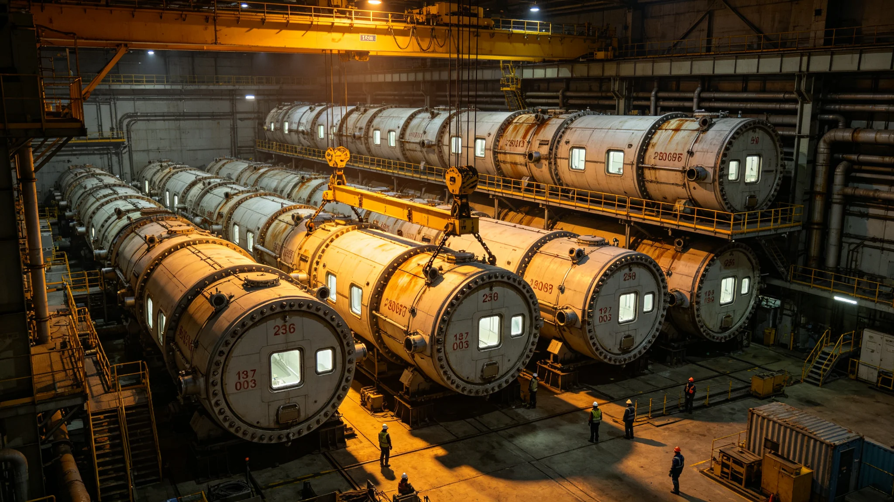

# 居住舱模块化扩容技术报告

## 一、扩容背景

飞船人口随世代增长，原居住舱已满，噪声与夜眠监测在老舱段陆续报警。模块化扩容自3798年开工，以预制段吊装拼装，建成七段入住三千余户，在建三段。扩容不另起新城，只在既有结构上拼接。

## 二、预制段吊装与坍塌

原方案一次吊装三段，3800年坍塌险情中一段坠落。后修订为一次一段，两段间须固定与复验两工序。坍塌后工期顺延十四日。吊装顺序修订案在总指挥名下留存，全系统一次三段改一次一段。

## 三、入住前四项实测

新舱段入住前抽十户实测隔声、照明、新风、给排水。隔声不达标加密封层复测，照明补灯复测，新风量不足整改后再入住，给排水改管线两月内。第三段新风量不足设计值一成，整改后入住推迟两月，不计住户违约。

## 四、公差平移

预制车间时期工长攒下的合格率基准，被平移至扩容工地。新造预制段合格率不得低于车间时期九成，前两段略低，第三段起把车间公差标准搬过来，合格率追平。工地不是车间的次品收容所，公差一放松十年后住户替我们修。

## 五、绿化与基质接口

新舱段绿化用水与环能署回用残渣基质对接，水质合格后才交付居住。绿化系统与居住同步交付，不先分房后补绿化。

## 六、施工时段与投诉

高噪声工序避开居民公认夜眠时段，投诉逐件登记，三十三件三日内处置，四件改管线延后。施工时间后移，同段连续两季投诉下降六成方固定时段。

## 七、验收结论

已建成七段合格入住，报修率逐季下降，第三年趋稳。总工程师本人先住三夜夜眠数据附验收单后。在建三段按修订吊装方案推进。本报告经居住署与监督处会签。
## 八、已建成七段入住与报修统计

| 段别 | 入住户数 | 入住初月报修 | 第三季报修 | 备注 |
|---|---|---|---|---|
| 第一段 | 四百二十 | 七项 | 两项 | 隔声达标 |
| 第二段 | 四百五十 | 九项 | 三项 | 照明补灯 |
| 第三段 | 四百八十 | 十四项 | 四项 | 新风整改推迟两月 |
| 第四至七段 | 共两千余 | 逐段下降 | 趋稳 | 公差平移后 |

第三段新风量不足整改后入住推迟，总工程师本人先住三夜。报修率逐季下降，第三年趋稳。在建三段按一次一段吊装方案推进。
## 九、施工期事故记录

施工期共记录一次坍塌险情，一段预制段坠落，无人员重伤。事故后一次三段改一次一段，工期顺延十四日。另记录新风量不足一处，整改后入住推迟。事故均未致居民伤亡。

## 十、入住交接与随访

新舱段交付居住署后，首户入住由居住署随访半年。报修率逐季统计，次年纳入验收标准修订。绿化用水与基质接口会签后交付。在建三段按修订方案推进。
## 十一、与老居住舱对照

| 项目 | 老舱段 | 新舱段 | 依据 |
|---|---|---|---|
| 隔声 | 逐渐变差 | 实测合格 | 新密封层 |
| 新风 | 不足 | 达标 | 整改 |
| 照明 | 偏暗 | 分时段达标 | 补灯 |
| 绿化 | 无 | 有 | 基质回用 |
| 施工噪声 | 无施工 | 可控时段 | 投诉调整 |

对照表说明新舱段在四项实测与绿化上均优于老段。老舱段住满后逐步迁出，新段轮候入住。报修率逐季下降，第三年趋稳。本报告附七段入住报修统计。
## 十二、结语

扩容以预制段吊装拼装，不另起新城。一次一段吊装与十户实测验收，是坍塌与新风不达标两条教训换来的。本报告附入住报修统计、四项实测、对照表三项。已建成七段合格入住，在建三段按修订方案推进。后续报修率统计另册。

## 附录：关键节点日期

| 节点 | 年份 | 事项 |
|---|---|---|
| 开工 | 3798 | 预制段吊装 |
| 坍塌险情 | 3800 | 一次三段改一次一段 |
| 第三段整改 | 3801 | 新风不足推迟入住 |
| 建成七段 | 3803 | 入住三千余户 |
| 本报告 | 3818 | 汇总 |

在建三段按修订方案推进，投诉调整后次季降六成。后续报修率逐季统计另册。

入住前抽十户实测四项，总工程师本人先住三夜。绿化用水与基质接口会签后交付。施工噪声避开夜眠时段。

本报告编制日3818年7月，所附材料包括扩容背景、吊装、四项实测、公差平移、绿化基质、施工噪声、验收结论、七段报修表、施工事故、入住随访、新旧对照、结语、关键节点。材料齐全。

材料齐全，可供验收。本报告不涉建筑标准本身，标准另见验收规程。

本报告经居住署与监督处会签，签字日期3818年7月。

本报告归档于居住署，附七段入住报修统计与四项实测记录。

归档编号已编定。附入住随访半年记录。

归档编号已编定。本报告自颁行日起执行。

既往段不溯及，新段按本报告验收。

本报告解释权归居住工程署。

解释中如遇轮候与施工冲突，以住户权益为先。

本报告不溯及既往。

既往不补办手续。

既往不补手续。

既往不补。

既往不改。

既往不变。

既往不改。

既往不溯。

既往不溯及。

既往不溯及，新按本报告。