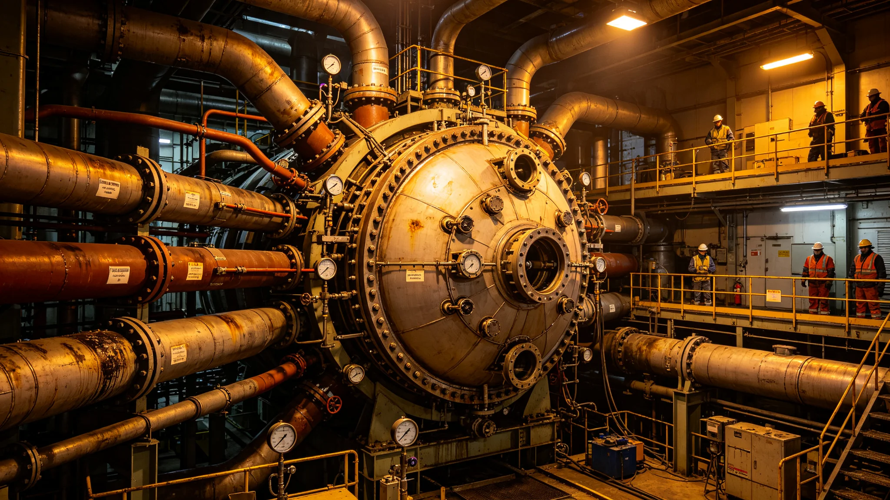

# 聚变堆芯升级技术报告

## 一、升级背景

原堆芯发电量不敷改造期工程用电与人口增长。堆芯升级自3799年启动，含装料、升功率、保护定值复点，3820年进入装料阶段。升级不新增堆型，只提功率与可靠性。

## 二、过载停电教训

3802年扩容工程临时负荷未计入堆芯调度曲线，堆芯保护跳闸，全船三级回路停电十一分钟，生命支持回路靠备用电池维持未断。事后立临时负荷双人核对签字与系统自动拒批，堆芯余量低于阈值即拒批。

## 三、保护定值复点

装料前总工艺师列四十一项检查单逐项亲自复点，发现一项保护定值被上次试验改动后未复原，当场改回。装料后再发现定值错，代价不是扣工时能算的。

## 四、备用电池保底

停电十一分钟电池容量剩三成二，再延九分钟即触发闭环降级。生命支持备用电池保底容量据此设定，任何施工不得挤破。备用电池每季放电试一次。

## 五、配额排序

生命支持占比不低于四成，工程次之，生活再次。五年对照生命支持从未跌破四成。改造期生活用电让渡工程，生命支持一寸不让。

## 六、装料窗口

装料不可换人，高风险夜班每周不超一次。装料前配额预估提前一月报改造署，堆芯升功率各阶段每日报余裕。

## 七、结论

堆芯升级装料按程序推进，双人核对与保底容量制度已执行十年。本报告经能源署与安全处会签，附三年配额占比对照。
## 八、三年配额占比与电池试放电

| 年度 | 生命支持 | 工程施工 | 生活用电 | 电池试放电 |
|---|---|---|---|---|
| 3801 | 四成三 | 三成一 | 两成六 | 正常 |
| 3802 | 四成一 | 三成六 | 两成三 | 停电十一分钟触底 |
| 3803 | 四成二 | 三成五 | 两成三 | 试放电达标 |

三年生命支持从未跌破四成。3802年停电暴露备用电池保底不足，后设保底容量条款。双人核对自3803年执行未再单人申报。装料前四十一项复点改回一项定值。
## 九、运行期事件记录

运行期记录一次过载停电，扩容临时负荷致堆芯跳闸，停电十一分钟。事故后立双人核对与自动拒批。装料前复点改回一项保护定值。无堆芯本身故障记录。

## 十、运行交接与培训

值班培训强调临时负荷双人签字、保底容量不挤破、装料不可换人。配额每日报余裕，电池每季试放电。双人核对制已执行十年未再单人申报。
## 十一、升级前后对照

| 项目 | 升级前 | 升级后 | 依据 |
|---|---|---|---|
| 发电量 | 基准 | 提升 | 提功率 |
| 临时负荷 | 单人签字 | 双人核对 | 制度 |
| 备用电池 | 保底不明 | 保底明确 | 停电教训 |
| 配额排序 | 不明确 | 生命支持优先 | 制度化 |
| 保护定值 | 试后未复原 | 装料前复点 | 流程 |

对照表说明升级不仅是提功率，更是把停电后暴露的流程漏洞补齐。双人核对与保底容量已执行十年。本报告附三年配额对照与电池试放电记录。
## 十二、结语

堆芯升级不仅提功率，更把停电暴露的流程漏洞补齐。双人核对、保底容量、配额排序三项已执行十年。本报告附三年配额、电池试放电、对照表三项。后续装料与升功率另册。

## 附录：关键节点日期

| 节点 | 年份 | 事项 |
|---|---|---|
| 升级启动 | 3799 | 装料升功率 |
| 过载停电 | 3802 | 十一分钟跳闸 |
| 双人核对入制度 | 3803 | 自动拒批 |
| 装料复点 | 3820 | 四十一项 |
| 本报告 | 3820 | 汇总 |

生命支持配额五年不跌破四成。后续升功率另册。

装料前四十一项复点改回一项定值。备用电池每季试放电。生命支持占比五年不跌破四成。

本报告编制日3820年4月，所附材料包括升级背景、停电教训、定值复点、电池保底、配额排序、装料窗口、结论、三年配额表、运行事件、交接培训、升级前后对照、结语、关键节点。材料齐全。

材料齐全，可供验收。本报告不涉堆芯参数本身，参数另见运行规程。

本报告经能源署与安全处会签，签字日期3820年4月。

本报告归档于能源署，附三年配额占比与电池试放电记录。

归档编号已编定。附装料前四十一项复点记录。

归档编号已编定。本报告自颁行日起执行。

既往申报不溯及，新申报按本报告双人核对。

本报告解释权归能源署。

解释中如遇工程与生命支持冲突，以生命支持为先。

本报告不溯及既往。

既往不补办手续。

既往不补手续。

既往不补。

既往不改。

既往不变。

既往不改。

既往不溯。

既往不溯及。

既往不溯及，新按本报告。

本报告自颁行日起执行，解释权归能源署。

解释中如遇工程与生命支持冲突，以生命支持为先。

本报告归档于能源署，附三年配额对照。

归档编号已编定。

本报告自颁行日起执行。

既往申报不溯及，新申报双人核对。

本报告附装料前四十一项复点记录。

本报告经能源署与安全处会签。

签字日期3820年4月。

本报告不涉堆芯参数本身。

参数另见运行规程。

归档编号已编定。

归档编号已编定，无误。