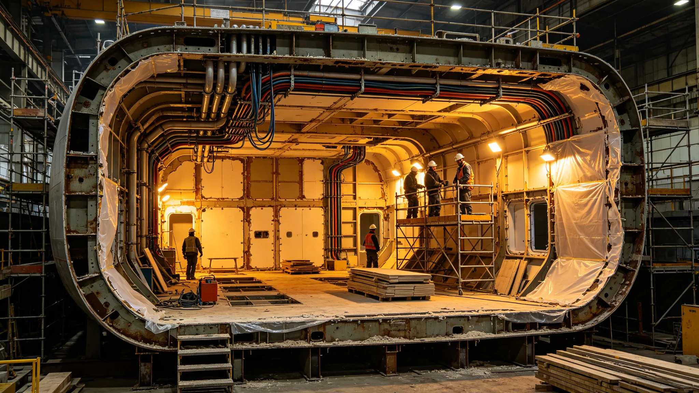

# 舱段重构技术报告

## 一、重构背景

中期大修中部分老旧舱段布局不合理，内部接口与新推进、新闭环、新居住不匹配。舱段重构把旧舱段拆解重装，保留结构骨架，重排内部管线与舱室。

## 二、开工顺序

舱段重构子项最晚开工，等待结构延寿结论与推进换装接口。八子项进度对照表显示其不拖累其他子项收尾，关键段不停，非关键段减速。

## 三、开腹与防护

开腹前居民迁置完毕，临时防护就绪方可开腹，迁置未完成不得开腹。已开腹舱段维持临时防护，不长时间暴露。燃料供应紧张时改分段减速而非全停。

## 四、接口公差

重构舱段与主桁架、推进、闭环接口公差须会签，超差不吊装。接口校核未完成段列入未移交项跟踪。

## 五、重构与新建区别

重构沿用原舱段结构骨架，重排内部布局；新建为预制段吊装。两者公差标准一致，不许重构段公差放松。

## 六、材料复用

拆下旧材分级：可复用件检修后回用，不可复用件回收。惰性废料走回收通道，不混降解系统。

## 七、结论

舱段重构按大修间隙推进，接口会签齐备，材料分级记录在案。本报告经舱段署与结构延寿署会签。
## 八、重构子项进度对照

| 子项 | 开工 | 收尾 | 与重构关系 |
|---|---|---|---|
| 推进换装 | 早 | 中 | 重构等其接口 |
| 结构延寿 | 早 | 中 | 重构等其结论 |
| 居住扩容 | 中 | 中 | 与重构并行 |
| 舱段重构 | 最晚 | 收尾 | 不拖累其他 |

重构等待结构延寿结论与推进接口，关键段不停非关键段减速。拆下旧材分级复用，惰性废料走回收通道。接口公差会签齐备，超差不吊装。
## 九、开腹期事件记录

开腹期记录一次燃料供应紧张，要求大修暂停，改分段减速而非全停。一次迁置未完成险些开腹，被临时防护程序拦下。事件后立迁置完成方可开腹。

## 十、重构交接与培训

重构段交付前先验后还，接口公差会签齐备。拆下旧材分级复用，惰性废料走回收通道。重构与新建公差标准一致，不许重构段放松。子项进度对照表留档。
## 十一、重构与新建对照

| 项目 | 新建预制段 | 重构旧舱段 | 依据 |
|---|---|---|---|
| 骨架 | 新造 | 沿用 | 保留 |
| 布局 | 新设计 | 重排 | 适配新系统 |
| 公差 | 基准 | 同基准 | 不放松 |
| 材料 | 全新 | 分级复用 | 回收 |
| 进度 | 早 | 最晚 | 等接口 |

对照表说明重构是保留骨架重排内部，公差不放松。重构等结构延寿与推进接口，不拖累其他子项。本报告附八子项进度对照。
## 十二、结语

舱段重构保留骨架重排内部，公差不放松，进度不拖累其他子项。迁置完成方可开腹、燃料紧张改减速两条，是大修纪律。本报告附开腹事件、子项进度、对照表三项。后续重构段验收另册。

## 附录：关键节点日期

| 节点 | 年份 | 事项 |
|---|---|---|
| 子项开工 | 最晚 | 等接口 |
| 燃料紧张 | 3804 | 改减速不停工 |
| 迁置方可开腹 | 制度 | 拦下一次险开腹 |
| 接口会签 | 全程 | 超差不吊装 |
| 本报告 | 3822 | 汇总 |

重构不拖累其他子项。后续重构段验收另册。

拆下旧材分级复用，惰性废料走回收通道。重构与新建公差标准一致。迁置完成方可开腹。

本报告编制日3822年8月，所附材料包括重构背景、开工顺序、开腹防护、接口公差、新旧区别、材料复用、结论、子项进度表、开腹事件、交接培训、重构新建对照、结语、关键节点。材料齐全。

材料齐全，可供验收。本报告不涉重构图纸本身，图纸另见舱段署。

本报告经舱段署与结构延寿署会签，签字日期3822年8月。

本报告归档于舱段署，附八子项进度对照与材料分级记录。

归档编号已编定。附开腹防护程序记录。

归档编号已编定。本报告自颁行日起执行。

既往开腹不溯及，新开腹按本报告迁置完成方可。

本报告解释权归舱段工程署。

解释中如遇开腹与迁置冲突，迁置未完成不得开腹。

本报告不溯及既往。

既往不补办手续。

既往不补手续。

既往不补。

既往不改。

既往不变。

既往不改。

既往不溯。

既往不溯及。

既往不溯及，新按本报告。

本报告自颁行日起执行，解释权归舱段工程署。

解释中如遇开腹与迁置冲突，迁置未完成不得开腹。

本报告归档于舱段署，附子项进度对照。

归档编号已编定。

本报告自颁行日起执行。

既往开腹不溯及，新开腹迁置完成方可。

本报告附开腹防护程序记录。

本报告经舱段署与结构延寿署会签。

签字日期3822年8月。

本报告不涉重构图纸本身。

图纸另见舱段署。

归档编号已编定。

归档编号已编定，无误。

本报告自颁行日起执行。

既往不溯及。

新按本报告执行。

解释权归舱段工程署。

解释中如开腹与迁置冲突，迁置未完成不得开腹。

本报告所附材料齐全。

可供验收。

本报告所附材料齐全，可供验收。

本报告所附材料齐全，可供验收，无误。

本报告所附材料齐全，可供验收，无误，齐全。