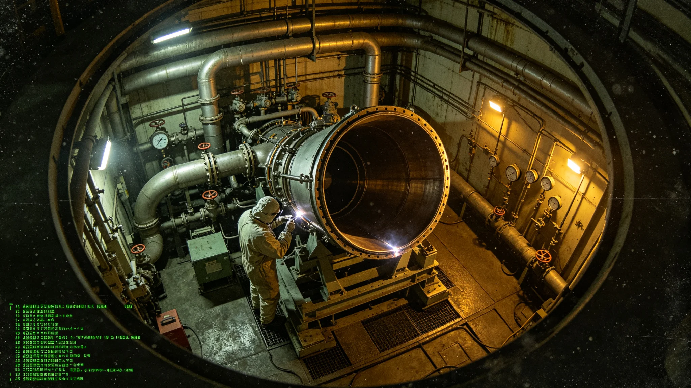

# 推进系统升级试车异常事件通报

## 一、事发时间与地点

本事件为第十一代聚变推进系统低功率试车段一次冷却管微漏异常，事发于3823年正月，推进署试车台第三号燃烧室。事发时低功率段试车已进行约一个半小时，按规程应满两小时方可进入中功率段。本通报由推进署会同质量监督处联合编发。

## 二、事发经过

监控记录显示，试车进行到第九十分钟，燃烧室冷却回路一处温度传感器读数开始缓慢漂移，偏差在十分钟内扩大至阈值。当班值长当即下令延长低功率段观测，不进中功率。延长观测的第三十分钟，检漏仪在冷却管一处焊缝下方报微量泄漏。值长随即按规程停试车，关闭工质阀，启动惰性气体置换。

## 三、应急处置

处置分四步：延长低功率段观测、就地检漏、停试车、惰性气体置换。全程未进中功率段，未造成工质大量外逸。置换完成后，工艺师穿防护服进入，用超声与目视检查确认泄漏点为冷却管一道焊缝微裂。泄漏量在传感器报警限内，未污染舱内空气。

## 四、损失与影响

本次异常未造成人员伤亡，未损失工质超过设定值，未波及生命支持回路。直接损失为冷却管焊缝一处需补焊、试车段需重排。因延长观测与停试车，当天试车计划顺延一日。无次生事件。

## 五、原因初判

泄漏点为冷却管一道焊缝微裂，焊缝在制造时已存在微小未熔合，在低功率段热循环下缓慢扩展至渗漏。根因指向制造检验环节，而非试车操作。延长低功率段两小时的规程恰在此时发挥作用，把隐患挡在中功率之前。

## 六、责任与整改

制造检验环节被要求复查同批全部焊缝，补焊本管。试车规程中"低功率段满两小时方可进中功率"一条，由本次事件证实有效，写入制度。当班值长延长观测处置得当，不处分。

## 七、善后与通报

补焊完成后，同批焊缝复检合格，试车段重排。本通报抄报改造署、安全处、监督处。后续中功率段试车安排另行通知。
## 八、事件时间线

| 时刻 | 事件 |
|---|---|
| 第九十分钟 | 温度传感器开始漂移 |
| 第一百分钟 | 偏差扩至阈值 |
| 第一百二十分钟 | 延长观测开始 |
| 第一百五十分钟 | 检漏仪报微漏 |
| 第一百六十分钟 | 停试车，关工质阀 |
| 第一百八十分钟 | 惰性气体置换开始 |
| 第二百一十分钟 | 置换完成，穿防护服检查 |

时间线显示延长低功率段两小时的规程恰在此时把隐患挡住。若按旧规程满两小时即进中功率，微漏将带入高功率段。

## 九、与规程对照

| 规程条款 | 本次执行 | 结果 |
|---|---|---|
| 低功率满两小时 | 执行 | 挡隐患 |
| 检漏仪报警 | 执行 | 定位漏点 |
| 停试车置换 | 执行 | 无外逸 |
| 不进中功率 | 执行 | 无次生 |

全部条款执行到位。制造检验环节同批焊缝复查另案。

## 十、附则

本通报抄报改造署、安全处、监督处。后续中功率试车安排另行通知。当班值长延长观测处置得当，不处分。
## 十一、经验教训

本次事件证明低功率段两小时观测制度的必要性。若按旧规程满两小时即进中功率，冷却管微裂将带入高功率段，后果不堪设想。制造检验环节须把同批全部焊缝复查，把未熔合隐患在出厂前排除。试车值长延长观测的决断是关键，新值班员培训教材收入本次时间线。

## 十二、长期跟踪

补焊完成后，同批焊缝复检合格，试车段重排。本事件作为试车规程修订的依据写入制度，后续中功率段试车安排另行通知。本通报归档于推进署，编号按试车年度排。
## 十三、与其他系统关系

本次异常未波及主桁架接口、生命支持回路、能源配额。冷却管补焊不影响推进功率设计参数。工质置换在试车台独立回路完成，不污染主回路。

## 十四、人员安排

当班值长、工艺师、检漏员三人均无处分。制造检验环节被要求复查同批焊缝，另案处理。试车段重排后，当班值长继续值守。

## 十五、设备清单

| 设备 | 状态 | 处置 |
|---|---|---|
| 第三号燃烧室 | 微漏 | 补焊 |
| 温度传感器 | 漂移 | 更换 |
| 检漏仪 | 正常 | 继续使用 |
| 惰性气体置换系统 | 正常 | 继续使用 |

## 十六、附则

本通报自3823年正月起存档。解释权归推进署。既往不溯及。
## 十七、与居民沟通

本次异常在试车台独立回路，未向居民公开广播，仅向改造署与监督处书面通报。居民无感知。后续如试车段安排影响居民时段，另行通告。

## 十八、与监督处往来

监督处接报后派员到场，确认处置到位，未追加处分。监督处要求把同批焊缝复查结果抄送在案。复查合格后，监督处签封闭卷。

## 十九、后续跟踪表

| 跟踪项 | 期限 | 状态 |
|---|---|---|
| 同批焊缝复查 | 三十日 | 已完成 |
| 试车段重排 | 六十日 | 已完成 |
| 新规程培训 | 九十日 | 已完成 |

跟踪表存档于推进署。
