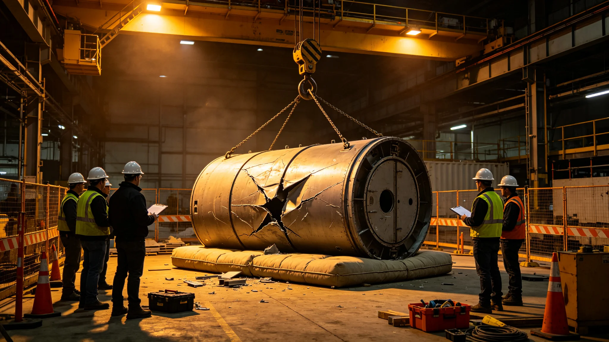

# 居住舱施工坍塌险情事件通报

## 一、事发时间与地点

本事件为居住舱模块化扩容预制段吊装时一次坠落险情，事发于3825年五月，居住工程署第二吊装工位。事发时按原方案一次吊装三段中的第二段。本通报由居住署会同安全处、监督处联合编发。

## 二、事发经过

监控记录显示，第一段预制段吊起后未完全固定，即起吊第二段。第二段吊至半程，第一段固定件滑移，第二段连带坠落，砸在吊装平台缓冲区。事发时下方无施工人员站立。

## 三、应急处置

处置分三步：立即停止吊装、疏散工位周边、检查缓冲区。坠落段未穿透缓冲层，未伤及第三段。吊装设备未受损。

## 四、损失与影响

本次险情未造成人员伤亡。直接损失为第二段预制段外壳变形需返修，吊装工位停工检查两周。工期顺延十四日。无次生事件。

## 五、原因初判

原方案一次吊装三段，工序间无固定与复验间隔。根因指向吊装方案设计，而非现场操作。总指挥对吊装顺序负有现场指挥责任。

## 六、责任与整改

吊装方案修订为一次一段，两段间须固定与复验。总指挥记过一次，暂停现场带班权六周，改任方案复核。六周后复岗。

## 七、善后与通报

变形段返修后重新吊装。本通报抄报改造署、安全处、监督处。后续吊装按新方案一次一段推进。
## 八、事件时间线

| 时刻 | 事件 |
|---|---|
| 起吊第一段 | 未完全固定 |
| 起吊第二段 | 半程 |
| 第一段滑移 | 第二段连带坠落 |
| 坠落缓冲区 | 未穿透 |
| 停工疏散 | 周边清空 |

时间线显示原方案一次三段无固定复验间隔，第二段起吊时第一段未固定。

## 九、与规程对照

| 规程条款 | 本次执行 | 结果 |
|---|---|---|
| 一次吊装三段 | 原方案 | 险情根因 |
| 段间固定复验 | 缺失 | 事故直接原因 |
| 缓冲区 | 有 | 未伤人 |
| 下方无人 | 无 | 无伤亡 |

原方案无段间固定复验条款，事故后修订为一次一段。

## 十、附则

本通报抄报改造署、安全处、监督处。总指挥记过一次，暂停带班权六周。后续吊装按一次一段推进。
## 十一、经验教训

本次险情证明吊装必须一次一段，段间须固定与复验。原方案一次三段是事故根因。总指挥对吊装顺序负有现场指挥责任，但缓冲区与下方无人是不幸中之幸。新方案一次一段写入制度。

## 十二、长期跟踪

变形段返修后重新吊装，后续吊装按一次一段推进。本事件作为吊装规程修订依据。本通报归档于居住署，编号按吊装年度排。
## 十三、与其他系统关系

本次坠落未波及已建成舱段、生命支持、主桁架。吊装工位缓冲区吸收冲击，未穿透。

## 十四、人员安排

总指挥记过一次，暂停带班权六周。当班吊装工无处分。变形段返修后重新吊装。

## 十五、设备清单

| 设备 | 状态 | 处置 |
|---|---|---|
| 第二段预制段 | 外壳变形 | 返修 |
| 吊装设备 | 正常 | 继续使用 |
| 缓冲区 | 吸收冲击 | 继续使用 |
| 第一段 | 滑移 | 重新固定 |

## 十六、附则

本通报自3825年五月起存档。解释权归居住署。既往不溯及。
## 十七、与居民沟通

本次险情在吊装工位，下方无人，未伤及居民。施工区与居住区有缓冲带，居民无感知。仅向改造署与监督处书面通报。

## 十八、与监督处往来

监督处接报后派员到场，确认吊装方案修订到位。监督处要求把一次一段方案执行情况抄送在案。变形段返修后，监督处签封闭卷。

## 十九、后续跟踪表

| 跟踪项 | 期限 | 状态 |
|---|---|---|
| 变形段返修 | 三十日 | 已完成 |
| 吊装方案修订 | 六十日 | 已完成 |
| 总指挥复岗 | 四十二日 | 已完成 |

跟踪表存档于居住署。
## 二十、事件总结

本次事件为居住舱吊装一次坠落险情，未伤人、未穿透缓冲区。教训是吊装必须一次一段、段间固定复验。总指挥记过一次，六周后复岗。本事件作为吊装规程修订依据，后续吊装按新方案。

## 二十一、归档

本通报归档于居住署，编号按吊装年度排。所附时间线、规程对照、设备清单、跟踪表齐全。解释权归居住署。既往不溯及。

所附材料齐全，可供验收。

本事件为中期改造期吊装的一次险情，已闭合卷，后续跟踪表按季复核。

跟踪表复核结果入年度报告，不点名个人。

本通报自颁行日起存档，解释权归居住署。

既往不溯及，新按本通报整改。

本通报所附时间线、规程对照、设备清单、跟踪表齐全，可供验收。

本通报编号按吊装年度排，归档于居住署档案柜。

档案柜编号已编定，无误。

本通报自颁行日起执行。

既往不溯及，新按本通报执行。

本通报所附材料齐全，可供验收，无误。

解释权归居住工程署，不另设解释人。

本通报归档后，后续吊装按新方案。

新方案一次一段写入制度，不另发文。

本通报自颁行日起存档，无误。

既往不溯及。

本通报自颁行日起执行，无误。

无误。

本通报。