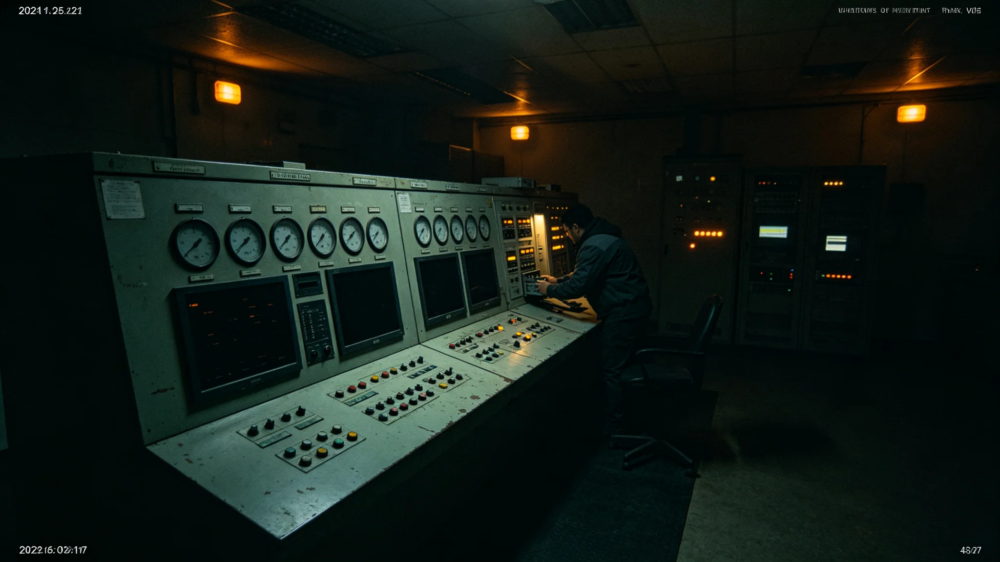

# 能源系统过载停电事件通报

## 一、事发时间与地点

本事件为聚变堆芯升级期间一次过载停电，事发于3826年七月，能源署调度室。事发时扩容工程临时负荷刚接入。本通报由能源署会同安全处、监督处联合编发。

## 二、事发经过

调度屏显示堆芯输出功率突然被扩容临时负荷拉高，超过保护阈值。保护系统自动跳闸，全船三级回路停电。生命支持回路靠备用电池维持。停电持续十一分钟后，调度按规程切除临时负荷，堆芯重启。

## 三、应急处置

处置分三步：保护跳闸、切除临时负荷、堆芯重启。生命支持回路未断氧，备用电池放电至三成二。重启后逐步恢复其他回路。全程无人为误操作。

## 四、损失与影响

本次停电持续十一分钟，未造成生命支持中断。直接损失为临时负荷接入计划推迟，堆芯重启耗工时。备用电池未触底。无人员伤亡。

## 五、原因初判

扩容工程临时负荷未计入堆芯调度曲线，当班总工艺师在负荷申报单上签字前未核对临时负荷与堆芯余量对应表。根因指向流程漏洞：申报单与调度曲线之间缺双人核对。

## 六、责任与整改

当班总工艺师书面检查，扣绩效工时十二小时，通报全能源署。事后立临时负荷双人核对签字与系统自动拒批，堆芯余量低于阈值即拒批。修订案当年执行。

## 七、善后与通报

双人核对制执行后，未再发生单人签字申报。本通报抄报改造署、安全处、监督处。后续临时负荷接入均按新流程。
## 八、事件时间线

| 时刻 | 事件 |
|---|---|
| 临时负荷接入 | 堆芯功率被拉高 |
| 超保护阈值 | 保护跳闸 |
| 全船三级回路停电 | 备用电池维持 |
| 第十一分钟 | 切除临时负荷 |
| 重启 | 恢复 |

时间线显示停电十一分钟，备用电池剩三成二，再延九分钟触发降级。

## 九、与规程对照

| 规程条款 | 本次执行 | 结果 |
|---|---|---|
| 临时负荷申报 | 单人签字 | 流程漏洞 |
| 堆芯余量核对 | 缺失 | 跳闸直接原因 |
| 备用电池 | 维持 | 未断氧 |
| 保护跳闸 | 自动 | 未扩大 |

事故后立双人核对与系统自动拒批。

## 十、附则

本通报抄报改造署、安全处、监督处。当班总工艺师书面检查，扣绩效工时十二小时。后续临时负荷按新流程。
## 十一、经验教训

本次停电证明临时负荷申报必须双人核对。单人签字与调度曲线缺核对是跳闸直接原因。保护跳闸自动切除避免了扩大，备用电池未触底是关键。事后立双人核对与系统自动拒批，堆芯余量低于阈值即拒批。

## 十二、长期跟踪

双人核对制执行后未再发生单人签字申报。本事件作为能源配额制度修订依据。本通报归档于能源署，编号按停电年度排。
## 十三、与其他系统关系

本次停电未波及生命支持（备用电池维持）、推进系统、居住舱主要设备。重启后逐步恢复三级回路。

## 十四、人员安排

当班总工艺师书面检查，扣绩效工时十二小时。其余值班员无处分。双人核对制执行后，值班安排不变。

## 十五、设备清单

| 设备 | 状态 | 处置 |
|---|---|---|
| 堆芯 | 保护跳闸 | 重启 |
| 备用电池 | 放电三成二 | 充电 |
| 临时负荷线 | 切除 | 待重接 |
| 调度屏 | 正常 | 继续使用 |

## 十六、附则

本通报自3826年七月起存档。解释权归能源署。既往不溯及。
## 十七、与居民沟通

本次停电十一分钟，生命支持未断氧，居民短暂感受照明波动。改造署向受影响居住环发说明一纸，解释停电原因与恢复时间。

## 十八、与监督处往来

监督处接报后确认双人核对制整改到位。监督处要求把备用电池保底容量条款抄送在案。重启稳定后，监督处签封闭卷。

## 十九、后续跟踪表

| 跟踪项 | 期限 | 状态 |
|---|---|---|
| 双人核对制 | 三十日 | 已执行 |
| 保底容量条款 | 六十日 | 已入制度 |
| 居民说明 | 七日 | 已发出 |

跟踪表存档于能源署。
## 二十、事件总结

本次事件为堆芯升级一次过载停电，未断氧、未伤居民。教训是临时负荷申报必须双人核对，备用电池保底容量须明确。当班总工艺师书面检查。本事件作为能源配额制度修订依据，后续申报按新流程。

## 二十一、归档

本通报归档于能源署，编号按停电年度排。所附时间线、规程对照、设备清单、跟踪表齐全。解释权归能源署。既往不溯及。
