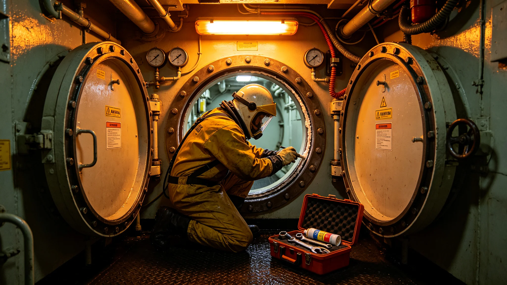

# 大修期间舱段泄漏事件通报

## 一、事发时间与地点

本事件为中期大修开腹段一次舱内空气微泄漏，事发于3827年九月，大修工程署第三开腹段。事发时该段已开腹两周，临时防护层在夜间巡检中发现一处渗漏。本通报由大修署会同安全处联合编发。

## 二、事发经过

夜间巡检员在第三开腹段过渡舱闻到极淡异味，检漏仪报一处气密层微漏。值班长当即关闭过渡舱外门，启动局部补压，防止主舱压力下降。

## 三、应急处置

处置分三步：关闭过渡舱外门、局部补压、排查漏点。漏点为临时密封层一道接缝，因热胀冷缩出现微小缝隙。工艺师现场补封，压力读数二十分钟内恢复。

## 四、损失与影响

本次微泄漏未造成主舱压力下降超限，未影响生命支持。直接损失为过渡舱补封工时半日，夜间巡检计划顺延。无人员伤亡。

## 五、原因初判

临时密封层在开腹两周后随温度变化出现接缝微张。根因指向临时防护层材料在反复热循环下的疲劳，而非施工失误。

## 六、责任与整改

临时密封层在开腹后第三、第七、第十四日各加一次接缝巡检。过渡舱补压程序写入大修规程。夜间巡检员发现及时，不处分。

## 七、善后与通报

补封后压力稳定，巡检间隔按新规程执行。本通报抄报改造署、安全处、监督处。后续开腹段按新巡检间隔。
## 八、事件时间线

| 时刻 | 事件 |
|---|---|
| 夜间巡检 | 闻到极淡异味 |
| 检漏仪报警 | 过渡舱接缝微漏 |
| 关过渡舱外门 | 防主舱降压 |
| 局部补压 | 压力回升 |
| 补封接缝 | 二十分钟恢复 |

时间线显示漏点为临时密封层接缝，因热胀冷缩微张。

## 九、与规程对照

| 规程条款 | 本次执行 | 结果 |
|---|---|---|
| 夜间巡检 | 执行 | 及时发现 |
| 过渡舱补压 | 执行 | 未降压超限 |
| 临时密封层巡检 | 原只每日一次 | 疲劳未早发现 |
| 补封 | 现场 | 恢复 |

事故后临时密封层在开腹后第三、第七、第十四日各加一次巡检。

## 十、附则

本通报抄报改造署、安全处、监督处。夜间巡检员发现及时，不处分。后续开腹段按新巡检间隔。
## 十一、经验教训

本次微泄漏证明临时密封层在开腹后须加巡检。原只每日一次巡检，未及时发现接缝微张。夜间巡检员发现及时，过渡舱补压程序有效。开腹后第三、第七、第十四日各加一次接缝巡检写入规程。

## 十二、长期跟踪

补封后压力稳定，后续开腹段按新巡检间隔。本事件作为大修防护规程修订依据。本通报归档于大修署，编号按开腹年度排。
## 十三、与其他系统关系

本次微泄漏未波及主舱压力、生命支持、居住舱空气。过渡舱补压后压力稳定。

## 十四、人员安排

夜间巡检员发现及时，无处分。工艺师现场补封，无处分。临时密封层巡检间隔调整后，巡检员增加。

## 十五、设备清单

| 设备 | 状态 | 处置 |
|---|---|---|
| 过渡舱密封层 | 接缝微漏 | 补封 |
| 检漏仪 | 报警 | 继续使用 |
| 补压系统 | 正常 | 继续使用 |
| 过渡舱外门 | 关闭 | 继续使用 |

## 十六、附则

本通报自3827年九月起存档。解释权归大修署。既往不溯及。
## 十七、与居民沟通

本次微泄漏在过渡舱，主舱压力未降，居民无感知。仅向改造署与监督处书面通报。

## 十八、与监督处往来

监督处接报后确认补封到位，未追加处分。监督处要求把临时密封层巡检间隔调整抄送在案。压力稳定后，监督处签封闭卷。

## 十九、后续跟踪表

| 跟踪项 | 期限 | 状态 |
|---|---|---|
| 补封接缝 | 半日 | 已完成 |
| 巡检间隔调整 | 三十日 | 已完成 |
| 压力观察 | 七日 | 已稳定 |

跟踪表存档于大修署。
## 二十、事件总结

本次事件为大修开腹段一次微泄漏，未降压超限、未伤居民。教训是临时密封层须在开腹后加巡检。夜间巡检员发现及时。本事件作为大修防护规程修订依据，后续开腹段按新间隔。

## 二十一、归档

本通报归档于大修署，编号按开腹年度排。所附时间线、规程对照、设备清单、跟踪表齐全。解释权归大修署。既往不溯及。
