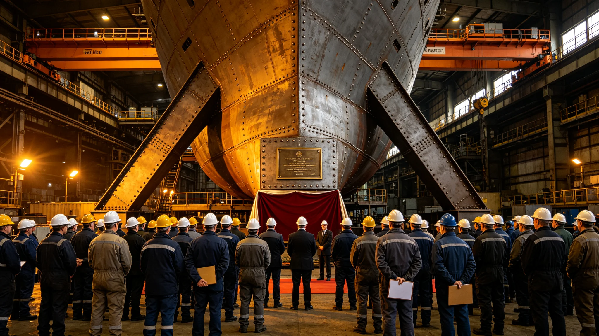

# 飞船中期改造开工典礼规程

## 一、典礼目的

本典礼为中期改造正式开工的仪典，自3830年四月一日举行。典礼不庆功、不宣捷，只宣布改造开始、红线生效、工期表封存。出席者八署负责人、居民代表、监督处代表共一百二十人。

## 二、典礼时间与地点

典礼于3830年四月一日晨，主桁架旁第三开腹工位举行。时间取船历晨班第一刻，不另选吉时。地点选在第一块待换装甲板旁，不用仪式厅。

## 三、典礼程序

程序七项：一、总工程师宣布开工；二、宣读改造法三原则；三、揭开第一块待换装甲板封布；四、八署负责人在工期表上签认；五、监督处代表宣布监督独立；六、居民代表致辞；七、礼成。程序自第一次中期改造起沿用，本次为第三次。

## 四、工期表封存

八署负责人签认的工期表当场封存，存入大修署档案柜。封存后工期顺延须另走程序，不得在典礼上口头改。封存表副本贴于各署公告板。

## 五、出席签到

一百二十名出席者均签到，含八署负责人八人、居民代表一百人、监督处代表十二人。签到表由大修署封存。无缺席。

## 六、礼成后安排

礼成后第一块装甲板更换正式开始。当日无宴饮，仅在工间食堂供一餐简餐。开工典礼不发纪念品，不立碑。

## 七、与前两次典礼对照

前两次开工典礼均在主桁架旁同一工位，程序一致。本次为第三次，出席人数略增。
## 八、典礼宣读词

总工程师宣读改造法三原则：第一，生命支持回路在改造任何阶段不得中断，允许降级不允许停摆；第二，改造不得降低飞船对微流星与辐射的防护等级；第三，工期可顺延，质量不可让步。宣读词不另发文件，典礼现场宣读。

## 九、封布与第一块装甲板

第一块待换装甲板封布为素白，无图案无文字。揭开封布后，装甲板表面的微流星擦痕与工质消蚀可见。在场者不拍照，不录像。装甲板揭开后即进入更换。

## 十、出席者名单节选

八署负责人：推进署、环控署、居住署、结构署、能源署、环能署、大修署、舱段署各一人。居民代表一百人按居住环抽签产生，不另选。监督处代表十二人由监督处指派。

## 十一、典礼后当日报备

礼成当日，大修署向船务署报备典礼已举行，工期表已封存。报备不附照片，只附签到表复印件。

## 十二、与前两次典礼对照

| 典礼 | 年份 | 出席人数 | 礼成后 |
|---|---|---|---|
| 第一次 | 前次 | 一百人 | 开工 |
| 第二次 | 前次 | 一百一十人 | 开工 |
| 第三次 | 3830 | 一百二十人 | 开工 |

程序一致，出席人数略增。

## 十三、附则

本规程自3830年四月一日起执行。解释权归大修署。既往不溯及。
## 十四、典礼禁忌

典礼不敬酒、不送礼、不立碑、不拍照。出席者不穿礼服，仍穿作业服。不设主席台，八署负责人站成一排。

## 十五、典礼后首日

礼成后第一日，总工程师巡查八子项开工情况，记录各子项首日进度。首日无意外。

## 十六、归档

本规程与签到表、封存表副本同存于大修署。编号按开工典礼年度排。
## 十七、典礼词底稿留存

典礼词底稿不另发文件，只由总工程师现场宣读。底稿留存在大修署，不公开。宣读词内容即三原则，无祝酒、无展望。

## 十八、出席者不发言

除总工程师宣读、居民代表简短致辞外，出席者不发言。监督处代表只宣布监督独立，不评论。

## 十九、典礼时长

典礼全程不超过一个时辰。礼成后即开工，不另留时间合影。
## 二十、典礼当日工间餐

礼成后在工间食堂供一餐简餐，不设酒食。出席者与当班工艺师同桌，不另开席。

## 二十一、典礼不发纪念品

典礼不发任何纪念品，不立碑，不拍照。出席者只在签到表上留名。

## 二十二、与改造法关系

本规程为改造法在典礼事项上的执行细则。与改造法抵触者以改造法为准。
## 二十三、典礼后第一年回顾

礼成后第一年，大修署按季向船务署报开工进度。第一年内无重大意外，工期按封存表推进。

## 二十四、与居民知情权

典礼程序在改造法修订后向居民公开。居民可查签到表与封存表副本，不查底稿。

## 二十五、附则补遗

本规程自颁行日起存档，解释权归大修署。既往不溯及，新按本规程执行。
## 二十六、典礼监督

监督处代表在典礼全程在场，不发言、不干预。监督处代表只在宣布监督独立时开口。

## 二十七、典礼后异议

典礼后居民如有异议，向监督处提出，不向总工程师直接提出。异议三个月内答复。

## 二十八、本规程所附材料

签到表、封存表副本、宣读词底稿、出席名单节选，共四份。齐全，可供验收。
## 二十九、典礼与监督关系

监督处独立于八署，不隶属改造署。监督处在典礼上只宣布独立，不点评。

## 三十、本规程生效

本规程自颁行日起生效，不另发通知。

本规程编讫。