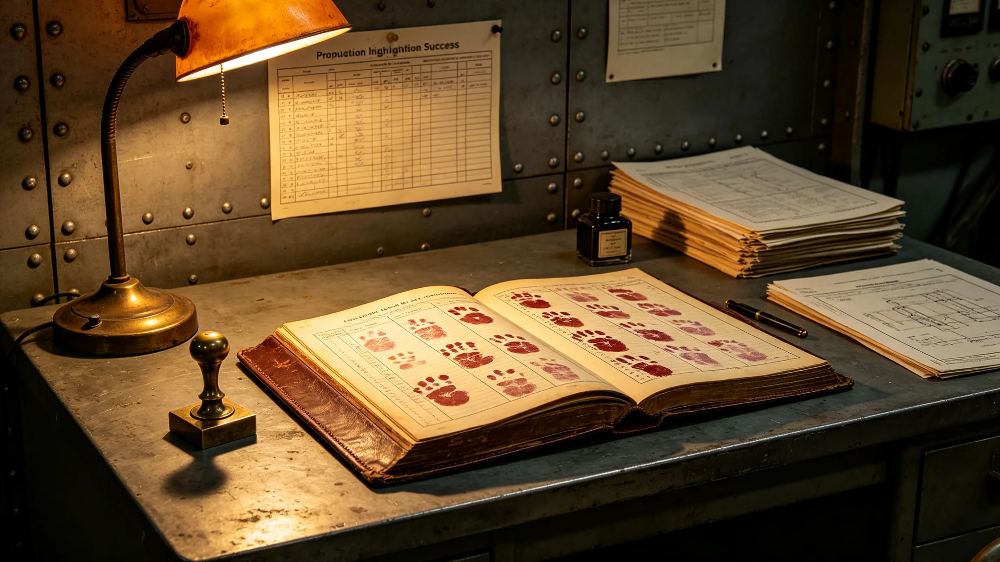

# 推进系统点火成功纪念规程

## 一、纪念目的

本仪式为第十一代聚变推进第三次试车一次通过后的纪念，自3831年六月十五日举行。仪式不庆功，只记录点火成功、长期数据周期开始。出席者推进署、总工程师、试车指挥、监督处代表共四十人。

## 二、仪式时间与地点

仪式于3831年六月十五日，试车台第三号燃烧室旁举行。时间取第三次试车成功后第七日，不另选。

## 三、仪式程序

程序五项：一、试车指挥宣读第三次试车签认结果；二、总设计师在长期数据记录本上签下起始日；三、在场者在记录本上按手印；四、监督处代表宣布长期数据周期开始；五、礼成。

## 四、长期数据记录本

记录本厚三百页，签认后开始逐日记录辐射器余温、效率、液滴分布。满二十个月后方可定型。记录本锁入推进署档案柜，仅总设计师与总工程师可开启。

## 五、出席签到

四十人签到，含推进署负责人、总设计师、试车指挥、监督处代表。签到表与记录本同存。

## 六、礼成后安排

礼成后试车台转入长期观测，不再点火。仪式无宴饮，不立碑。

## 七、与前次纪念对照

第十代推进点火纪念在同一试车台，程序一致。本次为第十一代，长期数据周期二十个月。
## 八、第三次试车签认结果

第三次试车一次通过，无补写，无附加条件。试车指挥与总设计师双签。签认单副本与记录本同存。

## 九、长期数据记录本使用

记录本厚三百页，每日一页，列余温、效率、液滴分布三项。每页由当班值长签字，总设计师每周复看一次。满二十个月后，记录本交改造署验收。

## 十、出席者名单节选

推进署负责人、总设计师、试车指挥、当班值长、监督处代表。共四十人。

## 十一、礼成后第七日安排

礼成后第七日，试车台转入长期观测，不再点火。试车台封条贴于第三号燃烧室入口。

## 十二、与前次纪念对照

| 纪念 | 代次 | 长期周期 | 礼成后 |
|---|---|---|---|
| 前次 | 第十代 | 无 | 定型 |
| 本次 | 第十一代 | 二十个月 | 观测 |

本次新增长期数据周期要求。

## 十三、附则

本规程自3831年六月十五日起执行。解释权归推进署。既往不溯及。
## 十四、纪念禁忌

仪式不敬酒、不送礼、不立碑。在场者不拍照。不设主席台。

## 十五、纪念后首周

礼成后首周，试车台封条贴于入口，长期观测开始。

## 十六、归档

本规程与记录本、签认单副本同存于推进署。编号按点火纪念年度排。
## 十七、纪念词底稿留存

纪念词底稿不另发文件，只由试车指挥现场宣读。底稿留存在推进署，不公开。宣读词内容即第三次试车签认结果与长期周期开始。

## 十八、出席者不发言

除试车指挥宣读、监督处代表宣布外，出席者不发言。总设计师只在记录本上签字，不讲话。

## 十九、纪念时长

纪念全程不超过半个时辰。礼成后试车台即封。
## 二十、纪念当日工间餐

礼成后在工间食堂供一餐简餐，不设酒食。出席者与当班值长同桌。

## 二十一、纪念不发纪念品

纪念不发任何纪念品，不立碑，不拍照。

## 二十二、与试车制度关系

本规程为试车制度在点火纪念上的执行细则。与试车制度抵触者以试车制度为准。
## 二十三、纪念后第一年回顾

礼成后第一年，推进署按季报长期观测数据。第一年内效率稳定。

## 二十四、与居民知情权

纪念程序向居民公开。居民可查签认单副本，不查记录本。

## 二十五、附则补遗

本规程自颁行日起存档，解释权归推进署。既往不溯及，新按本规程执行。
## 二十六、纪念监督

监督处代表在纪念全程在场，不发言、不干预。

## 二十七、纪念后异议

纪念后居民如有异议，向监督处提出。异议三个月内答复。

## 二十八、本规程所附材料

签到表、签认单副本、记录本副本、出席名单节选，共四份。齐全，可供验收。
## 二十九、纪念与监督关系

监督处独立于推进署。监督处在纪念上只宣布长期周期开始。

## 三十、本规程生效

本规程自颁行日起生效，不另发通知。

本规程编讫。
## 三十一、长期观测第三年回顾

礼成后第三年，长期数据记录本已记三百页。效率稳定，无异常值。第三年下半年可提交定型建议。

## 三十二、记录本保管

记录本锁入推进署档案柜，钥匙两把，总设计师与总工程师各一。两把同开方可查阅。
## 三十三、定型建议

第三年下半年，总设计师提出定型建议，附记录本三百页数据。建议经监督处复核后，提交改造署验收。

## 三十四、定型后

定型后记录本交改造署归档，不再逐日记录。推进系统转入运行维护。
## 三十五、定型后记录本处置

定型后记录本交改造署归档，不销毁。记录本永久保存。

## 三十六、本规程编讫

本规程自颁行日起存档。解释权归推进署。既往不溯及。

本规程编讫。

本规程。