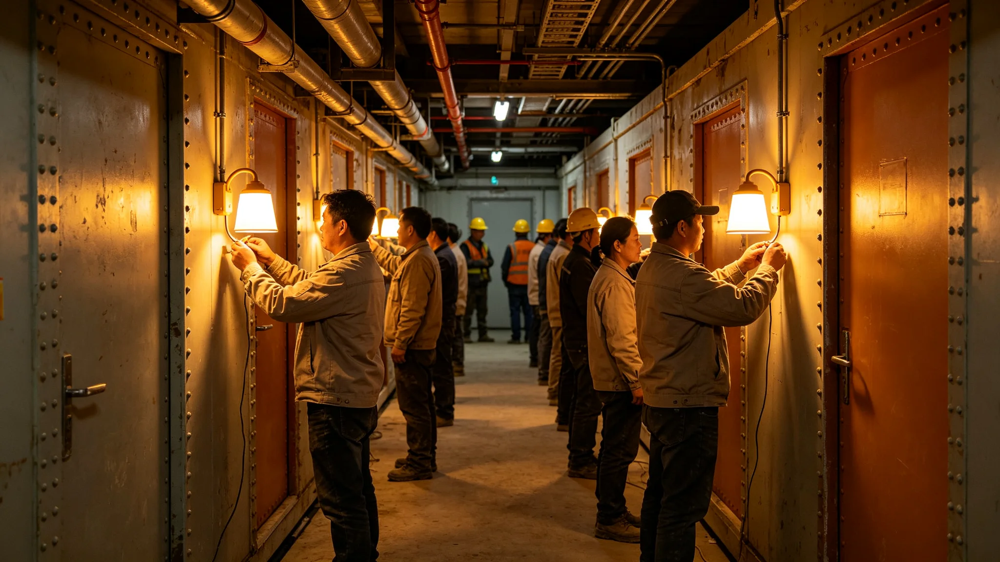

# 新居住舱首批入住接灯仪式规程

## 一、仪式目的

本仪式为新居住舱段建成后首批住户入住的接灯礼，自3832年八月二十日举行。仪式不庆乔迁，只接灯、验房、登记到户。出席者首批住户二十户、居住署、总工程师、监督处代表共六十人。

## 二、仪式时间与地点

仪式于3832年八月二十日，新舱段第三段走廊举行。时间取晨班第一刻，不另选。

## 三、仪式程序

程序六项：一、总工程师宣布新段验收合格；二、首批住户逐户接灯；三、住户在验房单上签字；四、居住署登记到户；五、住户代表致辞；六、礼成。

## 四、接灯与验房

接灯即住户按亮自己舱室的灯。验房单列隔声、照明、新风、给排水四项，住户实测后签字。第三段曾因新风量不足整改后入住，本次接灯即整改后首批。

## 五、出席签到

六十人签到，含二十户住户、居住署、总工程师、监督处代表。签到表与验房单同存。

## 六、礼成后安排

礼成后住户正式入住，居住署随访半年。仪式无宴饮，不立碑。

## 七、与前次接灯对照

前两次新舱段接灯在不同段，程序一致。本次为第三段整改后首批。
## 八、接灯程序

首批二十户逐户接灯。接灯即住户按亮自己舱室的灯，灯亮后住户在验房单上签字。不另发钥匙，灯亮即入住。

## 九、验房四项

隔声、照明、新风、给排水四项实测。第三段曾因新风量不足整改，本次为整改后首批。验房单由住户与居住署双签。

## 十、出席者名单节选

首批二十户、居住署验收员、总工程师、监督处代表。共六十人。

## 十一、随访安排

礼成后居住署随访半年，记录报修率。报修率逐季统计，次年纳入验收标准修订。

## 十二、与前次接灯对照

| 接灯 | 段别 | 户数 | 备注 |
|---|---|---|---|
| 第一次 | 第一段 | 十五户 | 新风达标 |
| 第二次 | 第二段 | 十八户 | 照明补灯 |
| 第三次 | 第三段 | 二十户 | 整改后首批 |

户数逐段略增。

## 十三、附则

本规程自3832年八月二十日起执行。解释权归居住署。既往不溯及。
## 十四、接灯禁忌

仪式不敬酒、不送礼、不立碑。住户仍穿日常服。不设主席台。

## 十五、接灯后首月

礼成后首月，居住署逐户随访，记录报修。

## 十六、归档

本规程与验房单、签到表同存于居住署。编号按接灯年度排。
## 十七、接灯词底稿留存

接灯词底稿不另发文件，只由总工程师现场宣读。底稿留存在居住署，不公开。宣读词内容即新段验收合格。

## 十八、出席者不发言

除总工程师宣读、住户代表简短致辞外，出席者不发言。

## 十九、接灯时长

接灯全程不超过半个时辰。礼成后住户即入住。
## 二十、接灯当日工间餐

礼成后在新舱段食堂供一餐简餐，不设酒食。住户与验收员同桌。

## 二十一、接灯不发纪念品

接灯不发任何纪念品，不立碑。

## 二十二、与居住分配制度关系

本规程为居住分配制度在入住接灯上的执行细则。与分配制度抵触者以分配制度为准。
## 二十三、接灯后第一年回顾

礼成后第一年，居住署按季报报修率。第一年报修率低于第二段。

## 二十四、与居民知情权

接灯程序向居民公开。居民可查验房单副本，不查住户隐私。

## 二十五、附则补遗

本规程自颁行日起存档，解释权归居住署。既往不溯及，新按本规程执行。
## 二十六、接灯监督

监督处代表在接灯全程在场，不发言、不干预。

## 二十七、接灯后异议

接灯后住户如有异议，向监督处提出。异议三个月内答复。

## 二十八、本规程所附材料

验房单、签到表、随访记录、出席名单节选，共四份。齐全，可供验收。
## 二十九、接灯与监督关系

监督处独立于居住署。监督处在接灯上只到场，不点评。

## 三十、本规程生效

本规程自颁行日起生效，不另发通知。

本规程编讫。
## 三十一、随访第二年回顾

礼成后第二年，居住署继续随访。报修率稳定，无新增整改。第三段入住户数饱和。

## 三十二、钥匙管理

新舱段不另发钥匙，灯亮即入住。钥匙为舱室门磁条，住户自带。
## 三十三、饱和后安排

第三段入住饱和后，居住署不再向第三段安排新户。后续新户按第四段。

## 三十四、随访结束

随访半年期满后，居住署结束随访，转入常规报修。
## 三十五、随访报告归档

随访报告半年期满后归档于居住署，不公开传阅。

## 三十六、本规程编讫

本规程自颁行日起存档。解释权归居住署。既往不溯及。

本规程编讫。

本规程。
## 三十七、新舱段照明标准

新舱段照明按每室十瓦、走廊十五瓦。住户可在标准内自行调节亮度。

## 三十八、新舱段通风标准

新舱段新风量按每人每时辰六立方。第三段整改后达标。

本规程编讫。
## 三十九、接灯与绿化

新舱段绿化按每室一盆，由环控署配给。住户不自行引种。

## 四十、接灯与储物

新舱段储物按每人一柜，柜由居住署配给。
