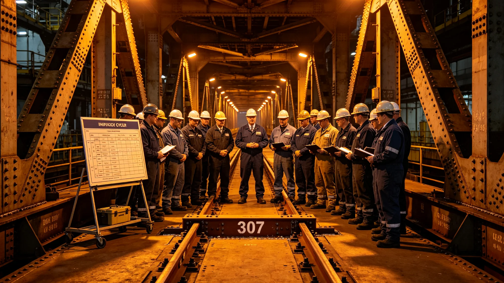

# 飞船延寿纪念规程

## 一、纪念目的

本仪式为主桁架结构延寿完成、第三百零七段更换后的纪念，自3833年十月五日举行。仪式不庆功，只宣布延寿完成、检测周期定型。出席者结构署、总工程师、监督处代表、相邻段住户代表共五十人。

## 二、仪式时间与地点

仪式于3833年十月五日，主桁架第三百零七段更换点旁举行。时间取更换后复检合格日，不另选。

## 三、仪式程序

程序五项：一、结构署负责人宣布更换合格；二、首席专家在检测周期表上签六年一轮；三、在场者在周期表上按手印；四、监督处代表宣布六年一轮入制度；五、礼成。

## 四、检测周期表

周期表列一千二百段检测排程，六年一轮。新疲劳模型分流至下一艘船，本船按实测更换。表锁入结构署档案柜。

## 五、出席签到

五十人签到，含结构署、总工程师、监督处、住户代表。签到表与周期表同存。

## 六、礼成后安排

礼成后主桁架转入六年一轮检测。仪式无宴饮，不立碑。

## 七、与前次延寿对照

前次结构延寿无裂纹检出，本次为裂纹后更换。
## 八、第三百零七段更换情况

第三百零七段裂纹超阈值，列入更换。更换排大修间隙，不另停航。更换后复检合格，转入六年一轮检测。

## 九、六年一轮周期表

周期表列一千二百段检测排程，六年一轮。关键段六年，非关键段八年。表锁入结构署档案柜。

## 十、出席者名单节选

结构署负责人、首席专家、探伤员两名、总工程师、监督处代表、相邻段住户代表。共五十人。

## 十一、新疲劳模型分流

检测得出新疲劳模型用于下一艘船设计，本船按实测更换。两案分开，互不混同。

## 十二、与前次延寿对照

| 延寿 | 裂纹检出 | 周期 | 礼成后 |
|---|---|---|---|
| 前次 | 无 | 十年 | 观测 |
| 本次 | 有 | 六年 | 更换后观测 |

本次为裂纹后更换。

## 十三、附则

本规程自3833年十月五日起执行。解释权归结构署。既往不溯及。
## 十四、纪念禁忌

仪式不敬酒、不送礼、不立碑。在场者仍穿作业服。不设主席台。

## 十五、纪念后首季

礼成后首季，结构署按六年一轮排检测计划。

## 十六、归档

本规程与周期表、签到表同存于结构署。编号按延寿纪念年度排。
## 十七、纪念词底稿留存

纪念词底稿不另发文件，只由结构署负责人现场宣读。底稿留存在结构署，不公开。

## 十八、出席者不发言

除结构署负责人宣读、监督处代表宣布外，出席者不发言。

## 十九、纪念时长

纪念全程不超过半个时辰。礼成后即转检测。
## 二十、纪念当日工间餐

礼成后在工间食堂供一餐简餐，不设酒食。

## 二十一、纪念不发纪念品

纪念不发任何纪念品，不立碑。

## 二十二、与结构标准关系

本规程为结构延寿标准在纪念事项上的执行细则。与标准抵触者以标准为准。
## 二十三、纪念后第一年回顾

礼成后第一年，结构署按季报检测排程。第一年无新裂纹。

## 二十四、与居民知情权

纪念程序向居民公开。居民可查周期表副本。

## 二十五、附则补遗

本规程自颁行日起存档，解释权归结构署。既往不溯及，新按本规程执行。
## 二十六、纪念监督

监督处代表在纪念全程在场，不发言、不干预。

## 二十七、纪念后异议

纪念后居民如有异议，向监督处提出。异议三个月内答复。

## 二十八、本规程所附材料

周期表、签到表、检测记录、出席名单节选，共四份。齐全，可供验收。
## 二十九、纪念与监督关系

监督处独立于结构署。监督处在纪念上只宣布六年一轮入制度。

## 三十、本规程生效

本规程自颁行日起生效，不另发通知。

本规程编讫。
## 三十一、检测第三年回顾

礼成后第三年，结构署按六年一轮排检测。第三年检测四百段，无新裂纹。

## 三十二、周期表保管

周期表锁入结构署档案柜，钥匙两把，首席专家与总工程师各一。
## 三十三、第三年检测结果

第三年检测四百段，无新裂纹。第三百零七段更换后复检合格。

## 三十四、第六年复测

第六年按六年一轮复测，检测结果与第三年对照。
## 三十五、复测报告归档

第六年复测报告归档于结构署，不公开传阅。

## 三十六、本规程编讫

本规程自颁行日起存档。解释权归结构署。既往不溯及。

本规程编讫。

本规程。
## 三十七、关键段清单

关键段列主桁架受力集中段二百段，六年一轮检测。非关键段八年。

## 三十八、检测方法

检测采用超声与漏磁双轨，关键段加表面探伤。

本规程编讫。
## 三十九、裂纹处置流程

检测发现裂纹后，先标记、复探、评估、列入更换。流程三步，不另设。

## 四十、更换窗口

更换排大修间隙，不另停航。窗口由大修署排定。

本规程编讫。
## 四十一、检测人员资质

探伤员须经结构署培训，持证上岗。每两年复训一次。

## 四十二、检测记录保存

检测记录归档于结构署，永久保存。
