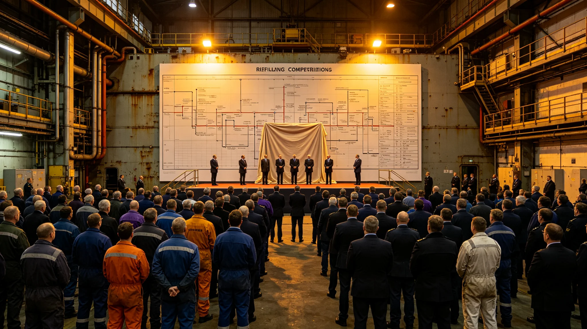

# 大修竣工庆典规程

## 一、庆典目的

本庆典为中期大修八子项全部验收合格后的竣工礼，自3834年十二月三十日举行。庆典不庆功，只封存总验收表、宣布改造结束。出席者八署负责人、居民代表、监督处代表共二百人。

## 二、庆典时间与地点

庆典于3834年十二月三十日，总验收厅举行。时间取收尾验收合格日，不另选。

## 三、庆典程序

程序七项：一、总工程师宣布八子项全部合格；二、宣读总验收清单四十四项；三、八署负责人在总表上签认；四、总表封存；五、居民代表致辞；六、监督处代表宣布监督收尾；七、礼成。

## 四、总表封存

总验收表四十四项签认后封存，存入大修署档案柜。封存后本表不复用。总工期二十三年，较原定延二十三个月。

## 五、出席签到

二百人签到，含八署负责人、居民代表一百五十人、监督处代表。签到表与总表同存。

## 六、礼成后安排

礼成后改造署转入运行维护，不再以改造署名义行事。庆典无宴饮，不立碑。

## 七、与前次竣工对照

前次大修竣工工期按原表完成，本次顺延二十三个月。
## 八、总验收清单四十四项

清单列八子项关键工序验收，每项由子项署与监督处双签。四十四项一次性通过，无补签。

## 九、总工期说明

总工期原定二十年，实际二十三年，顺延二十三个月。顺延两次均由总工程师提出说明，三方会签。

## 十、出席者名单节选

八署负责人、居民代表一百五十人、监督处代表。共二百人。

## 十一、礼成后改造署改组

礼成后改造署转入运行维护，不再以改造署名义行事。总工程师卸任。

## 十二、与前次竣工对照

| 竣工 | 工期 | 顺延 | 礼成后 |
|---|---|---|---|
| 前次 | 二十年 | 无 | 运行 |
| 本次 | 二十三年 | 二十三个月 | 运行 |

本次顺延为历次最长。

## 十三、附则

本规程自3834年十二月三十日起执行。解释权归大修署。既往不溯及。
## 十四、庆典禁忌

庆典不敬酒、不送礼、不立碑。出席者仍穿作业服。不设主席台。

## 十五、庆典后首周

礼成后首周，改造署向运行署移交全部台账。

## 十六、归档

本规程与总验收表、签到表同存于大修署。编号按竣工年度排。
## 十七、庆典词底稿留存

庆典词底稿不另发文件，只由总工程师现场宣读。底稿留存在大修署，不公开。宣读词内容即八子项合格与总表封存。

## 十八、出席者不发言

除总工程师宣读、居民代表简短致辞外，出席者不发言。

## 十九、庆典时长

庆典全程不超过一个时辰。礼成后改造署即改组。
## 二十、庆典当日工间餐

礼成后在工间食堂供一餐简餐，不设酒食。

## 二十一、庆典不发纪念品

庆典不发任何纪念品，不立碑。

## 二十二、与改造法关系

本规程为改造法在竣工事项上的执行细则。与改造法抵触者以改造法为准。
## 二十三、庆典后第一年回顾

礼成后第一年，改造署向运行署移交完毕。第一年无返工。

## 二十四、与居民知情权

庆典程序向居民公开。居民可查总验收表副本。

## 二十五、附则补遗

本规程自颁行日起存档，解释权归大修署。既往不溯及，新按本规程执行。
## 二十六、庆典监督

监督处代表在庆典全程在场，不发言、不干预。

## 二十七、庆典后异议

庆典后居民如有异议，向监督处提出。异议三个月内答复。

## 二十八、本规程所附材料

总验收表、签到表、移交清单、出席名单节选，共四份。齐全，可供验收。
## 二十九、庆典与监督关系

监督处独立于大修署。监督处在庆典上只宣布监督收尾。

## 三十、本规程生效

本规程自颁行日起生效，不另发通知。

本规程编讫。
## 三十一、移交第二年回顾

礼成后第二年，运行署接管完毕。第一年无返工，第二年亦无。

## 三十二、总表保管

总验收表锁入大修署档案柜，钥匙两把，总工程师与监督处代表各一。
## 三十三、移交清单

移交清单列改造署全部台账，含八子项技术报告、事故通报、工期表、决算报告。清单逐项签收。

## 三十四、移交后

移交后改造署不再对外行文。运行署对外行文。
## 三十五、移交后运行署行文

移交后运行署对外行文，改造署不再对外。运行署行文须注明改造署已移交。

## 三十六、本规程编讫

本规程自颁行日起存档。解释权归大修署。既往不溯及。

本规程编讫。

本规程。
## 三十七、总验收四十四项分项

四十四项分八子项，每子项五项至七项不等。每项双签。

## 三十八、验收后整改

总验收后无整改，四十四项一次性通过。

本规程编讫。
## 三十九、竣工后船务署行文

竣工后船务署对外行文，注明改造已完成。改造署不再对外。

## 四十、竣工后居民申诉

竣工后居民如有申诉，向船务署提出，不向改造署提出。

本规程编讫。
## 四十一、竣工后监督收尾

监督处在庆典上宣布监督收尾。收尾后监督处转入常规监督。

## 四十二、竣工后档案归档

竣工后全部档案归档于大修署，不销毁。
