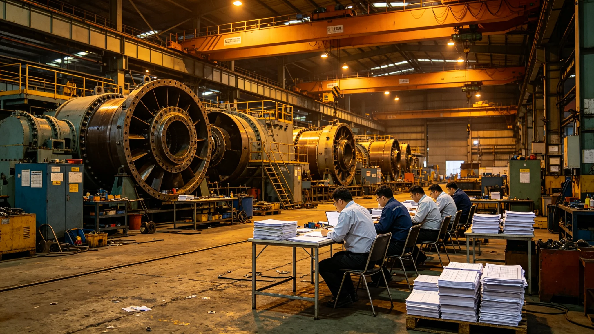

# 飞船改造工程产业链决算报告

## 一、决算范围

本决算为中期改造全产业链决算，覆盖推进、生命支持、居住扩容、结构延寿、能源、废物循环、舱段重构、大修服务八子产业。决算期自3830年开工至3834年竣工，共二十三年。

## 二、总决算

总决算支出按工时分摊，不列货币。总工时分摊为推进三成、生命支持两成、居住一成、结构一成、能源一成、废物循环半成、舱段半成、大修服务一成。其余一成入监督与行政。

## 三、八子产业决算

| 子产业 | 工时占比 | 备注 |
|---|---|---|
| 推进 | 三成 | 第十一代聚变 |
| 生命支持 | 两成 | 第三代闭环 |
| 居住 | 一成 | 模块化扩容 |
| 结构 | 一成 | 主桁架延寿 |
| 能源 | 一成 | 堆芯升级 |
| 废物循环 | 半成 | 全循环 |
| 舱段 | 半成 | 重构 |
| 大修服务 | 一成 | 开腹与验收 |

## 四、与原定预算对照

原定二十年，实际二十三年，顺延二十三个月。顺延工时主要在吊装与检测，不在制造。

## 五、决算说明

决算不列货币，只列工时与材料。材料按库存领用，不另购。决算由经济署编制，监督处复核。

## 六、附则

本决算自3836年七月十日起存档。解释权归经济署。
## 七、决算编制依据

本决算依据改造法、各子项技术报告、事故通报、工期表编制。不列货币，只列工时与材料。

## 八、监督复核

监督处对决算独立复核，不隶属经济署。复核重点在工时分摊与材料领用。

## 九、与前次决算对照

| 决算 | 中期改造次序 | 工期 | 顺延 |
|---|---|---|---|
| 前次 | 第二次 | 二十年 | 无 |
| 本次 | 第三次 | 二十三年 | 二十三个月 |

本次顺延为历次最长。

## 十、决算说明补遗

决算不列货币，只列工时与材料。材料按库存领用，不另购。监督处复核通过后存档。

## 十一、附则补遗

本决算自颁行日起存档，解释权归经济署。既往不溯及。
## 十二、决算审核流程

决算编制后，先由经济署自审，再送监督处复核，最后报总工程师签认。三级流程，不另设。

## 十三、决算公布

决算公布于船务署公告板，居民可查。不列货币，只列工时与材料占比。

## 十四、决算异议

居民对决算有异议，向监督处提出，三个月内答复。

## 十五、决算归档

决算存档于经济署，永久保存。副本送监督处与船务署。
## 十六、决算与工期关系

决算顺延二十三个月，主要在吊装与检测。制造工时未超。

## 十七、决算与材料关系

材料按库存领用，不另购。库存不足时走紧急领用，记入决算。

## 十八、决算与监督关系

监督处独立复核，不隶属经济署。复核意见附决算后。

## 十九、决算与居民关系

居民可查决算占比，不查工时明细。明细存经济署。

## 二十、决算与下一艘船关系

本次决算经验供下一艘船参考，不直接套用。
## 二十一、决算不列货币说明

本船内不发行货币，决算只列工时与材料。工时分摊按岗位级别与班次。材料按库存领用登记。

## 二十二、决算与八署关系

八署各报子项决算，经济署汇总。监督处复核汇总表。

## 二十三、决算与总工程师关系

总工程师签认汇总表，不另看明细。明细存经济署。

## 二十四、决算与船务署关系

船务署公布汇总表，不公布明细。居民可查公告板。

## 二十五、决算长期跟踪

决算公布后，经济署按季跟踪实际工时与决算差异。
## 二十六、决算差异处理

实际工时与决算差异超过一成，经济署须说明。未超一成，不说明。

## 二十七、决算与奖惩关系

决算不与奖惩挂钩。奖惩另按考勤与签认档案处理。

## 二十八、决算与居民申诉关系

居民对决算有申诉，向监督处提出。监督处不替经济署解释。

## 二十九、决算与下一艘船编制关系

下一艘船编制决算时，参考本次占比，不直接套用。

## 三十、本决算编讫

本决算自颁行日起存档，解释权归经济署。既往不溯及。
## 三十一、决算所附材料

本决算所附：八子项决算分册、监督复核意见、总工程师签认单、公布公告副本。共四份。

## 三十二、决算编号

本决算编号按中期改造年度排，存档于经济署档案柜。

## 三十三、决算与改造法关系

本决算为改造法在决算事项上的执行细则。与改造法抵触者以改造法为准。

## 三十四、决算与居民知情权

居民可查公布版占比，不查工时明细。明细存经济署，居民申请可查。

## 三十五、本决算生效

本决算自颁行日起生效，不另发通知。
## 三十六、决算与工时级别

工时按岗位级别分摊：总工程师一级、署负责人二级、工艺师三级、工人四级。级别越高，单位工时越重。

## 三十七、决算与班次

班次分白班与夜班。夜班工时按一点二倍计。

## 三十八、决算与材料领用

材料按库存领用，领用时登记品名、数量、领用人。紧急领用另记。

## 三十九、决算与库存盘点

决算前，经济署会同各署盘点库存。盘点结果与决算材料领用对照。

## 四十、决算与下一艘船预算

下一艘船预算编制参考本次决算占比，不直接套用。
