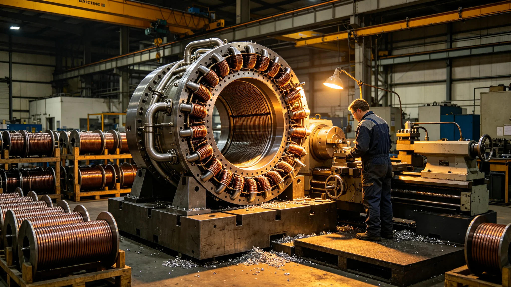

# 推进系统制造产业决算报告

## 一、决算范围

本决算为第十一代聚变推进制造产业决算，覆盖燃烧室、磁约束、辐射器、工质液滴、试车台改装。

## 二、总决算

制造工时占总决算三成。燃烧室工时最多，磁约束次之。

## 三、关键设备工时

| 设备 | 工时占比 | 备注 |
|---|---|---|
| 燃烧室 | 三成 | 试车微漏已修 |
| 磁约束 | 两成 | 线圈重绕 |
| 辐射器 | 两成 | 新制 |
| 工质液滴 | 一成半 | 微控阀 |
| 试车台改装 | 一成半 | 第三次通过 |

## 四、与原定对照

原定工时略紧，实际略增。试车微漏返修占增额。

## 五、决算说明

决算不列货币，只列工时与材料。材料按库存领用。

## 六、附则

本决算自3837年七月十一日起存档。解释权归经济署。

## 七、决算编制依据

本决算依据推进技术报告、试车签认单、制造工时记录编制。

## 八、监督复核

监督处对制造工时独立复核。重点在燃烧室返修工时。

## 九、与前次决算对照

| 决算 | 代次 | 工时占比 | 备注 |
|---|---|---|---|
| 前次 | 第十代 | 三成 | 无返修 |
| 本次 | 第十一代 | 三成 | 微漏返修 |

本次新增试车微漏返修。

## 十、附则补遗

本决算自颁行日起存档，解释权归经济署。既往不溯及。

## 十一、决算审核流程

制造决算先由推进署自审，再送监督处复核，最后报总工程师签认。

## 十二、决算公布

公布于船务署公告板，居民可查。

## 十三、决算异议

居民有异议，向监督处提出。

## 十四、决算归档

存档于经济署，副本送推进署与监督处。

## 十五、决算与居民关系

居民可查占比，不查明细。

## 十六、决算与下一艘船关系

经验供下一艘船参考。

## 十七、决算与推进署关系

推进署报子项决算，经济署汇总。

## 十八、决算与总工程师关系

总工程师签认子项表。

## 十九、决算与船务署关系

船务署公布子项占比。

## 二十、决算长期跟踪

经济署按季跟踪差异。

## 二十一、决算差异处理

差异超一成须说明。

## 二十二、决算与奖惩关系

不与奖惩挂钩。

## 二十三、决算所附材料

本决算所附：制造工时记录、监督复核意见、总工程师签认单、公布公告副本。

## 二十四、决算编号

本决算编号按制造年度排，存档于经济署。

## 二十五、决算与改造法关系

本决算为改造法在制造决算上的执行细则。

## 二十六、本决算生效

本决算自颁行日起生效。

## 二十七、决算与工时级别

工时按四级分摊。

## 二十八、决算与班次

夜班一点二倍。

## 二十九、决算与材料领用

领用登记品名数量。

## 三十、决算与库存盘点

决算前盘点。

## 三十一、制造车间排班

制造车间按白夜班两班倒。每班八时辰。周末不休。

## 三十二、制造材料清单

燃烧室内衬、磁约束线圈、辐射器板、工质微控阀、试车台管线。共五类。

## 三十三、制造质量门

每类材料入库前过质量门。不合格退回。

## 三十四、制造与监督

监督处派员驻车间，不干预生产。

## 三十五、制造工时明细

燃烧室制造工时最长，磁约束次之。试车微漏返修工时占增额两成。

## 三十六、制造材料消耗

内衬消耗最多，线圈次之。材料按库存领用，不另购。

## 三十七、制造人员

制造人员含工艺师十二人、工人八十人。按四级分摊工时。

## 三十八、制造后车间处置

制造结束后车间封存，转运行维护。

## 三十九、本决算所附材料齐全

所附工时记录、材料清单、质量门记录、监督意见，共四份。齐全，可供验收。

## 四十、制造与试车关系

制造完成后送试车。试车三次，第三次通过。

## 四十一、制造与验收关系

制造由推进署验收，监督处复核。

## 四十二、制造与归档关系

制造记录归档于经济署，副本送推进署。

