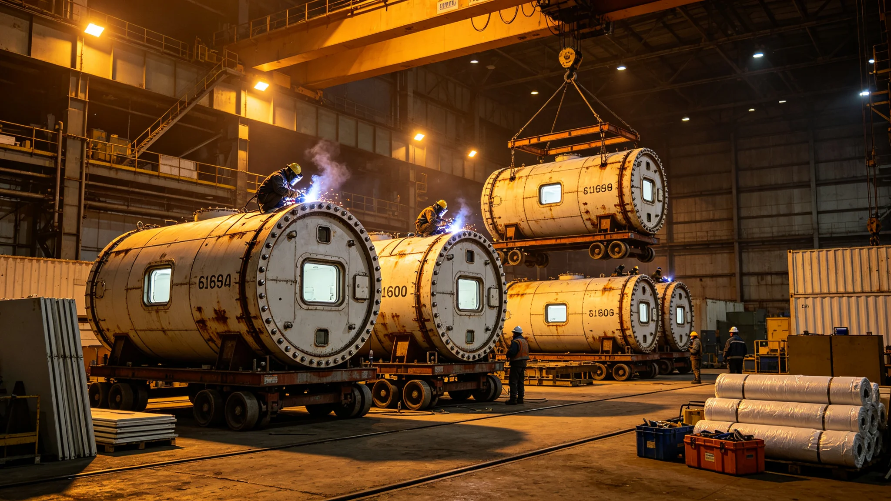

# 居住舱建造产业决算报告

## 一、决算范围

本决算为居住舱模块化扩容产业决算，覆盖舱段制造、吊装、内装、绿化、验收。

## 二、总决算

制造工时占总决算一成。吊装工时最多。

## 三、关键设备工时

| 设备 | 工时占比 | 备注 |
|---|---|---|
| 舱段制造 | 三成 | 模块化 |
| 吊装 | 三成 | 坍塌险情后改方案 |
| 内装 | 两成 | 隔声照明 |
| 绿化 | 一成 | 升级 |
| 验收 | 一成 | 第三段整改 |

## 四、与原定对照

原定工时略紧，实际略增。坍塌险情后改方案占增额。

## 五、决算说明

决算不列货币，只列工时与材料。

## 六、附则

本决算自3839年七月十三日起存档。解释权归经济署。

## 七、决算编制依据

本决算依据居住扩容技术报告、坍塌险情通报、验房单编制。

## 八、监督复核

监督处对吊装工时独立复核。重点在坍塌险情后改方案工时。

## 九、与前次决算对照

| 决算 | 段别 | 工时占比 | 备注 |
|---|---|---|---|
| 前次 | 第一二段 | 一成 | 无险情 |
| 本次 | 第三段 | 一成 | 坍塌后改方案 |
本次新增吊装改方案。

## 十、决算审核流程

建造决算先由居住署自审，再送监督处复核，最后报总工程师签认。

## 十一、决算公布

公布于船务署公告板，居民可查。

## 十二、决算异议

居民有异议，向监督处提出。

## 十三、决算归档

存档于经济署，副本送居住署与监督处。

## 十四、决算与工期关系

建造工时未超，坍塌后改方案占增额。

## 十五、决算不列货币说明

本船内不发行货币，决算只列工时与材料。

## 十六、决算长期跟踪

经济署按季跟踪差异。

## 十七、决算差异处理

差异超一成须说明。

## 十八、决算所附材料

本决算所附：建造工时记录、监督复核意见、总工程师签认单、公布公告副本。

## 十九、决算编号

本决算编号按建造年度排，存档于经济署。

## 二十、决算与改造法关系

本决算为改造法在建造决算上的执行细则。

## 二十一、本决算生效

本决算自颁行日起生效。

## 二十二、决算与工时级别

工时按四级分摊。

## 二十三、决算与班次

夜班一点二倍。

## 二十四、决算与材料领用

领用登记。

## 二十五、决算与库存盘点

决算前盘点。

## 二十六、舱段车间排班

舱段车间按白夜班两班倒。每班八时辰。

## 二十七、建造材料清单

舱段壁、吊装件、内装板、绿化盆、验房仪表。共五类。

## 二十八、建造质量门

每类入库前过质量门。

## 二十九、建造与监督

监督处派员驻车间。

## 三十、建造工时明细

舱段制造工时最长，吊装次之。坍塌后改方案占增额两成。

## 三十一、建造材料消耗

舱段壁消耗最多，吊装件次之。

## 三十二、建造人员

建造人员含工艺师十人、工人七十人。

## 三十三、建造后车间处置

建造结束后车间封存。

## 三十四、本决算所附材料齐全

所附工时记录、材料清单、质量门记录、监督意见，共四份。齐全。

## 三十五、建造与吊装关系

建造完成后吊装。吊装一次险情后改方案。

## 三十六、建造与验收关系

建造由居住署验收。

## 三十七、建造与归档关系

建造记录归档于经济署。
