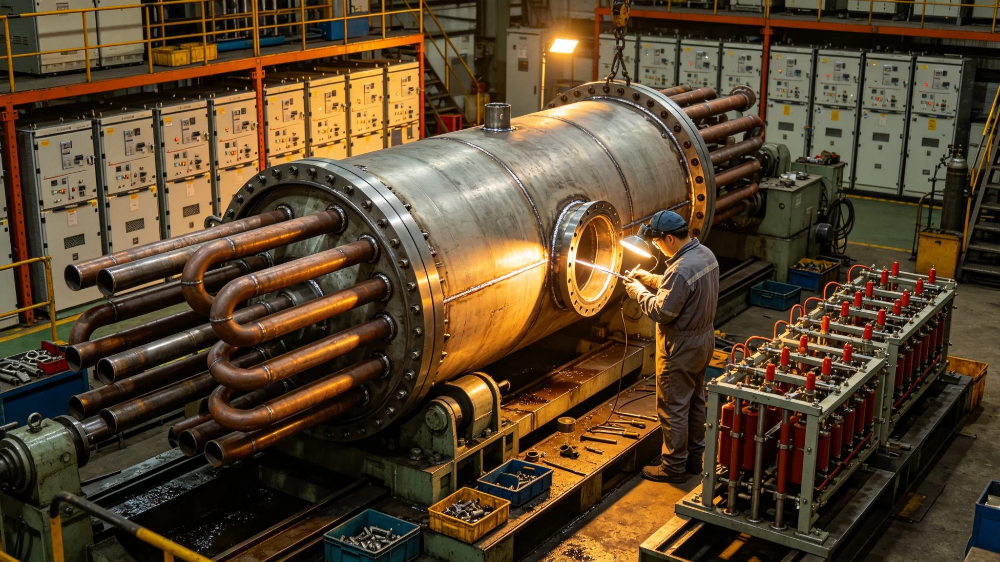

# 能源系统升级产业决算报告

## 一、决算范围

本决算为聚变堆芯升级产业决算，覆盖堆芯、换热、配电、备用电池、监测。

## 二、总决算

制造工时占总决算一成。堆芯工时最多。

## 三、关键设备工时

| 设备 | 工时占比 | 备注 |
|---|---|---|
| 堆芯 | 三成 | 升级 |
| 换热 | 两成 | 新制 |
| 配电 | 两成 | 过载停电后改 |
| 备用电池 | 两成 | 保底 |
| 监测 | 一成 | 连续值守 |

## 四、与原定对照

原定工时略紧，实际略增。过载停电后整改占增额。

## 五、决算说明

决算不列货币，只列工时与材料。

## 六、附则

本决算自3840年七月十四日起存档。解释权归经济署。

## 七、决算编制依据

本决算依据堆芯技术报告、过载停电通报、值班记录编制。

## 八、监督复核

监督处对堆芯工时独立复核。重点在过载停电后整改工时。

## 九、与前次决算对照

| 决算 | 代次 | 工时占比 | 备注 |
|---|---|---|---|
| 前次 | 第五代 | 一成 | 无停电 |
| 本次 | 第六代 | 一成 | 过载停电 |
本次新增停电后整改。

## 十、决算审核流程

升级决算先由能源署自审，再送监督处复核，最后报总工程师签认。

## 十一、决算公布

公布于船务署公告板，居民可查。

## 十二、决算异议

居民有异议，向监督处提出。

## 十三、决算归档

存档于经济署，副本送能源署与监督处。

## 十四、决算与工期关系

升级工时未超，停电后整改占增额。

## 十五、决算不列货币说明

本船内不发行货币，决算只列工时与材料。

## 十六、决算长期跟踪

经济署按季跟踪差异。

## 十七、决算差异处理

差异超一成须说明。

## 十八、决算所附材料

本决算所附：升级工时记录、监督复核意见、总工程师签认单、公布公告副本。

## 十九、决算编号

本决算编号按升级年度排，存档于经济署。

## 二十、决算与改造法关系

本决算为改造法在升级决算上的执行细则。

## 二十一、本决算生效

本决算自颁行日起生效。

## 二十二、决算与工时级别

工时按四级分摊。

## 二十三、决算与班次

夜班一点二倍。

## 二十四、决算与材料领用

领用登记。

## 二十五、决算与库存盘点

决算前盘点。

## 二十六、堆芯车间排班

堆芯车间按白班一班，夜班值守。每班八时辰。

## 二十七、升级材料清单

堆芯件、换热板、配电盘、电池、监测仪。共五类。

## 二十八、升级质量门

每类入库前过质量门。

## 二十九、升级与监督

监督处派员驻车间。

## 三十、升级工时明细

堆芯升级工时最长，换热次之。停电后整改占增额两成。

## 三十一、升级材料消耗

堆芯件消耗最多，换热板次之。

## 三十二、升级人员

升级人员含工艺师十人、工人五十人。

## 三十三、升级后车间处置

升级结束后车间封存。

## 三十四、本决算所附材料齐全

所附工时记录、材料清单、质量门记录、监督意见，共四份。齐全。

## 三十五、升级与送电关系

升级完成后送电。送电一次过载停电后通过。

## 三十六、升级与验收关系

升级由能源署验收。

## 三十七、升级与归档关系

升级记录归档于经济署。
