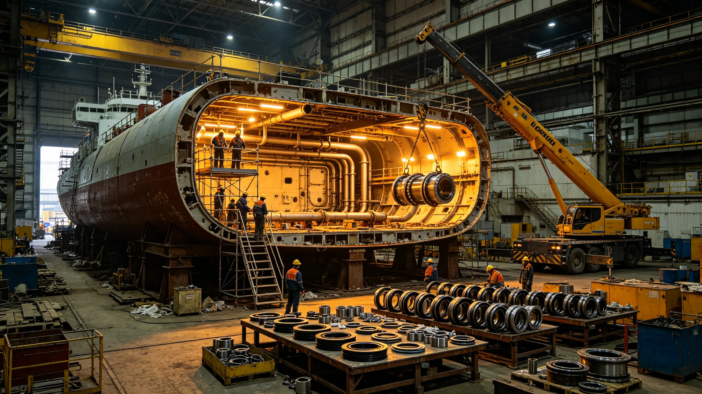

# 大修服务产业决算报告

## 一、决算范围

本决算为大修服务产业决算，覆盖开腹、密封、检测、临时安置、验收。

## 二、总决算

服务工时占总决算一成。开腹工时最多。

## 三、关键服务工时

| 服务 | 工时占比 | 备注 |
|---|---|---|
| 开腹 | 三成 | 微泄漏后改 |
| 密封 | 两成 | 临时密封层 |
| 检测 | 两成 | 六年一轮 |
| 临时安置 | 两成 | 居民搬入搬出 |
| 验收 | 一成 | 总表四十四项 |

## 四、与原定对照

原定工时略紧，实际略增。微泄漏后整改占增额。

## 五、决算说明

决算不列货币，只列工时与材料。

## 六、附则

本决算自3841年七月十五日起存档。解释权归经济署。

## 七、决算编制依据

本决算依据大修技术报告、泄漏通报、临时安置记录编制。

## 八、监督复核

监督处对开腹工时独立复核。重点在微泄漏后整改工时。

## 九、与前次决算对照

| 决算 | 中期改造次序 | 工时占比 | 备注 |
|---|---|---|---|
| 前次 | 第二次 | 一成 | 无泄漏 |
| 本次 | 第三次 | 一成 | 微泄漏 |
本次新增泄漏后整改。

## 十、决算审核流程

服务决算先由大修署自审，再送监督处复核，最后报总工程师签认。

## 十一、决算公布

公布于船务署公告板，居民可查。

## 十二、决算异议

居民有异议，向监督处提出。

## 十三、决算归档

存档于经济署，副本送大修署与监督处。

## 十四、决算与工期关系

服务工时未超，泄漏后整改占增额。

## 十五、决算不列货币说明

本船内不发行货币，决算只列工时与材料。

## 十六、决算长期跟踪

经济署按季跟踪差异。

## 十七、决算差异处理

差异超一成须说明。

## 十八、决算所附材料

本决算所附：服务工时记录、监督复核意见、总工程师签认单、公布公告副本。

## 十九、决算编号

本决算编号按服务年度排，存档于经济署。

## 二十、决算与改造法关系

本决算为改造法在服务决算上的执行细则。

## 二十一、本决算生效

本决算自颁行日起生效。

## 二十二、决算与工时级别

工时按四级分摊。

## 二十三、决算与班次

夜班一点二倍。

## 二十四、决算与材料领用

领用登记。

## 二十五、决算与库存盘点

决算前盘点。

## 二十六、大修车间排班

大修车间按白夜班两班倒。每班八时辰。

## 二十七、服务材料清单

开腹件、密封层、检测仪、安置铺、验收表。共五类。

## 二十八、服务质量门

每项入库前过质量门。

## 二十九、服务与监督

监督处派员驻车间。

## 三十、服务工时明细

开腹服务工时最长，密封次之。泄漏后整改占增额两成。

## 三十一、服务材料消耗

开腹件消耗最多，密封层次之。

## 三十二、服务人员

服务人员含工艺师十二人、工人八十人。

## 三十三、服务后车间处置

服务结束后车间封存。

## 三十四、本决算所附材料齐全

所附工时记录、材料清单、质量门记录、监督意见，共四份。齐全。

## 三十五、服务与开腹关系

服务完成后开腹。开腹一次微泄漏后通过。

## 三十六、服务与验收关系

服务由大修署验收。

## 三十七、服务与归档关系

服务记录归档于经济署。
