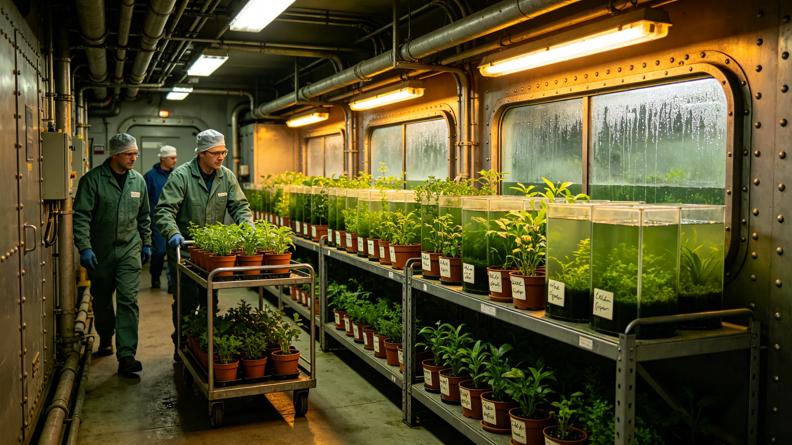

# 改造期间生态舱临时安置报告

## 一、安置缘由

中期改造期间，原生态舱须开腹改造。生态舱内藻池、菌群、观赏植株、水培作物须临时迁至备用舱。安置自3842年五月开始。

## 二、安置对象

藻池五座、菌群罐十二只、观赏植株二十盆、水培作物三槽。全部迁至备用舱乙区。

## 三、安置过程

搬迁分五批，每批一天。搬迁期间原生态舱不断氧，备用舱热备。藻池搬迁用转运罐，菌群罐整体搬，植株盆栽搬，水培作物连槽搬。

## 四、安置后监测

安置后连续监测七日，藻光合、菌群活性、植株长势、水培产量均正常。无死苗。

## 五、与改造配合

原生态舱开腹期间，备用舱维持闭环。开腹结束后回迁。

## 六、附则

本报告自3842年五月八日起存档。解释权归环控署。

## 七、安置前准备

安置前，备用舱乙区预先热备，藻光合灯、菌群温控、植株补光均调至原生舱参数。转运罐消毒、备用。

## 八、搬迁班次

搬迁分五批，每批一天，由白班工艺师执行。夜班值守备用舱。

## 九、搬迁后七日监测

| 指标 | 原生舱 | 备用舱 | 结论 |
|---|---|---|---|
| 藻光合 | 正常 | 正常 | 达标 |
| 菌群活性 | 正常 | 正常 | 达标 |
| 植株长势 | 正常 | 正常 | 达标 |
| 水培产量 | 正常 | 正常 | 达标 |

## 十、回迁

原生态舱开腹结束后回迁，回迁亦分五批，每批一天。回迁后连续监测七日，无死苗。

## 十一、安置人员

安置人员含生态舱工艺师四人、搬运工八人。按白班执行。

## 十二、安置与监督

监督处派员在场，不干预搬迁。监督处只查是否不断氧。

## 十三、安置与居民

居民不参与搬迁。搬迁期间居民不经过备用舱乙区。

## 十四、安置后长期跟踪

安置后长期跟踪六个月，植物与菌群稳定。

## 十五、本报告所附材料

本报告所附：搬迁记录、七日监测表、回迁记录、人员名单，共四份。齐全。

## 十六、安置与原生舱开腹

原生态舱开腹期间，备用舱乙区维持闭环。开腹不影响居民。

## 十七、安置与氧气

安置期间氧气由备用藻池供给，不降氧分压。

## 十八、安置与水质

水质连续监测，无异常。

## 十九、安置后归档

安置记录归档于环控署，不公开传阅。

## 二十、本报告生效

本报告自颁行日起生效，不另发通知。

## 二十一、安置与下一艘船

安置经验供下一艘船生态舱改造参考。

## 二十二、安置与改造法

本报告为改造法在生态舱安置上的执行细则。

## 二十三、安置与居民知情权

居民可查安置结果，不查搬迁明细。

## 二十四、安置与温度

备用舱温度按原生舱调，藻光合灯调至十小时光十小时暗。

## 二十五、安置与湿度

湿度按原生舱调，水培区略高，观叶区适中。

## 二十六、安置与光照

光照按原生舱调，不另加灯。

## 二十七、安置与通风

通风按原生舱调，不另开风。

## 二十八、安置与人员排班

搬迁白班，值守夜班。每班八时辰。

## 二十九、安置与工具

转运罐、消毒器、补光灯、温控仪。共四类。

## 三十、安置与安全

搬迁期间不发生泄漏。安全由环控署负责。

## 三十一、安置与应急

如搬迁中泄漏，立即停搬，封罐，复检。本次无泄漏。

## 三十二、安置与副本

副本送监督处与船务署。

## 三十三、安置与异议

居民对安置有异议，向监督处提出。

## 三十四、安置与原生舱参数

原生舱参数：温度二十度、湿度六成、光照十时。备用舱按此调。

## 三十五、安置与藻光合

藻光合速率搬迁前后对照，降幅小于一成，达标。

## 三十六、安置与菌群活性

菌群活性搬迁前后对照，降幅小于一成，达标。

## 三十七、安置与植株长势

植株长势搬迁前后对照，无枯萎，达标。

## 三十八、安置与水培

水培作物连槽搬，三十日正常。

## 三十九、安置与观赏植株

观赏植株盆栽搬，三十日正常。

## 四十、安置与菌群罐

菌群罐整体搬，活性正常。

## 四十一、安置与藻池

藻池分五批搬，光合正常。

本报告自颁行日起存档，解释权归环控署。既往不溯及，新按本报告执行。

本报告所附材料齐全，可供验收，无误。
