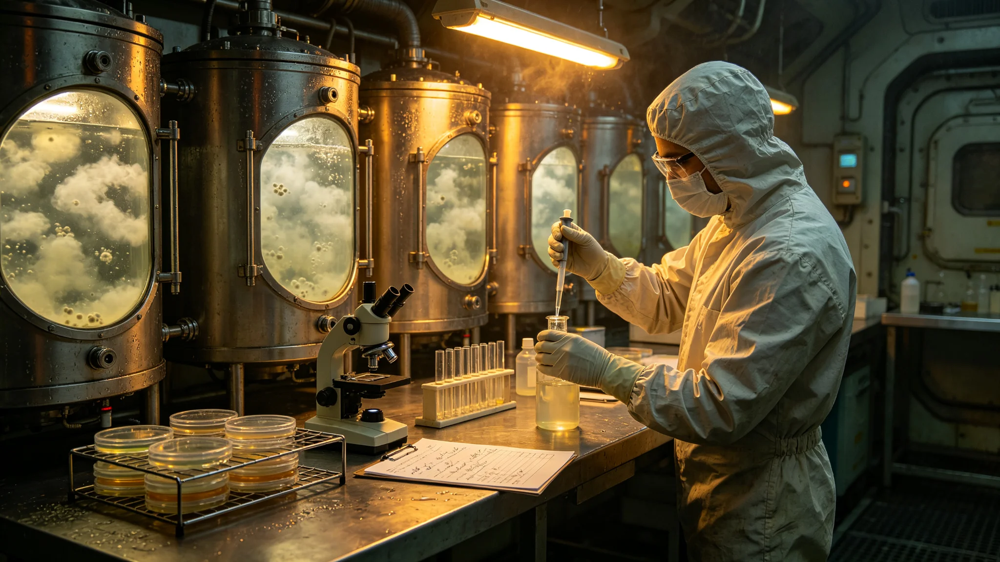

# 生命支持系统菌群重建报告

## 一、重建缘由

第三代闭环切换期间，菌群活性一度下降。须重建菌群，恢复闭环稳定。

## 二、重建对象

氧化菌群、硝化菌群、反硝化菌群、水培根际菌群，共四类。

## 三、重建过程

重建分四步：留样、扩培、接种、监测。留样取自切换前备用罐，扩培七日，接种入新罐，监测三十日。

## 四、重建结果

三十日后菌群活性恢复至切换前九成。闭环稳定。

## 五、与切换故障关系

切换故障夜三十一小时期间，备用罐热备保住了菌种。本次重建以此为基础。

## 六、附则

本报告自3843年五月九日起存档。解释权归环控署。

## 七、留样

留样取自切换前备用罐，共四只。留样冷冻保存，不直接用。

## 八、扩培

扩培七日，温度与底物按原配方。扩培后菌量达接种要求。

## 九、接种

接种入新罐，分四类同时。接种后封闭，不另扰动。

## 十、三十日监测

| 周次 | 氧化菌 | 硝化菌 | 反硝化菌 | 水培根际 |
|---|---|---|---|---|
| 第一周 | 六成 | 五成 | 五成 | 六成 |
| 第二周 | 七成 | 六成 | 六成 | 七成 |
| 第三周 | 八成 | 七成 | 七成 | 八成 |
| 第四周 | 九成 | 八成五 | 八成五 | 九成 |

## 十一、重建人员

重建人员含环控署工艺师六人、接种工四人。

## 十二、重建与监督

监督处派员在场。

## 十三、重建后长期跟踪

重建后长期跟踪六个月，菌群稳定。

## 十四、本报告所附材料

本报告所附：留样记录、扩培记录、接种记录、监测表，共四份。齐全。

## 十五、重建与闭环

重建期间闭环由备用罐维持，不降氧。

## 十六、重建与水质

水质连续监测，无异常。

## 十七、重建后归档

重建记录归档于环控署。

## 十八、本报告生效

本报告自颁行日起生效。

## 十九、重建与下一艘船

重建经验供下一艘船参考。

## 二十、重建与改造法

本报告为改造法在菌群重建上的执行细则。

## 二十一、重建与温度

扩培温度按原配方，三十度。

## 二十二、重建与底物

底物按原配方，不另改。

## 二十三、重建与时间

扩培七日，接种后三十日监测。

## 二十四、重建与监测

监测四项菌群活性。

## 二十五、重建与人员排班

扩培白班，接种夜班值守。每班八时辰。

## 二十六、重建与工具

培养罐、接种器、温控仪、监测探头。共四类。

## 二十七、重建与安全

重建期间不发生污染。

## 二十八、重建与应急

如污染，弃罐重培。本次无污染。

## 二十九、重建与副本

副本送监督处。

## 三十、重建与异议

居民有异议，向监督处提出。

## 三十一、重建与原生罐参数

原生罐参数：温度三十度、底物按配方。新罐按此。

## 三十二、重建与氧化菌

氧化菌三十日恢复九成。

## 三十三、重建与硝化菌

硝化菌三十日恢复八成五。

## 三十四、重建与反硝化菌

反硝化菌三十日恢复八成五。

## 三十五、重建与水培根际

水培根际菌三十日恢复九成。

## 三十六、重建与备用罐

备用罐热备保住菌种。

## 三十七、重建与切换故障

切换故障夜三十一小时期间，备用罐维持闭环。

## 三十八、重建与闭环

重建后闭环稳定。

## 三十九、重建与留样

留样四只，冷冻保存，重建后不销毁。

## 四十、重建与总工程师

总工程师签认重建结果。

## 四十一、重建与监督处

监督处复核重建记录。

## 四十二、重建与船务署

船务署公布重建结果。
