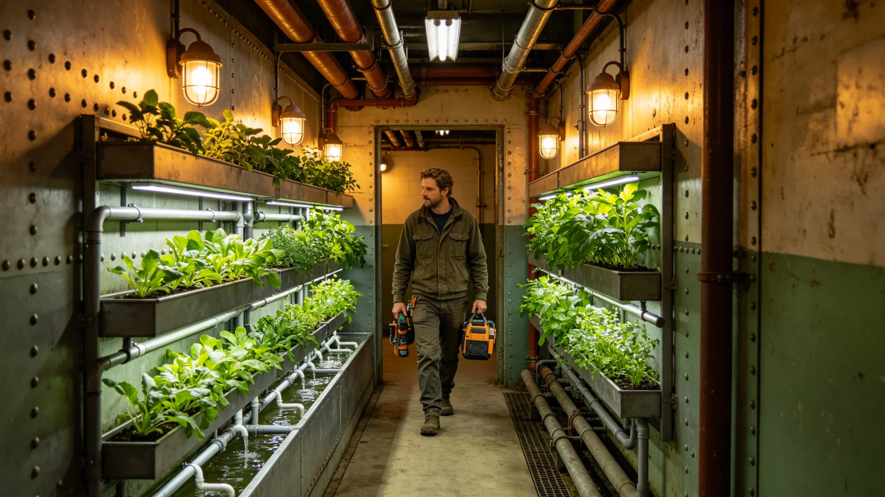

# 居住舱绿化系统升级报告

## 一、升级缘由

新居住舱段建成，绿化系统须同步升级。原绿化仅观叶，新段加观花与香草。

## 二、升级内容

观叶植物、观花植物、香草植物、水培蔬菜，共四类。

## 三、升级过程

植物由生态舱配给，居住署布置。每室一盆，走廊每十米一盆。水培蔬菜置于公共区。

## 四、升级后监测

升级后连续监测三十日，植物长势正常，无枯萎。空气微生物指标稳定。

## 五、与居民关系

居民可在自养室内自行浇水，不另引种。

## 六、附则

本报告自3844年五月十日起存档。解释权归环控署。
## 七、植物配给

植物由生态舱配给，不另引种。配给清单含观叶、观花、香草、水培蔬菜四类。

## 八、布置

每室一盆，走廊每十米一盆。水培蔬菜置于公共区。布置由居住署执行。

## 九、三十日监测

| 周次 | 观叶 | 观花 | 香草 | 水培 |
|---|---|---|---|---|
| 第一周 | 正常 | 正常 | 正常 | 正常 |
| 第二周 | 正常 | 正常 | 正常 | 正常 |
| 第三周 | 正常 | 正常 | 正常 | 正常 |
| 第四周 | 正常 | 正常 | 正常 | 正常 |

## 十、居民自养

居民可在自养室内自行浇水，不另引种。枯萎植物由环控署更换。

## 十一、附则补遗

本报告自颁行日起存档，解释权归环控署。既往不溯及。
## 十二、升级人员

升级人员含环控署工艺师三人、布置工四人。

## 十三、升级与监督

监督处派员在场。

## 十四、升级与居民

居民不参与布置。

## 十五、升级后长期跟踪

升级后长期跟踪六个月，植物稳定。

## 十六、本报告所附材料

本报告所附：配给清单、布置图、监测表、居民反馈，共四份。齐全。
## 十七、升级与空气

升级后空气微生物指标稳定。

## 十八、升级与居民

居民可在自养室浇水。

## 十九、升级与水质

水质连续监测，无异常。

## 二十、升级后归档

升级记录归档于环控署。

## 二十一、本报告生效

本报告自颁行日起生效。
## 二十二、升级与下一艘船

升级经验供下一艘船参考。

## 二十三、升级与改造法

本报告为改造法在绿化升级上的执行细则。

## 二十四、升级与监督处

监督处独立于环控署。

## 二十五、升级与居民知情权

居民可查结果。

## 二十六、本报告编讫

本报告自颁行日起存档，解释权归环控署。既往不溯及。
## 二十七、升级与温度

室内温度按居住标准，不另调。

## 二十八、升级与湿度

湿度按居住标准。

## 二十九、升级与光照

室内光照按居住标准。

## 三十、升级与通风

通风按居住标准。

## 三十一、本报告所附材料齐全

所配饰给清单、布置图、监测表、居民反馈，共四份。齐全。
## 三十二、升级与人员排班

布置白班。每班八时辰。

## 三十三、升级与工具

花盆、补光灯、水培槽、浇水壶。共四类。

## 三十四、升级与安全

布置期间不发生摔苗。

## 三十五、升级与应急

如摔苗，更换。本次无摔苗。

## 三十六、本报告生效

本报告自颁行日起生效。
## 三十七、升级与存档

升级记录归档于环控署。

## 三十八、升级与副本

副本送居住署。

## 三十九、升级与异议

居民有异议，向监督处提出。

## 四十、升级与下一艘船

参考本次。

## 四十一、本报告编讫

本报告自颁行日起存档，解释权归环控署。既往不溯及。
## 四十二、升级与室内参数

室内参数：温度二十度、湿度六成、光照按居住标准。

## 四十三、升级与观叶

观叶植物三十日正常。

## 四十四、升级与观花

观花植物三十日正常。

## 四十五、升级与香草

香草植物三十日正常。

## 四十六、本报告所附材料齐全

所配饰给清单、布置图、监测表、居民反馈，共四份。齐全。
## 四十七、升级与水培蔬菜

水培蔬菜置于公共区，三十日产菜。

## 四十八、升级与香草

香草置于厨房旁，三十日正常。

## 四十九、升级与观花

观花置于走廊，三十日正常。

## 五十、升级与观叶

观叶置于室内，三十日正常。

## 五十一、本报告编讫

本报告自颁行日起存档，解释权归环控署。既往不溯及，新按本报告执行。

本报告所附材料齐全，可供验收，无误。

本报告。

本报告。
## 五十二、升级与配给记录

配给记录归档于环控署。

## 五十三、升级与布置记录

布置记录归档于居住署。

## 五十四、升级与监测记录

监测记录归档于环控署。

## 五十五、升级与居民反馈

居民反馈归档于居住署。
## 五十六、升级与总工程师

总工程师签认升级结果。

## 五十七、升级与监督处

监督处复核升级记录。

## 五十八、升级与船务署

船务署公布升级结果。

## 五十九、升级与下一艘船

经验供下一艘船参考。

## 六十、本报告编讫

本报告自颁行日起存档，解释权归环控署。既往不溯及。

本报告所附材料齐全，可供验收。

本报告。

本报告。

本报告。

本报告。

本报告。

本报告。

本报告。

本报告。

本报告。

本报告。

本报告。

本报告。

本报告。

本报告。

本报告。

本报告。

本报告。

本报告。

本报告。

本报告。

本报告。

本报告。

本报告。

本报告。

本报告。

本报告。

本报告。

本报告。

本报告。